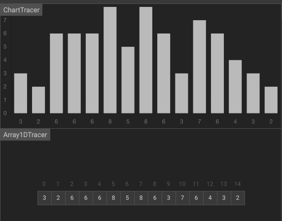

# 排序

## 冒泡排序


原理：

- 冒泡排序只会操作相邻的两个数据
- 每次冒泡操作都会对相邻的两个元素进行比较，看是否满足大小关系要求。如果不满足就让它俩互换
- 一次冒泡会让至少一个元素移动到它应该在的位置，重复 n 次，就完成了 n 个数据的排序工作

特点：

- 优点：排序算法的基础，简单实用易于理解
- 缺点：比较次数多，效率较低

实现：

```js
const bubbleSort = arr => {
  const length = arr.length
  if (length <= 1) return
  // i < length - 1 是因为外层只需要 length-1 次就排好了，第 length 次比较是多余的。
  for (let i = 0; i < length - 1; i++) {
    let hasChange = false // 提前退出冒泡循环的标志位
    // j < length - i - 1 是因为内层的 length-i-1 到 length-1 的位置已经排好了，不需要再比较一次。
    for (let j = 0; j < length - i - 1; j++) {
      if (arr[j] > arr[j + 1]) {
        const temp = arr[j]
        arr[j] = arr[j + 1]
        arr[j + 1] = temp
        hasChange = true // 表示有数据交换
      }
    }
    // 如果 false 说明所有元素已经到位，没有数据交换，提前退出
    if (!hasChange) break
  }
}
```

## 选择排序

原理：


- 首先在未排序序列中找到最小（大）元素，存放到排序序列的起始位置。
- 再从剩余未排序元素中继续寻找最小（大）元素，然后放到已排序序列的末尾。
- 重复第二步，直到所有元素均排序完毕。

实现：

```js
const selectionSort = array => {
  const len = array.length
  let minIndex, temp
  for (let i = 0; i < len - 1; i++) {
    minIndex = i
    for (let j = i + 1; j < len; j++) {
      if (array[j] < array[minIndex]) {
        // 寻找最小的数
        minIndex = j // 将最小数的索引保存
      }
    }
    temp = array[i]
    array[i] = array[minIndex]
    array[minIndex] = temp
    console.log('array: ', array)
  }
  return array
}
```

## 快速排序

快速排序的特点就是快，而且效率高！它是处理大数据最快的排序算法之一。

原理：


- 先找到一个基准点（一般指数组的中部），然后数组被该基准点分为两部分，依次与该基准点数据比较，如果比它小，放左边；反之，放右边。
- 左右分别用一个空数组去存储比较后的数据。
- 最后递归执行上述操作，直到数组长度 <= 1;

特点：

- 特点：快速，常用
- 缺点：需要另外声明两个数组，浪费了内存空间资源

实现：

```js
const quickSort = arr => {
  if (arr.length <= 1) {
    return arr
  }
  //取基准点
  const midIndex = Math.floor(arr.length / 2)
  //取基准点的值，splice(index,1) 则返回的是含有被删除的元素的数组。
  const valArr = arr.splice(midIndex, 1)
  const midIndexVal = valArr[0]
  const left = [] //存放比基准点小的数组
  const right = [] //存放比基准点大的数组
  //遍历数组，进行判断分配
  for (let i = 0; i < arr.length; i++) {
    if (arr[i] < midIndexVal) {
      left.push(arr[i]) //比基准点小的放在左边数组
    } else {
      right.push(arr[i]) //比基准点大的放在右边数组
    }
  }
  //递归执行以上操作，对左右两个数组进行操作，直到数组长度为 <= 1
  return quickSort(left).concat(midIndexVal, quickSort(right))
}
```

## 插入排序

原理：


通过构建有序序列，对于未排序数据，在已排序序列中从后向前扫描，找到相应位置并插入

- 从第一个元素开始，该元素可以认为已经被排序；
- 取出下一个元素，在已经排序的元素序列中从后向前扫描；
- 如果该元素（已排序）大于新元素，将该元素移到下一位置；
- 重复步骤 3，直到找到已排序的元素小于或者等于新元素的位置；
- 将新元素插入到该位置后；
- 重复步骤 2~5。

实现：

```js
const insertionSort = array => {
  const len = array.length
  if (len <= 1) return

  let preIndex, current
  for (let i = 1; i < len; i++) {
    preIndex = i - 1 //待比较元素的下标
    current = array[i] //当前元素
    while (preIndex >= 0 && array[preIndex] > current) {
      //前置条件之一: 待比较元素比当前元素大
      array[preIndex + 1] = array[preIndex] //将待比较元素后移一位
      preIndex-- //游标前移一位
    }
    if (preIndex + 1 != i) {
      //避免同一个元素赋值给自身
      array[preIndex + 1] = current //将当前元素插入预留空位
      console.log('array :', array)
    }
  }
  return array
}
```

## 希尔排序



原理：

- 先将整个待排序的记录序列分割成为若干子序列。
- 分别进行直接插入排序。
- 待整个序列中的记录基本有序时，再对全体记录进行依次直接插入排序。

实现：

```js
const shellSort = arr => {
  let len = arr.length,
    temp,
    gap = 1
  while (gap < len / 3) {
    //动态定义间隔序列
    gap = gap * 3 + 1
  }
  for (gap; gap > 0; gap = Math.floor(gap / 3)) {
    for (let i = gap; i < len; i++) {
      temp = arr[i]
      let j = i - gap
      for (; j >= 0 && arr[j] > temp; j -= gap) {
        arr[j + gap] = arr[j]
      }
      arr[j + gap] = temp
    }
  }
  return arr
}
```