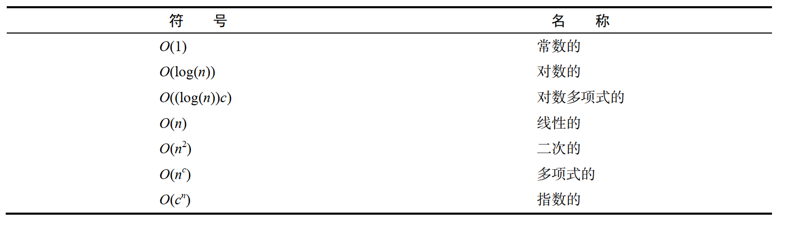
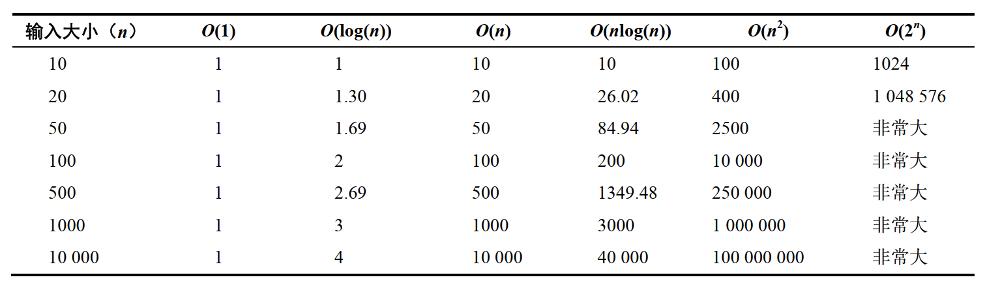
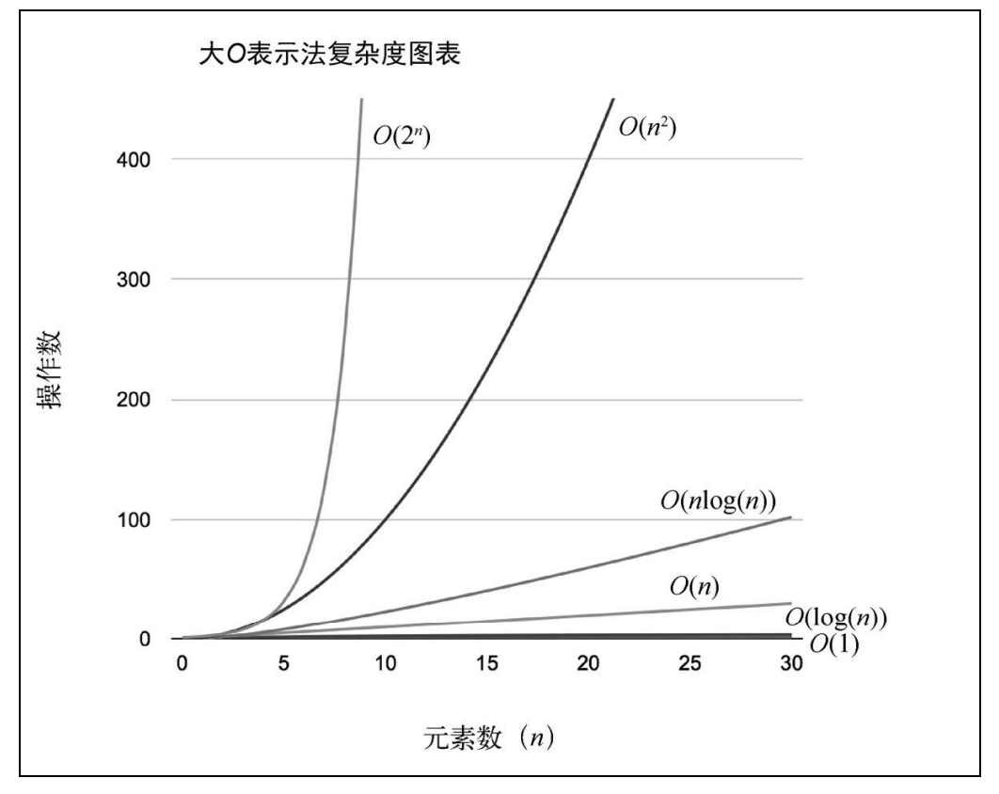
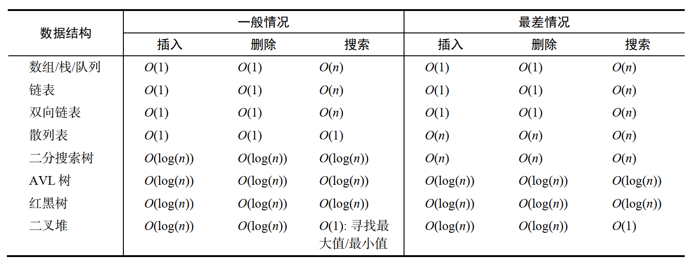
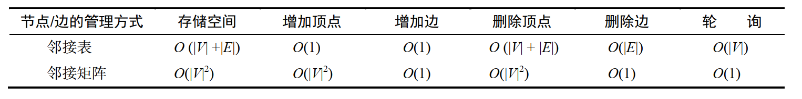
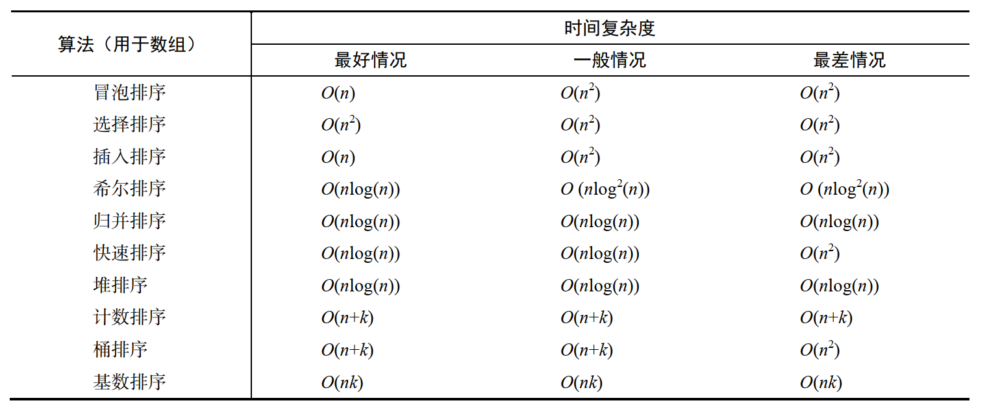
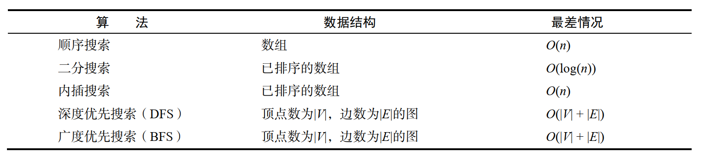

# 算法复杂度

## 大O表示法

### 概念

- 它用于描述算法的性能和复杂程度。
- 大O表示法将算法按照消耗的时间进行分类，依据随输入增大所需要的空间/内存

## 分析算法常用函数



## 理解大O表示法

如何衡量算法的效率？通常是用资源，例如 CPU（时间）占用、内存占用、硬盘占用和网络占用。当讨论大 O 表示法时，一般考虑的是 CPU（时间）占用

### O(1)

```js
function increment(num) {
  return ++num
}
```

- 假设运行 increment(1)函数，执行时间等于 X
- 如果再用不同的参数运行一次increment 函数，执行时间依然是 X
- 和参数无关， increment 函数的性能都一样。因此，上述函数的复杂度是 O(1)

### O(n)

```js
function sequentialSearch(array, value, equalsFn = defaultEquals) {
  for (let i = 0; i < array.length; i++) {
    if (equalsFn(value, array[i])) { // {1}
      return i
    }
  }
  return -1
}
```

- 如果将含 10 个元素的数组（ [1, ..., 10]）传递给该函数，假如要搜索元素 11。行{1}会执行 10 次
- 假如该数组有 1000 个元素（ [1, ..., 1000]）。搜索 1001 的结果是行{1}执行了1000 次
- sequentialSearch 函数执行的总开销取决于数组元素的个数（数组大小），而且也和搜索的值有关
- 最坏情况下，如果数组大小是 10，开销就是 10；如果数组大小是 1000，开销就是 1000。可以得出 sequentialSearch 函数的时间复杂度是 O(n)， n 是（输入）数组的大小。

### O(n²)

```js
function bubbleSort(array, compareFn = defaultCompare) {
  const { length } = array
  for (let i = 0; i < length; i++) {// {1}
    for (let j = 0; j < length - 1; j++) {// {2}
      if (compareFn(array[j], array[j + 1]) === Compare.BIGGER_THAN) {
        swap(array, j, j + 1)
      }
    }
  }
  return array
}
```

- 如果用大小为 10 的数组执行 bubbleSort，开销是 100（ 10²）。
- 如果用大小为 100 的数组执行 bubbleSort，开销就是 10000（ 100²）。需要注意，我们每次增加输入的大小，执行都会越来越久

时间复杂度 O(n)的代码只有一层循环，而 O(n²)的代码有双层嵌套循环。如果算法有三层迭代数组的嵌套循环，它的时间复杂度很可能就是 O(n³)

## 时间复杂度比较

### 不同的时间复杂度



### 大O速查表



[参考](https://www.bigocheatsheet.com/)

### 数据结构

常用数据结构的时间复杂度：



### 图

图的时间复杂度



### 排序算法

排序算法的时间复杂度



### 搜索算法

搜索算法的时间复杂度


