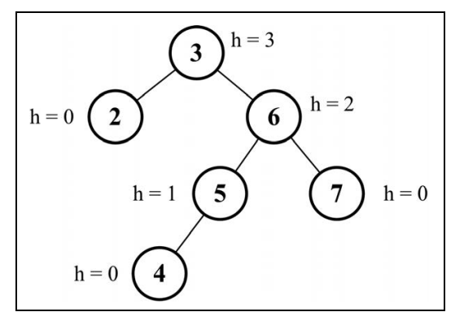

BST 存在一个问题：取决于你添加的节点数，树的一条边可能会非常深；也就是说，树的一条分支会有很多层，而其他的分支却只有几层。这会在需要在某条边上添加、移除和搜索某个节点时引起一些性能问题。

为了解决这个问题，有一种树叫作`Adelson-Velskii-Landi`树（`AVL`树）。

`AVL`树是一种自平衡二叉搜索树，意思是**任何一个节点左右两侧子树的高度之差最多为 1**

# AVL树

- AVL树是一种自平衡树。
- 添加或移除节点时， AVL树会尝试保持自平衡。
- 任意一个节点（不论深度）的左子树和右子树高度最多相差 1。
- 添加或移除节点时， AVL树会尽可能尝试转换为完全树

## 创建AVL类

```js
class AVLTree extends BinarySearchTree {
  constructor(compareFn = defaultCompare) {
    super(compareFn)
    this.compareFn = compareFn
    this.root = null
  }
}
```

在 `AVL` 树中插入或移除节点和 `BST` 完全相同。然而， AVL 树的不同之处在于我们需要检验它的**平衡因子**，如果有需要，会将其逻辑应用于树的自平衡

## 节点的高度

- 从**节点**到**任意子节点**的边的**最大值**

下图展示了一个包含每个节点高度的树:



计算一个节点高度：

```js
getNodeHeight(node) {
  if (node == null) {
    return -1
  }
  return Math.max(this.getNodeHeight(node.left), this.getNodeHeight(node.right)) + 1
}
```

## 平衡因子

在`AVL`树中，需要对每个节点计算右子树高度（`hr`）和左子树高度（`hl`）之间的差值，该值（`hr－ hl`）应为**0、 1 或-1**。

如果结果不是这三个值之一，则需要平衡该`AVL`树。这就是平衡因子的概念

```js
// 计数器
const BalanceFactor = {
  UNBALANCED_RIGHT: 1,
  SLIGHTLY_UNBALANCED_RIGHT: 2,
  BALANCED: 3,
  SLIGHTLY_UNBALANCED_LEFT: 4,
  UNBALANCED_LEFT: 5,
}
// 计算一个节点的平衡因子，并返回值
getBalanceFactor(node) {
  const heightDifference = this.getNodeHeight(node.left) - this.getNodeHeight(node.right)
  switch (heightDifference) {
    case -2:
      return BalanceFactor.UNBALANCED_RIGHT
    case -1:
      return BalanceFactor.SLIGHTLY_UNBALANCED_RIGHT
    case 1:
      return BalanceFactor.SLIGHTLY_UNBALANCED_LEFT
    case 2:
      return BalanceFactor.UNBALANCED_LEFT
    default:
      return BalanceFactor.BALANCED
  }
}
```

## 平衡操作——AVL旋转

在对`AVL`树添加或移除节点后，我们要计算节点的高度并验证树是否需要进行平衡。向`AVL`树插入节点时，可以执行单旋转或双旋转两种平衡操作，分别对应四种场景：

- 左——左（LL）：向右的单旋转
- 右——右（RR）：向左的单旋转188 第 10 章 树
- 左——右（LR）：向右的双旋转（先 LL 旋转，再 RR 旋转）
- 右——左（RL）：向左的双旋转（先 RR 旋转，再 LL 旋转）

### LL

向右的单旋转：节点的左侧子节点的高度大于右侧子节点的高度

```js
rotationLL(node) {
  const tmp = node.left 
  node.left = tmp.right 
  tmp.right = node 
  return tmp
}
```

### RR

向左的单旋转：右侧子节点的高度大于左侧子节点的高度

```js
rotationRR(node) {
  const tmp = node.right 
  node.right = tmp.left
  tmp.left = node 
  return tmp
}
```

### LR

向右的双旋转：左侧子节点的高度大于右侧子节点的高度，并且左侧子节点右侧较重

```js
rotationLR(node) {
  node.left = this.rotationRR(node.left)
  return this.rotationLL(node)
}
```

### RL

向左的双旋转：右侧子节点的高度大于左侧子节点的高度，并且右侧子节点左侧较重

```js
rotationRL(node) {
  node.right = this.rotationLL(node.right)
  return this.rotationRR(node)
}
```

## 向AVL树插入节点

向`AVL`树插入节点和在`BST`中是一样的。除了插入节点外，我们还要验证插入后树是否还是平衡的，如果不是，就要进行必要的旋转操作

```js
insertNode(node, key) {
  if (node == null) {
    return new Node(key)
  } else if (this.compareFn(key, node.key) === Compare.LESS_THAN) {
    node.left = this.insertNode(node.left, key)
  } else if (this.compareFn(key, node.key) === Compare.BIGGER_THAN) {
    node.right = this.insertNode(node.right, key)
  } else {
    return node
  }
  const balanceFactor = this.getBalanceFactor(node)
  if (balanceFactor === BalanceFactor.UNBALANCED_LEFT) {
    if (this.compareFn(key, node.left.key) === Compare.LESS_THAN) {
      node = this.rotationLL(node)
    } else {
      return this.rotationLR(node)
    }
  }
  if (balanceFactor === BalanceFactor.UNBALANCED_RIGHT) {
    if (this.compareFn(key, node.right.key) === Compare.BIGGER_THAN) {
      node = this.rotationRR(node)
    } else {
      return this.rotationRL(node)
    }
  }
  return node
}
```

## 从AVL树中移除节点

从`AVL`树移除节点和在`BST`中是一样的。除了移除节点外，我们还要验证移除后树是否还是平衡的，如果不是，就要进行必要的旋转操作

```js
removeNode(node, key) {
  node = super.removeNode(node, key)
  if (node == null) {
    return node
  }
  const balanceFactor = this.getBalanceFactor(node) 
  if (balanceFactor === BalanceFactor.UNBALANCED_LEFT) {
    const balanceFactorLeft = this.getBalanceFactor(node.left)
    if (balanceFactorLeft === BalanceFactor.BALANCED || balanceFactorLeft === BalanceFactor.SLIGHTLY_UNBALANCED_LEFT) {
      return this.rotationLL(node) 
    }
    if (balanceFactorLeft === BalanceFactor.SLIGHTLY_UNBALANCED_RIGHT) {
      return this.rotationLR(node.left)
    }
  }
  if (balanceFactor === BalanceFactor.UNBALANCED_RIGHT) {
    const balanceFactorRight = this.getBalanceFactor(node.right) 
    if (balanceFactorRight === BalanceFactor.BALANCED || balanceFactorRight === BalanceFactor.SLIGHTLY_UNBALANCED_RIGHT) {
      return this.rotationRR(node) 
    }
    if (balanceFactorRight === BalanceFactor.SLIGHTLY_UNBALANCED_LEFT) {
      return this.rotationRL(node.right) 
    }
  }
  return node
}
```

## 最终实现

```js
const BalanceFactor = {
  UNBALANCED_RIGHT: 1,
  SLIGHTLY_UNBALANCED_RIGHT: 2,
  BALANCED: 3,
  SLIGHTLY_UNBALANCED_LEFT: 4,
  UNBALANCED_LEFT: 5,
}
class AVLTree extends BinarySearchTree {
  constructor(compareFn = defaultCompare) {
    super(compareFn)
    this.compareFn = compareFn
    this.root = null
  }
  getNodeHeight(node) {
    if (node == null) {
      return -1
    }
    return Math.max(this.getNodeHeight(node.left), this.getNodeHeight(node.right)) + 1
  }
  getBalanceFactor(node) {
    const heightDifference = this.getNodeHeight(node.left) - this.getNodeHeight(node.right)
    switch (heightDifference) {
      case -2:
        return BalanceFactor.UNBALANCED_RIGHT
      case -1:
        return BalanceFactor.SLIGHTLY_UNBALANCED_RIGHT
      case 1:
        return BalanceFactor.SLIGHTLY_UNBALANCED_LEFT
      case 2:
        return BalanceFactor.UNBALANCED_LEFT
      default:
        return BalanceFactor.BALANCED
    }
  }
  rotationLL(node) {
    const tmp = node.left
    node.left = tmp.right
    tmp.right = node
    return tmp
  }
  rotationRR(node) {
    const tmp = node.right
    node.right = tmp.left
    tmp.left = node
    return tmp
  }
  rotationLR(node) {
    node.left = this.rotationRR(node.left)
    return this.rotationLL(node)
  }
  rotationRL(node) {
    node.right = this.rotationLL(node.right)
    return this.rotationRR(node)
  }
  insert(key) {
    this.root = this.insertNode(this.root, key)
  }
  insertNode(node, key) {
    if (node == null) {
      return new Node(key)
    } else if (this.compareFn(key, node.key) === Compare.LESS_THAN) {
      node.left = this.insertNode(node.left, key)
    } else if (this.compareFn(key, node.key) === Compare.BIGGER_THAN) {
      node.right = this.insertNode(node.right, key)
    } else {
      return node
    }
    const balanceFactor = this.getBalanceFactor(node)
    if (balanceFactor === BalanceFactor.UNBALANCED_LEFT) {
      if (this.compareFn(key, node.left.key) === Compare.LESS_THAN) {
        node = this.rotationLL(node)
      } else {
        return this.rotationLR(node)
      }
    }
    if (balanceFactor === BalanceFactor.UNBALANCED_RIGHT) {
      if (this.compareFn(key, node.right.key) === Compare.BIGGER_THAN) {
        node = this.rotationRR(node)
      } else {
        return this.rotationRL(node)
      }
    }
    return node
  }
  removeNode(node, key) {
    node = super.removeNode(node, key)
    if (node == null) {
      return node
    }
    const balanceFactor = this.getBalanceFactor(node) 
    if (balanceFactor === BalanceFactor.UNBALANCED_LEFT) {
      const balanceFactorLeft = this.getBalanceFactor(node.left)
      if (balanceFactorLeft === BalanceFactor.BALANCED || balanceFactorLeft === BalanceFactor.SLIGHTLY_UNBALANCED_LEFT) {
        return this.rotationLL(node) 
      }
      if (balanceFactorLeft === BalanceFactor.SLIGHTLY_UNBALANCED_RIGHT) {
        return this.rotationLR(node.left)
      }
    }
    if (balanceFactor === BalanceFactor.UNBALANCED_RIGHT) {
      const balanceFactorRight = this.getBalanceFactor(node.right) 
      if (balanceFactorRight === BalanceFactor.BALANCED || balanceFactorRight === BalanceFactor.SLIGHTLY_UNBALANCED_RIGHT) {
        return this.rotationRR(node) 
      }
      if (balanceFactorRight === BalanceFactor.SLIGHTLY_UNBALANCED_LEFT) {
        return this.rotationRL(node.right) 
      }
    }
    return node
  }
}
```
