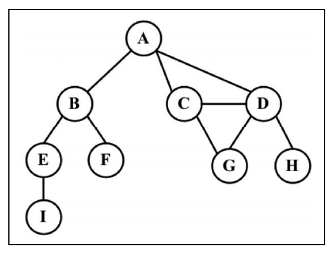

# 图

图是一种非线性数据结构。图是一组由边连接的节点（或顶点）。学习图是重要的，因为任何二元关系都可以用图来表示。

一个图 G = (V, E)由以下元素组成。

- V：一组顶点
- E：一组边，连接 V 中的顶点

下图表示一个图。



由一条边连接在一起的顶点称为**相邻顶点**。比如， A 和 B 是相邻的， A 和 D 是相邻的， A 和C 是相邻的， A 和 E 不是相邻的。

一个顶点的度是其相邻顶点的数量。比如， A 和其他三个顶点相连接，因此 A 的度为 3； E和其他两个顶点相连，因此 E 的度为 2。

路径是顶点 v1, v2, …, vk的一个连续序列，其中 vi和 vi+1是相邻的。以上一示意图中的图为例，其中包含路径 A B E I 和 A C D G

## 创建图类

```js
class Graph {
  constructor(isDirected = false) {
    this.isDirected = isDirected // 是否有向
    this.vertices = [] // 存储图中所有顶点的名字
    this.adjList = new Dictionary() // 存储邻接表
  }
}
```

