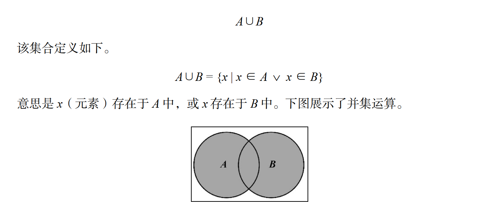
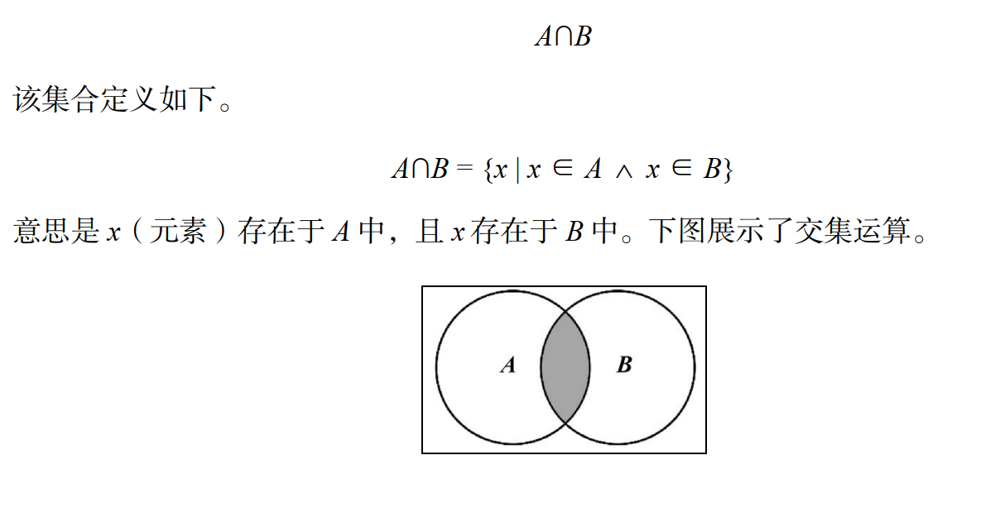
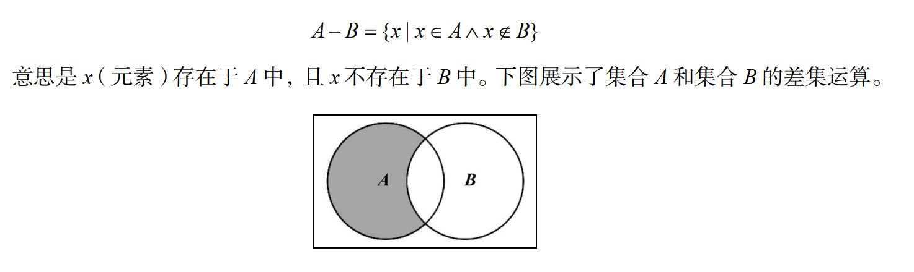
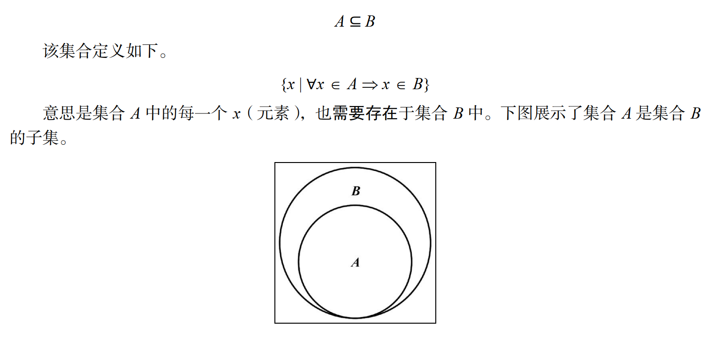

# 集合

## 定义

集合是由一组`无序`且`唯一`（即不能重复）的项组成的，用`[值，值]对`的形式来存储数据

## 创建集合

方法：

方法 | 说明 | 是否返回
---|---|---
add(element) | 向集合添加一个新元素 | true
delete(element) | 从集合移除一个元素 | true
has(element) | 如果元素在集合中，返回 true，否则返回 false | true
clear() | 移除集合中的所有元素 | false
size() | 返回集合所包含元素的数量。它与数组的 length 属性类似 | true
values() | 返回一个包含集合中所有值（元素）的数组 | true

使用对象来创建集合

```js
class Set {
  constructor() {
    this.items = {}
  }
}
```

### 检验某个元素是否存在于集合中

```js
has(element) {
  return element in this.items
}
```

或者

```js
has(element) {
  return Object.prototype.hasOwnProperty.call(this.items, element)
}
```

::: tip 提示

- Object 原型有 hasOwnProperty 方法。该方法返回一个表明对象是否具有特定属性的布尔值。
- in 运算符则返回表示对象在原型链上是否有特定属性的布尔值。

:::

### 添加元素

```js
add(element) {
  if (!this.has(element)) {
    this.items[element] = element
    return true
  }
  return false
}
```

- 添加成功返回`true`,否则返回`false`
- 添加元素`element`时，将它同时作为键和值保存，有利于查找

### 删除元素和清空集合

```js
delete(element) {
  if (this.has(element)) {
    delete this.items[element]
    return true
  }
  return false
}
clear() {
  this.items = {}
}
```

- 删除成功返回`true`,否则返回`false`

### 获取集合元素数量

第一种方法是使用length变量，每天添加或者删除的时候，改变length，就像链表中的处理方式一样

第二种方式

```js
size() {
  return Object.keys(this.items).length
}
```

第三种方式

```js
sizeLegacy() {
  let count = 0
  for (let key in this.items) {
    // 检查是否是对象自身的属性（避免重复计数)
    if (this.items.hasOwnProperty(key)) {
      count++
    }
  }
  return count
}
```

### 获取所有属性值

第一种：

```js
values() {
  return Object.values(this.items)
}
```

第二种：

```js
valuesLegacy() {
  let values = []
  for (let key in this.items) {
    if (this.items.hasOwnProperty(key)) {
      values.push(key)
    }
  }
  return values
}
```

### 最终实现

```js
class Set {
  constructor() {
    this.items = {}
  }
  has(element) {
    return element in this.items
  }
  add(element) {
    if (!this.has(element)) {
      this.items[element] = element
      return true
    }
    return false
  }
  delete(element) {
    if (this.has(element)) {
      delete this.items[element]
      return true
    }
    return false
  }
  clear() {
    this.items = {}
  }
  size() {
    return Object.keys(this.items).length
  }
  values() {
    return Object.values(this.items)
  }
}
```

测试

```js
const set = new Set()
set.add(1)
console.log(set.values()) // 输出[1]
console.log(set.has(1)) // 输出 true
console.log(set.size()) // 输出 1
set.add(2)
console.log(set.values()) // 输出[1, 2]
console.log(set.has(2)) // 输出 true
console.log(set.size()) // 输出 2
set.delete(1)
console.log(set.values()) // 输出[2]
set.delete(2)
console.log(set.values()) // 输出[]
```

## 集合运算

### 并集



计算两个集合的并集：

- 创建一个新的`集合C`
- 遍历`集合A`的所有属性值，将每个属性值添加到`集合C`
- 遍历`集合B`的所有属性值，将每个属性值添加到`集合C`
- 返回`集合C`

```js
union(otherSet) {
  const unionSet = new Set()
  this.values().forEach(val => unionSet.add(val))
  otherSet.values().forEach(val => unionSet.add(val))
  return unionSet
}
```

测试

```js
const setA = new Set()
setA.add(1)
setA.add(2)
setA.add(3)
const setB = new Set()
setB.add(3)
setB.add(4)
setB.add(5)
setB.add(6)
const unionAB = setA.union(setB)
console.log(unionAB.values())
```

### 交集



计算两个集合的交集：

- 创建一个新的`集合C`
- 遍历`集合A`的所有属性值，判断属性是否存在于现有`集合B`中
- 如果存在，则添加到`集合C`中
- 返回`集合C`

```js
intersection(otherSet) {
  const intersectionSet = new Set()
  const values = this.values()
  for (let i = 0; i < values.length; i++) {
    if (otherSet.has(values[i])) {
      intersectionSet.add(values[i])
    }
  }
  return intersectionSet
}
```

测试

```js
const setA = new Set()
setA.add(1)
setA.add(2)
setA.add(3)
const setB = new Set()
setB.add(2)
setB.add(3)
setB.add(4)
const intersectionAB = setA.intersection(setB)
console.log(intersectionAB.values())       
// 返回 [2, 3]
```

存在问题，如果`集合A`的比`集合B`的长度长，只需要遍历`集合B`就可以了

优化后：

- 创建新的`集合C`
- 比较`集合A`和`集合B`的属性值数组长度，设置两个变量`biggerSet`和`smallerSet`分别存储两个集合的属性值数组
- 遍历`smallerSet`，判断`smallerSet`中的属性是否存在于`biggerSet`中，如果存在，则将属性作为元素添加到`集合C`中
- 返回`集合C`

```js
intersection(otherSet) {
  const intersectionSet = new Set()
  const values = this.values()
  const otherValues = otherSet.values()
  let biggerSet = values
  let smallerSet = otherValues

  if (otherValues.length - values.length > 0) {
    biggerSet = otherValues
    smallerSet = values
  }

  smallerSet.forEach(val => {
    if (biggerSet.includes(val)) {
      intersectionSet.add(val)
    }
  })
  return intersectionSet
}
```

### 差集



- 创建新的`集合C`
- 遍历`集合A`的属性值数组，判断`集合B`中是否存在该属性
- 如果存在，则将改属性添加到`集合C`中
- 返回`集合C`

```js
difference(otherSet) {
  const differenceSet = new Set()
  this.values().forEach(val => {
    if (!otherSet.has(val)) {
      differenceSet.add(val)
    }
  })
  return differenceSet
}
```

测试

```js
const setA = new Set();
setA.add(1);
setA.add(2);
setA.add(3);
const setB = new Set();
setB.add(2);
setB.add(3);
setB.add(4);
const differenceAB = setA.difference(setB);
console.log(differenceAB.values());
// 返回 [1]
```

### 子集



```js
isSubsetOf(otherSet) {
  if (this.size() > otherSet.size()) {
    return false
  }
  let isSubset = true
  this.values().forEach(val => {
    if (!otherSet.has(val)) {
      isSubset = false
      return false
    }
    return true
  })
  return isSubset
}
```

测试

```js
const setA = new Set()
setA.add(1)
setA.add(2)
const setB = new Set()
setB.add(1)
setB.add(2)
setB.add(3)
const setC = new Set()
setC.add(2)
setC.add(3)
setC.add(4)
console.log(setA.isSubsetOf(setB))   // true
console.log(setA.isSubsetOf(setC))   // false
```

### 最终实现

```js
class Set {
  constructor() {
    this.items = {}
  }
  add(element) {
    if (!this.has(element)) {
      this.items[element] = element
      return true
    }
    return false
  }
  delete(element) {
    if (this.has(element)) {
      delete this.items[element]
      return true
    }
    return false
  }
  has(element) {
    return element in this.items
  }
  clear() {
    this.items = {}
  }
  size() {
    return Object.keys(this.items).length
  }
  values() {
    return Object.values(this.items)
  }
  union(otherSet) {
    const unionSet = new Set()
    this.values().forEach(val => unionSet.add(val))
    otherSet.values().forEach(val => unionSet.add(val))
    return unionSet
  }
  intersection(otherSet) {
    const intersectionSet = new Set()
    const values = this.values()
    const otherValues = otherSet.values()
    let biggerSet = values
    let smallerSet = otherValues

    if (otherValues.length - values.length > 0) {
      biggerSet = otherValues
      smallerSet = values
    }

    smallerSet.forEach(val => {
      if (biggerSet.includes(val)) {
        intersectionSet.add(val)
      }
    })
    return intersectionSet
  }
  difference(otherSet) {
    const differenceSet = new Set()
    this.values().forEach(val => {
      if (!otherSet.has(val)) {
        differenceSet.add(val)
      }
    })
    return differenceSet
  }
  isSubsetOf(otherSet) {
    if (this.size() > otherSet.size()) {
      return false
    }
    let isSubset = true
    this.values().forEach(val => {
      if (!otherSet.has(val)) {
        isSubset = false
        return false
      }
      return true
    })
    return isSubset
  }
}
```

## 原生Set类

```js
const set = new Set()
set.add(1)
console.log(set.values())
console.log(set.has(1))
console.log(set.size)
console.log(set.delete(1))
```

::: tip 提示

- `set.values()`返回一个`Iterator`,而不是数组
- 提供一个`size`属性，而不是方法
- 提供`delete()`方法
- `clear`方法会重置`set`数据结构

:::

由于原生的Set类并没有提供交集，并集，差集，子集的运算，可以自行实现

### 并集

```js
const union = (setA, setB) => {
  const unionAb = new Set()
  setA.forEach(value => unionAb.add(value))
  setB.forEach(value => unionAb.add(value))
  return unionAb
}
```

### 交集

```js
const intersection = (setA, setB) => {
  const intersectionSet = new Set()
  setA.forEach(value => {
    if (setB.has(value)) {
      intersectionSet.add(value)
    }
  })
  return intersectionSet
}
```

### 差集

```js
const difference = (setA, setB) => {
  const differenceSet = new Set()
  setA.forEach(value => {
    if (!setB.has(value)) {
      differenceSet.add(value)
    }
  })
  return differenceSet
}
```

### 扩展运算符实现Set类的运算

```js
// 并集
const union = (setA, setB) => new Set([...setA, ...setB])

// 交集
const intersection = (setA, setB) => new Set([...setA].filter(x => setB.has(x)))

// 差集
const difference = (setA, setB) =>new Set([...setA].filter(x => !setB.has(x)))
```
