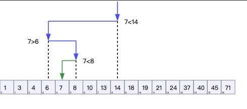

# 二分查找

## 定义

二分查找也称折半查找（Binary Search），它是一种效率较高的查找方法，前提是数据结构必须先排好序，可以在数据规模的对数时间复杂度内完成查找。但是

- 二分查找要求线性表具有有随机访问的特点（例如数组），
- 也要求线性表能够根据中间元素的特点推测它两侧元素的性质，以达到缩减问题规模的效果。

## 优势

- 省内存，二分查找算法基于已排序的原数组，属于本地查找算法
- 时间复杂度为`对数时间复杂度`O(logn)

## 局限性

- 依赖于顺序表
- 依赖于数据有序
- 不适用数据量太大的场景

## 应用



### 查找数组中目标值的下标,查找不到返回-1

```js
const binarySearch = (nums, target) => {
  // 数组长度为 0，返回 -1
  if (nums.length === 0) {
    return -1
  }
  let left = 0
  let right = nums.length - 1
  while (left < right) {
    // 取中位数，或者 mid = left + ((right - left) >> 1)
    let mid = Math.floor((right + left) / 2)
    // 如果中间值就是默认值，直接返回
    if (nums[mid] === target) {
      return mid
    }
    // 中间值小于目标值，说明目标值在右侧区间
    // 下次查询区间：[mid + 1, right]
    if (nums[mid] < target) {
      left = mid + 1
    }
    // 中间值大于目标值，说明目标值在左侧区间
    // 下次查询区间：[left, mid]
    if (nums[mid] > target) {
      right = mid
    }
  }
  // 退出循环时，没有找到目标值，返回 -1
  return -1
}
```