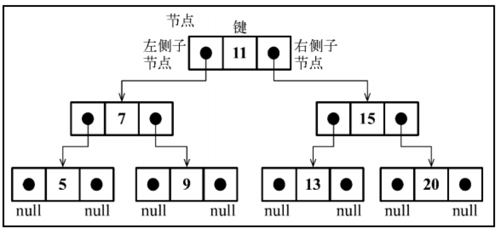
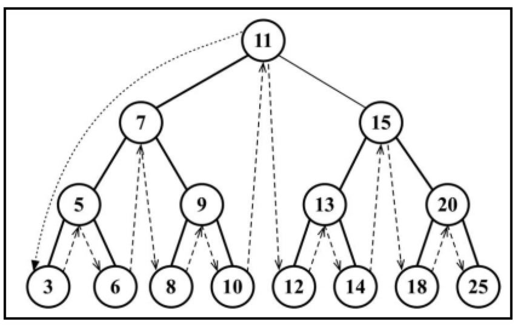
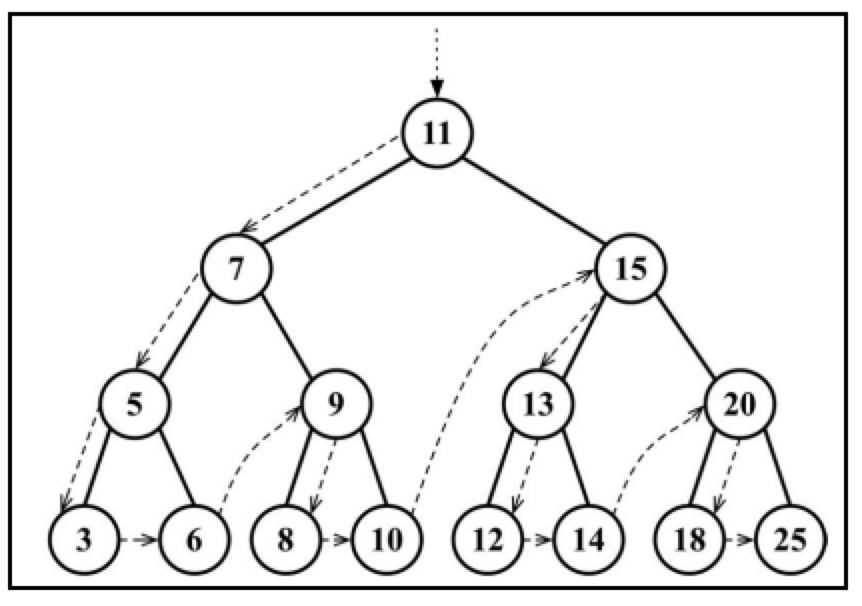

# 树

到目前为止，已经介绍了一些顺序数据结构，而第一个非顺序数据结构是散列表。现在学习另一种非顺序数据结构——树，它对于存储需要快速查找的数据非常有用


- 根节点：位于树顶部的节点（11）
- 节点：树中的每个元素
- 内部节点：至少有一个子节点的节点（11，7，5，9，15，13，20）
- 外部节点：没有子元素的节点（3，6，8，10，12，14，18，25）
- 子树：节点和它的后代构成

## 二叉树和二叉搜索树

**二叉树**中的节点最多只能有两个子节点：一个是左侧子节点，另一个是右侧子节点

**二叉搜索树**（`BST`）是二叉树的一种，但是只允许在`左侧节点`存储（比父节点）`小`的值，在`右侧节点`存储（比父节点）`大`的值。上图展示了一棵二叉搜索树

## 创建二叉搜索树类

二叉搜索树的数据结构组织图：



- 和链表一样，通过指针来表示节点间的关系
- 两个指针，一个指向左侧子节点，另一个指针指向右侧子节点
- 在这里，将节点称为`键`，`键`是树相关的术语中对节点的称呼

### 创建节点类Node

```js
class Node {
  constructor(key) {
    this.key = key    //  节点值
    this.left = null  // 左侧子节点引用
    this.right = null // 右侧子节点引用
  }
}
```

### 工具函数

```js
const Compare = {
  LESS_THAN: -1,
  BIGGER_THAN: 1,
}
function defaultCompare(a, b) {
  if (a === b) {
    return 0
  }
  return a < b ? Compare.LESS_THAN : Compare.BIGGER_THAN
}
```

### 创建BinarySearchTree类

```js
class BinarySearchTree {
  constructor(compareFn = defaultCompare) {
    this.compareFn = compareFn  // 用来比较节点值
    this.root = null            // Node 类型的根节点
  }
}

```

## 方法

方法 | 说明 | 是否返回
---|---|---
insert(key) | 向树中插入一个新的键 | false
search(key) | 在树中查找一个键，是否存在 | true
inOrderTraverse() | 通过`中序遍历`方式遍历所有节点 | false
preOrderTraverse() | 通过`先序遍历`方式遍历所有节点 | false
postOrderTraverse() | 通过`后序遍历`方式遍历所有节点 | false
min() | 返回树中最小的值/键 | true
max() | 返回树中最大的值/键 | true
remove(key) | 从树中移除某个键 | true

## 向二叉搜索树中插入一个键

步骤：

- 第一步是验证插入操作是否是特殊情况
- 第二步是将节点添加到根节点以外的其他位置
  - 通过参数传入树的根节点和要插入的节点
  - 如果新节点的键小于当前节点的键，那么需要检查当前节点的左侧子节点
    - 如果它没有左侧子节点，就在那里插入新的节点
    - 如果有左侧子节点，需要通过递归调用 insertNode方法继续找到树的下一层，比较的节点将会是当前节点的左侧子节点
  - 如果节点的键比当前节点的键大
    - 同时当前节点没有右侧子节点，就在那里插入新的节点
    - 如果有右侧子节点，同样需要递归调用 insertNode 方法，但是要用来和新节点比较的节点将会是右侧子节点

```js
insert(key) {
  if (this.root == null) {
    this.root = new Node(key)
  } else {
    this.insertNode(this.root, key)
  }
}
insertNode(node, key) {
  if (this.compareFn(key, node.key) === Compare.LESS_THAN) {
    if (node.left == null) {
      node.left = new Node(key)
    } else {
      this.insertNode(node.left, key)
    }
  } else {
    if (node.right == null) {
      node.right = new Node(key)
    } else {
      this.insertNode(node.right, key)
    }
  }
}
```

测试：

```js
const tree = new BinarySearchTree()
tree.insert(11)
tree.insert(7)
tree.insert(15)
tree.insert(5)
tree.insert(3)
tree.insert(9)
tree.insert(8)
tree.insert(10)
tree.insert(13)
tree.insert(12)
tree.insert(14)
tree.insert(20)
tree.insert(18)
tree.insert(25)

console.log(tree)
```

## 树的遍历

访问树的所有节点有三种方式：**中序**、**先序**和**后序**

### 中序遍历

中序遍历是一种以上行顺序访问 BST 所有节点的遍历方式，也就是以**从最小到最大的顺序访问所有节点**。中序遍历的一种应用就是对树进行**排序操作**

```js
inOrderTraverse(callback) {
  this.inOrderTraverseNode(this.root, callback)
}
inOrderTraverseNode(node, callback) {
  if (node != null) {
    this.inOrderTraverseNode(node.left, callback)
    callback(node.key)
    this.inOrderTraverseNode(node.right, callback)
  }
}
```

- callback：定义我们对遍历到的每个节点进行的操作
- 检查以参数形式传入的节点是否为 null——这就是停止递归继续执行的判断条件，即递归算法的基线条件

测试：

```js
const printNode = (value) => console.log(value); 
tree.inOrderTraverse(printNode);
// 3 5 6 7 8 9 10 11 12 13 14 15 18 20 25
```

下图描绘了 inOrderTraverse 方法的访问路径：



### 先序遍历

先序遍历是以**优先于后代节点的顺序**访问每个节点的。先序遍历的一种应用是打印一个结构化的文档

```js
preOrderTraverse(callback) {
  this.preOrderTraverseNode(this.root, callback)
}
preOrderTraverseNode(node, callback) {
  if (node != null) {
    callback(node.key)// {1}
    this.preOrderTraverseNode(node.left, callback) // {2}
    this.preOrderTraverseNode(node.right, callback)// {3}
  }
}
```

先序遍历和中序遍历的不同点是，先序遍历会先访问节点本身（行{1}），然后再访问它的左侧子节点（行{2}），最后是右侧子节点（行{3}）,而中序遍历的执行顺序是： {2}、 {1}和{3}。

测试

```js
const printNode = (value) => console.log(value); 
tree.preOrderTraverse(printNode);
// 11 7 5 3 6 9 8 10 15 13 12 14 20 18 25
```

下图描绘了 preOrderTraverse 方法的访问路径：



### 后序遍历

后序遍历则是**先访问节点的后代节点，再访问节点本身**。后序遍历的一种应用是计算一个目录及其子目录中所有文件所占空间的大小

```js
postOrderTraverse(callback) {
  this.postOrderTraverseNode(this.root, callback)
}
postOrderTraverseNode(node, callback) {
  if (node != null) {
    this.postOrderTraverseNode(node.left, callback) // {1}
    this.postOrderTraverseNode(node.right, callback) // {2}
    callback(node.key) // {3}
  }
}
```

后序遍历会先访问左侧子节点（行{1}），然后是右侧子节点（行{2}），最后是父节点本身（行{3}）。

中序、先序和后序遍历的实现方式是很相似的，唯一不同的是行{1}、 {2}和{3}树的执行顺序。

测试

```js
const printNode = (value) => console.log(value); 
tree.postOrderTraverse(printNode);
// 11 7 5 3 6 9 8 10 15 13 12 14 20 18 25
```

下图描绘了 postOrderTraverse 方法的访问路径：


### 总结

中序、先序、后序遍历函数的唯一区别就是`callback`函数的在递归左侧和右侧树的位置：

- 中序：`callback`在中间位置
- 先序：`callback`在前面位置
- 后序：`callback`在后面位置

## 树的搜索

在树中，有三种经常执行的搜索类型：

- 搜索最小值
- 搜索最大值
- 搜索特定的值

### 搜索最小值和最大值

对于寻找最小值，总是沿着树的左边；而对于寻找最大值，总是沿着树的右边。

```js
min() {
  return this.minNode(this.root)
}
minNode(node) {
  let current = node
  while (current != null && current.left != null) {
    current = current.left
  }
  return current
}
```

- minNode 方法允许我们从树中任意一个节点开始寻找最小的键
- 可以使用它来找到一棵树或其子树中最小的键
- 因此，我们在调用 minNode 方法的时候传入树的根节点
- 遍历到树最左端的节点

```js
max() {
  return this.maxNode(this.root)
}
maxNode(node) {
  let current = node
  while (current != null && current.right != null) {
    current = current.right
  }
  return current
}
```

- 沿着树的右边进行遍历，直到找到最右端的节点

### 搜索一个特定的值

```js
search(key) {
  return this.searchNode(this.root, key)
}
searchNode(node, key) {
  if (node == null) {
    return false
  }
  if (this.compareFn(key, node.key) === Compare.LESS_THAN) {
    return this.searchNode(node.left, key)
  } else if (this.compareFn(key, node.key) === Compare.BIGGER_THAN) {
    return this.searchNode(node.right, key)
  } else {
    return true
  }
}
```

- searchNode 方法可以用来寻找一棵树或其任意子树中的一个特定的值

### 移除一个节点

步骤：

- 键不存在于树中，返回`null`
- 如果要找的键比当前节点的值小，就沿着树的左边找到下一个节点
- 如果要找的键比当前节点的值大，就沿着树的右边找到下一个节点
- 找到了要找的键即：键等于`node.key`
  - 第一种情况：该节点是一个没有左侧或右侧子节点的叶节点
    - 给这个节点赋予 null 值来移除它
  - 第二种情况：移除有一个左侧子节点或右侧子节点的节点
    - 跳过这个节点，直接将父节点指向它的指针指向子节点
  - 第三种情况：移除有两个子节点的节点
    - 当找到了要移除的节点后，需要找到它右边子树中最小的节点
    - 用它右侧子树中最小节点的键去更新这个节点的值
    - 继续把右侧子树中的最小节点移除
    - 向它的父节点返回更新后节点的引用

```js
remove(key) {
  this.root = this.removeNode(this.root, key)
}
removeNode(node, key) {
  if (node == null) {
    return null
  }
  if (this.compareFn(key, node.key) === Compare.LESS_THAN) {
    node.left = this.removeNode(node.left, key)
    return node
  } else if (this.compareFn(key, node.key) === Compare.BIGGER_THAN) {
    node.right = this.removeNode(node.right, key)
    return node
  } else {
    // 第一种情况
    if (node.left == null && node.right == null) {
      node = null
      return node
    }
    // 第二种情况
    if (node.left == null) {
      node = node.right
      return node
    } else if (node.right == null) {
      node = node.left
      return node
    }
    // 第三种情况
    const aux = this.minNode(node.right)
    node.key = aux.key
    node.right = this.removeNode(node.right, aux.key)
    return node
  }
}
```

- root 被赋值为 removeNode 方法的返回值

## 最终实现

```js
const Compare = {
  LESS_THAN: -1,
  BIGGER_THAN: 1,
}
function defaultCompare(a, b) {
  if (a === b) {
    return 0
  }
  return a < b ? Compare.LESS_THAN : Compare.BIGGER_THAN
}
class Node {
  constructor(key) {
    this.key = key //  节点值
    this.left = null // 左侧子节点引用
    this.right = null // 右侧子节点引用
  }
}
class BinarySearchTree {
  constructor(compareFn = defaultCompare) {
    this.compareFn = compareFn // 用来比较节点值
    this.root = null // Node 类型的根节点
  }
  insert(key) {
    if (this.root == null) {
      this.root = new Node(key)
    } else {
      this.insertNode(this.root, key)
    }
  }
  insertNode(node, key) {
    if (this.compareFn(key, node.key) === Compare.LESS_THAN) {
      if (node.left == null) {
        node.left = new Node(key)
      } else {
        this.insertNode(node.left, key)
      }
    } else {
      if (node.right == null) {
        node.right = new Node(key)
      } else {
        this.insertNode(node.right, key)
      }
    }
  }
  inOrderTraverse(callback) {
    this.inOrderTraverseNode(this.root, callback)
  }
  inOrderTraverseNode(node, callback) {
    if (node != null) {
      this.inOrderTraverseNode(node.left, callback)
      callback(node.key)
      this.inOrderTraverseNode(node.right, callback)
    }
  }

  preOrderTraverse(callback) {
    this.preOrderTraverseNode(this.root, callback)
  }
  preOrderTraverseNode(node, callback) {
    if (node != null) {
      callback(node.key)
      this.preOrderTraverseNode(node.left, callback)
      this.preOrderTraverseNode(node.right, callback)
    }
  }

  postOrderTraverse(callback) {
    this.postOrderTraverseNode(this.root, callback)
  }
  postOrderTraverseNode(node, callback) {
    if (node != null) {
      this.postOrderTraverseNode(node.left, callback)
      this.postOrderTraverseNode(node.right, callback)
      callback(node.key)
    }
  }

  min() {
    return this.minNode(this.root)
  }
  minNode(node) {
    let current = node
    while (current != null && current.left != null) {
      current = current.left
    }
    return current
  }

  max() {
    return this.maxNode(this.root)
  }
  maxNode(node) {
    let current = node
    while (current != null && current.right != null) {
      current = current.right
    }
    return current
  }

  search(key) {
    return this.searchNode(this.root, key)
  }
  searchNode(node, key) {
    if (node == null) {
      return false
    }
    if (this.compareFn(key, node.key) === Compare.LESS_THAN) {
      return this.searchNode(node.left, key)
    } else if (this.compareFn(key, node.key) === Compare.BIGGER_THAN) {
      return this.searchNode(node.right, key)
    } else {
      return true
    }
  }

  remove(key) {
    this.root = this.removeNode(this.root, key)
  }
  removeNode(node, key) {
    if (node == null) {
      return null
    }
    if (this.compareFn(key, node.key) === Compare.LESS_THAN) {
      node.left = this.removeNode(node.left, key)
      return node
    } else if (this.compareFn(key, node.key) === Compare.BIGGER_THAN) {
      node.right = this.removeNode(node.right, key)
      return node
    } else {
      if (node.left == null && node.right == null) {
        node = null
        return node
      }
      if (node.left == null) {
        node = node.right
        return node
      } else if (node.right == null) {
        node = node.left
        return node
      }
      const aux = this.minNode(node.right)
      node.key = aux.key
      node.right = this.removeNode(node.right, aux.key)
      return node
    }
  }
}
```
