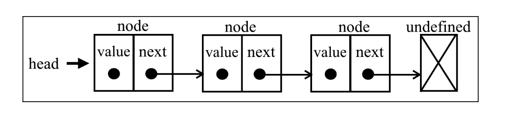
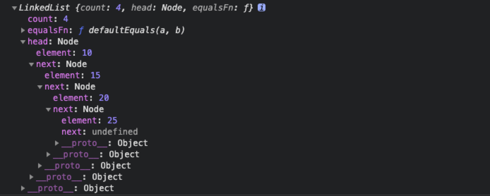
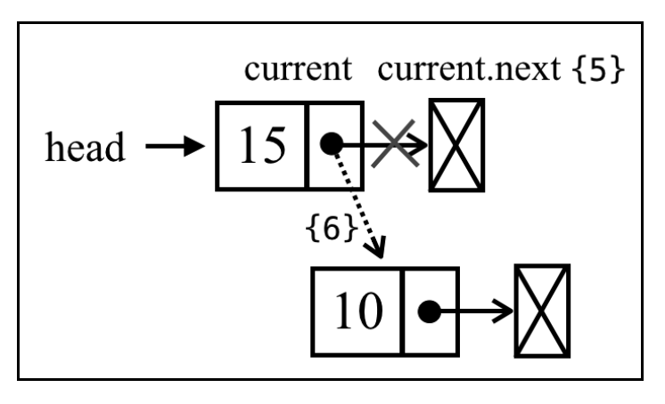
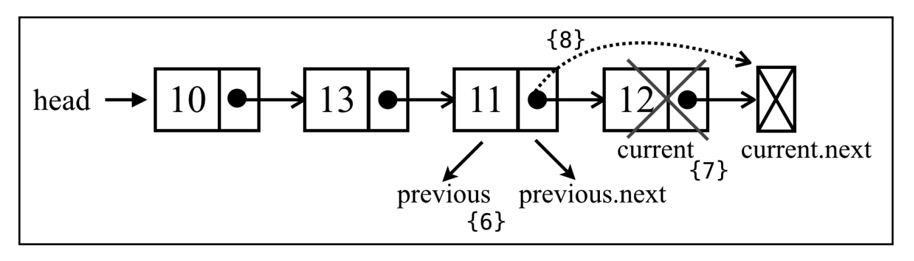
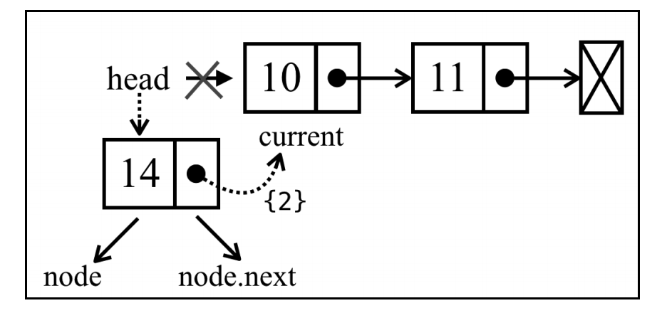
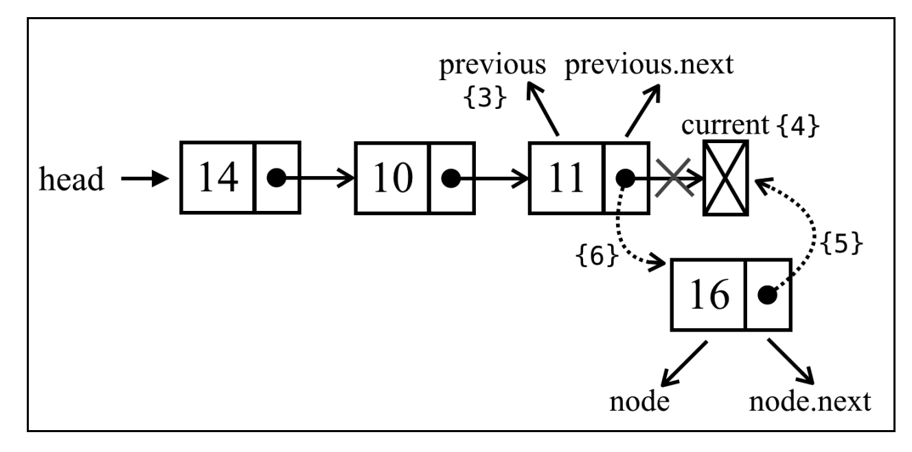

# 链表数据结构

- 数据呈线性排列的数据结构
- 数据的添加和删除都较为方便，就是访问比较耗费时间

## 定义

::: danger 数组的缺点

数组的大小是固定的，从数组的起点或中间插入或移 除项的成本很高，因为需要移动元素

:::

- 链表存储`有序的元素集合`，但不同于数组，链表中的元素在内存中并`不是连续放置`的
- 链表的每个元素都由`元素的值`和指向下一个元素的`指针`组成

下图展示了一个链表的结构：



与数组对比：

- 相对于传统的数组，链表的一个好处在于，添加或移除元素的时候不需要移动其他元素
- 链表需要使用`指针`,其实就是存储`下一个链表元素`
- 在数组中，我们可以直接访问任何位置的任何元素，而要想**访问链表中间的一个元素，则需要从起点(表头)开始迭代链表直到找到所需的元素**。

数据结构如下：



## 方法

添加删除链表元素的中心思想：改变`head`指针和`next`指针

方法 | 说明 | 是否返回
---|---|---
push(element) | 向链表尾部添加一个新元素 | false
insert(element, position) | 向链表的特定位置插入一个新元素 | false
getElementAt(index) | 返回特定位置的元素。不存在，则返回 undefined | true
remove(element) | 从链表中移除一个元素 | true
indexOf(element) | 返回元素的索引。如果链表中没有该元素则返回-1 | true
removeAt(position) | 从链表的特定位置移除一个元素 | true
isEmpty() | 不包含任何元素，返回 true；否则返回 false | true
size() | 返回链表包含的元素个数，与数组的 length 属性类似 | true
toString() | 返回表示整个链表的字符串。只输出元素的值 | true

## 实现

### 定义链表的元素类

```js
class Node {
  constructor(element) {
    this.element = element
    this.next = undefined
  }
}
```

::: tip 说明

- `element`：链表元素的值
- `next`：指向链表中下一个元素的指针（包括下一个元素的值和指针）
- 当一个 Node 实例被创建时，它的 `next` 指针总是 `undefined`

:::

### 定义链表类

```js
function defaultEquals(a, b) {
  return a === b
}
class LinkedList {
  constructor(equalsFn = defaultEquals) {
    this.count = 0
    this.head = undefined
    this.equalsFn = equalsFn
  }
}
```

::: tip 说明

- `count`：链表中元素的数量
- `head`：保存第一个元素的引用
- `equalsFn`：比较两个JavaScript对象或值是否相等的自定义函数，如果没有传入自定义函数，则默认使用`defaultEquals`函数

:::

### 添加元素

两个场景：

- 链表为空，添加的是第一个元素
- 链表不为空，向其追加元素

链表为空：


链表不为空：



```js
push(element) {
  // 链表元素
  const node = new Node(element)

  if (this.head == null) {
    // 添加第一个元素
    this.head = node
  } else {
    let current = this.head
    // 迭代链表找到链表最后一个元素
    while (current.next != null) {
      current = current.next
    }
    current.next = node
  }
  this.count++
}
```

步骤：

1. 传入值`element`，创建`node`元素
2. 链表为空
   1. 指针`head` 指向 `node` 元素。下一个元素自动为`undefined`,因为创建`node`元素的时候，`next`为`undefined`
3. 链表不为空
   1. 定义`current`表示当前元素的指针`head`，循环链表（循环终止条件为`current.next == null`）查找到最后一个元素，同样是赋值给`current`,跳出循环
   2. 将当前元素`current`的指针`next`指向下一个链表节点
4. 最后，递增链表的长度

说明：

```js
this.head == null 
// 等价于下列表达式
(this.head === undefined || head === null)

current.next != null 
// 等价于下列表达式
(current.next !== undefined && current.next !== null)
```

测试：

```js
const list = new LinkedList();
list.push(15);
list.push(10);
```

### 移除特定位置元素

- 从特定位置移除一个元素（ removeAt ）
- 根据元素的值移除元素( remove )

两种场景：

- 第一种是移除第一个元素
- 第二种是移除第一个元素之外的其他元素

删除第一个元素的图解：


删除任意位置元素的图解：



```js
removeAt(index) {
  if (index >= 0 && index < this.count) {
    let current = this.head

    if (index === 0) {
      // 删除第一个元素
      this.head = current.next
    } else {
      let previous
      // 迭代链表，找到目标元素的前一个元素`previous`和后一个元素`current.next`
      for (let i = 0; i < index; i++) {
        previous = current        
        current = current.next     
      }
      // 将目标元素的前一个元素的指针指向后一个元素
      previous.next = current.next
    }
    this.count--
    return current.element
  }
  return undefined
}
```

说明：

- index:移除的元素的位置，应该是从0开始,且小于链表元素个数
- 返回移出的元素的值，如果index无效，则返回`undefined`

步骤：

1. 校验`index`是否有效，无效返回`undefined`
2. 移除第一个元素
   1. 就是让指针`head`指向第二个元素
3. 移除第一个元素之外的其他元素
   1. 迭代链表的节点，找到目标元素`current`，当前元素的前一个元素`previous`和后一个元素`current.next`
   2. 将目标元素的的前一个元素的指针指向目标元素的后一个元素
4. 最后，递减链表的长度，返回要删除的元素的值

### 迭代链表直到目标位置

```js
getElementAt(index) {
  if (index >= 0 && index <= this.count) {
    let node = this.head
    for (let i = 0; i < index && node != null; i++) {
      node = node.next
    }
    return node
  }
  return undefined
}
```

说明

- 校验`index`是否合法,如果不合法返回`undefined`
- 结束循环时， node 元素 将是 index 位置元素的引用

重构`removeAt`方法

```js
removeAt(index) {
  if (index >= 0 && index < this.count) {
    let current = this.head
    if (index === 0) {
      this.head = current.next
    } else {
      const previous = this.getElementAt(index - 1)
      current = previous.next
      previous.next = current.next
    }
    this.count--
    return current.element
  }
  return undefined
}
```

### 插入元素

两种场景：

- 第一种在链表的起点添加一个元素
- 第二种在链表中间或尾部添加一个元素

在链表的起点添加一个元素图解:



在链表中间或尾部添加一个元素图解:




```js
insert(element, index) {
  if (index >= 0 && index <= this.count) {
    const node = new Node(element)
    if (index === 0) {
      const current = this.head
      node.next = current
      this.head = node
    } else {
      const previous = this.getElementAt(index - 1)
      const current = previous.next
      node.next = current
      previous.next = node
    }
    this.count++
    return true
  }
  return false
}
```

说明

- 校验`index`是否合法,如果不合法返回`false`
- 在链表的起点添加一个元素：
  - 把 `node.next` 的值设为 `current`
  - 把 `head` 的引用改为 `node`
- 在链表中间或尾部添加一个元素：
  - 迭代链表，找到目标位置
  - 把新元素和当前元素链接起来
  - 改变 previous 和 current 之间的链接
  - 让 previous.next 指向 node，取代 current

### 查找元素的位置

indexOf 方法接收一个元素的值，如果在链表中找到了它，就返回元素的位置，否则返回-1。

```js
indexOf(element) {
  let current = this.head
  for (let i = 0; i < this.count && current != null; i++) {
    if (this.equalsFn(element, current.element)) {
      return i
    }
    current = current.next
  }
  return -1
}
```

说明：

- 使用一个变量`current`来帮助我们循环访问链表
- 然后迭代元素，直到链表长度为止，为了确保不会发生运行时错误，可以验证一下 current 变量是否为 null 或 undefined
- 每次迭代时，将验证 current 节点的元素和目标元素是否相等

### 移除特定的元素

```js
remove(element) {
  const index = this.indexOf(element)
  return this.removeAt(index)
}
```

### size,isEmpty,getHead

```js
size() {
  return this.count
}
isEmpty() {
  return this.size() === 0
}
getHead() {
  return this.head
}
```

### toString

```js
toString() {
  if (this.head == null) {
    return ''
  }
  let objString = `${this.head.element}`
  let current = this.head.next
  for (let i = 1; i < this.size() && current != null; i++) {
    objString = `${objString},${current.element}`
    current = current.next
  }
  return objString
}
```

### 最终代码

```js
function defaultEquals(a, b) {
  return a === b
}
// 链表元素
class Node {
  constructor(element) {
    this.element = element
    this.next = undefined
  }
}
// 链表类
class LinkedList {
  constructor(equalsFn = defaultEquals) {
    this.count = 0
    this.head = undefined
    this.equalsFn = equalsFn
  }
  push(element) {
    const node = new Node(element)

    if (this.head == null) {
      this.head = node
    } else {
      let current = this.head
      while (current.next != null) {
        current = current.next
      }
      current.next = node
    }
    this.count++
  }
  removeAt(index) {
    if (index >= 0 && index < this.count) {
      let current = this.head
      if (index === 0) {
        this.head = current.next
      } else {
        const previous = this.getElementAt(index - 1)
        current = previous.next
        previous.next = current.next
      }
      this.count--
      return current.element
    }
    return undefined
  }
  getElementAt(index) {
    if (index >= 0 && index <= this.count) {
      let node = this.head
      for (let i = 0; i < index && node != null; i++) {
        node = node.next
      }
      return node
    }
    return undefined
  }
  insert(element, index) {
    if (index >= 0 && index <= this.count) {
      const node = new Node(element)
      if (index === 0) {
        const current = this.head
        node.next = current
        this.head = node
      } else {
        const previous = this.getElementAt(index - 1)
        const current = previous.next
        node.next = current
        previous.next = node
      }
      this.count++
      return true
    }
    return false
  }
  indexOf(element) {
    let current = this.head
    for (let i = 0; i < this.count && current != null; i++) {
      if (this.equalsFn(element, current.element)) {
        return i
      }
      current = current.next
    }
    return -1
  }

  remove(element) {
    const index = this.indexOf(element)
    return this.removeAt(index)
  }

  size() {
    return this.count
  }
  isEmpty() {
    return this.size() === 0
  }
  getHead() {
    return this.head
  }
  toString() {
    if (this.head == null) {
      return ''
    }
    let objString = `${this.head.element}`
    let current = this.head.next
    for (let i = 1; i < this.size() && current != null; i++) {
      objString = `${objString},${current.element}`
      current = current.next
    }
    return objString
  }
}
```