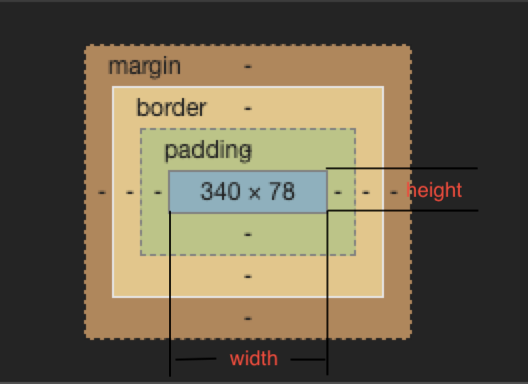

# 盒模型

## 概念

1. [概念](https://developer.mozilla.org/zh-CN/docs/Web/CSS/CSS_Box_Model/Introduction_to_the_CSS_box_model)


2. 说明：（四个部分）

- 内容边界**content**（通过 `width`、`min-width``max-width`、`height`、`min-height`，和 `max-height` 控制）
- 内边距边界**padding**（`padding-top`、`padding-right`、`padding-bottom`、`padding-left`，和简写属性 `padding` 控制）
- 边框边界**border**（边框的粗细由 `border-width` 和简写的 `border` 属性控制）
- 外边框边界**margin**（由 `margin-top`、`margin-right`、`margin-bottom`、`margin-left`，和简写属性 `margin` 控制）

## 标准盒模型与IE模盒型

概念 | 设置模型 | 说明
---|---|---
<div style="width: 80px">标准盒模型</div> | <div style="width: 350px">`box-sizing: content-box;`（默认值）</div> <br> width和height是对**content**设置 | 
IE模型 | `box-sizing: border-box;` 怪异盒模型 <br> width和height是对**content+padding+border**设置 | 

::: tip
1. 如果不想因为改变padding的时候盒子的大小也会跟着变化的话，可以使用怪异盒模型
2. 如果想让盒子的大小被padding撑开的话，可以使用标准盒模型
:::

## JS如何设置获取盒模型对应的宽和高

```js
dom.style.width/height  // 只能取内联样式的宽高
dom.currentStyle.width/height // 只有ie支持
window.getComputedStyle(dom).width/height
dom.getBoundingClientRect().width/height
```