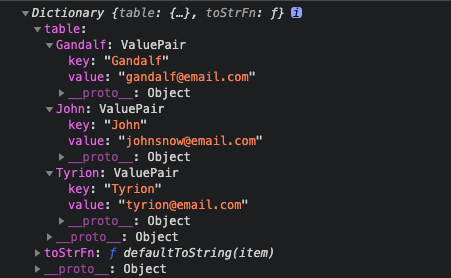
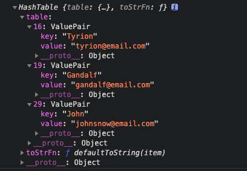

# 字典和散列表

使用字典和散列表，存储唯一值（不重复的值）的数据结构。用`[键，值]对`的形式来存储数据

## 字典

在字典中，存储的是`[键，值]对`，其中键名是用来查询特定元素的。字典和集合很相似，集合以`[值，值]`的形式存储元素，字典则是以`[键，值]`的形式来存储元素。字典也称作**映射**、 **符号表**或**关联数组**。

数据结构：



### 工具函数

将key转化为字符串

```js
function defaultToString(item) {
  if (item === null) {
    return 'NULL'
  } else if (item === undefined) {
    return 'UNDEFINED'
  } else if (typeof item === 'string' || item instanceof String) {
    return `${item}`
  }
  return item.toString()
}
```

- 将`null`转化为`'NULL'`字符串
- 将`undefined`转化为`'UNDEFINED'`字符串
- 字符串默认输出
- 其他的都调用`toString()`转化为字符串

### 创建字典类Dictionary

```js
class Dictionary {
  constructor(toStrFn = defaultToString) {
    this.toStrFn = toStrFn
    this.table = {}
  }
}
```

- 理想情况下，将字符串作为`键名`
- 将`[键，值]`对保存为`table[key] = {key, value}`

### 方法

方法 | 说明 | 是否返回
---|---|---
set(key,value) | 添加新元素。若key已存在，则覆盖value | true
remove(key) | 通过key来移出 | true
hasKey(key) | 查询key是否已存在 | true
get(key) | 通过key查找value | true
clear() | 清空字典 | false
size() | 返回字典所包含值的数量 | true
isEmpty() | 查询字典是否为空 | true
keys() | 将字典所包含的所有`键名`以`数组`形式返回 | true
values() | 将字典所包含的所有`数值`以`数组`形式返回 | true
keyValues() | 将字典中所有`[键，值]对`返回 | true
forEach(callbackFn) | 迭代字典中所有的键值对。 callbackFn 有两个参数： key 和value。该方法可以在回调函数返回 false 时被中止（和 Array 类中的 every 方法相似）。 | true

### 查询key是否已存在

```js
hasKey(key) {
  return this.table[this.toStrFn(key)] != null
}
```

### 添加元素

定义字典元素值类`ValuePair`,保存原始的`key`和`value`

```js
class ValuePair {
  constructor(key, value) {
    this.key = key
    this.value = value
  }
  toString() {
    return `[#${this.key}: ${this.value}]`
  }
}
```

添加新的值，或是更新已有的值

```js
// 添加新的值，或是更新已有的值
set(key, value) {
  if (key != null && value != null) {
    const tableKey = this.toStrFn(key)
    this.table[tableKey] = new ValuePair(key, value)
    return true
  }
  return false
}
```

### 删除元素

```js
remove(key) {
  if (this.hasKey(key)) {
    delete this.table[this.toStrFn(key)]
    return true
  }
  return false
}
```

### 根据key查找value

查找一个特定的 key，并检索它的 value

```js
get(key) {
  const valuePair = this.table[this.toStrFn(key)]
  return valuePair == null ? undefined : valuePair.value
}
```

### 查询所有的key和value

```js
// 查询所有的key
keys() {
  return this.keyValues().map(valuePair => valuePair.key)
}
// 查询所有的value
values() {
  return this.keyValues().map(valuePair => valuePair.value)
}

keyValues() {
  return Object.values(this.table)
}
```

`keyValues()`的ES5实现：

```js
keyValues() {
  const valuePairs = []
  for (const k in this.table) {
    if (this.hasKey(k)) {
      valuePairs.push(this.table[k])
    }
  }
  return valuePairs
}
```

`keys()`的ES5实现：

```js
keys() {
  const keys = []
  const valuePairs = this.keyValues()
  for (let i = 0; i < valuePairs.length; i++) {
    keys.push(valuePairs[i].key)
  }
  return keys
}
```

### 用 forEach 迭代字典中的每个键值对

```js
forEach(callbackFn) {
  const valuePairs = this.keyValues()
  for (let i = 0; i < valuePairs.length; i++) {
    const result = callbackFn(valuePairs[i].key, valuePairs[i].value)
    if (result === false) {
      break
    }
  }
}
```

### 其他方法

```js
size() {
  return Object.keys(this.table).length
}
isEmpty() {
  return this.size() === 0
}
clear() {
  this.table = {}
}
toString() {
  if (this.isEmpty()) {
    return ''
  }
  const valuePairs = this.keyValues()
  let objString = `${valuePairs[0].toString()}`
  for (let i = 1; i < valuePairs.length; i++) {
    objString = `${objString},${valuePairs[i].toString()}`
  }
  return objString
}
```

### 最终实现

```js
function defaultToString(item) {
  if (item === null) {
    return 'NULL'
  } else if (item === undefined) {
    return 'UNDEFINED'
  } else if (typeof item === 'string' || item instanceof String) {
    return `${item}`
  }
  return item.toString()
}
class ValuePair {
  constructor(key, value) {
    this.key = key
    this.value = value
  }
  toString() {
    return `[#${this.key}: ${this.value}]`
  }
}
class Dictionary {
  constructor(toStrFn = defaultToString) {
    this.toStrFn = toStrFn
    this.table = {}
  }
  hasKey(key) {
    return this.table[this.toStrFn(key)] != null
  }
  set(key, value) {
    if (key != null && value != null) {
      const tableKey = this.toStrFn(key)
      this.table[tableKey] = new ValuePair(key, value)
      return true
    }
    return false
  }
  remove(key) {
    if (this.hasKey(key)) {
      delete this.table[this.toStrFn(key)]
      return true
    }
    return false
  }
  get(key) {
    const valuePair = this.table[this.toStrFn(key)]
    return valuePair == null ? undefined : valuePair.value
  }
  keys() {
    return this.keyValues().map(valuePair => valuePair.key)
  }
  values() {
    return this.keyValues().map(valuePair => valuePair.value)
  }
  keyValues() {
    return Object.values(this.table)
  }
  forEach(callbackFn) {
    const valuePairs = this.keyValues()
    for (let i = 0; i < valuePairs.length; i++) {
      const result = callbackFn(valuePairs[i].key, valuePairs[i].value)
      if (result === false) {
        break
      }
    }
  }
  size() {
    return Object.keys(this.table).length
  }
  isEmpty() {
    return this.size() === 0
  }
  clear() {
    this.table = {}
  }
  toString() {
    if (this.isEmpty()) {
      return ''
    }
    const valuePairs = this.keyValues()
    let objString = `${valuePairs[0].toString()}`
    for (let i = 1; i < valuePairs.length; i++) {
      objString = `${objString},${valuePairs[i].toString()}`
    }
    return objString
  }
}
```

测试

```js
const dictionary = new Dictionary()
dictionary.set('Gandalf', 'gandalf@email.com')
dictionary.set('John', 'johnsnow@email.com')
dictionary.set('Tyrion', 'tyrion@email.com')

console.log(dictionary.hasKey('Gandalf'))  // true
console.log(dictionary.size())             // 3
console.log(dictionary.keys())             // ["Gandalf", "John", "Tyrion"]
console.log(dictionary.values())           // ["gandalf@email.com", "johnsnow@email.com", "tyrion@email.com"]
console.log(dictionary.get('Tyrion'))      // tyrion@email.com

dictionary.remove('John')
console.log(dictionary.keys())
console.log(dictionary.values())
console.log(dictionary.keyValues())

dictionary.forEach((k, v) => {
  console.log('forEach: ', `key: ${k}, value: ${v}`)
})
```

## 散列表

`HashTable` 类，也叫 `HashMap` 类，它是 Dictionary 类的一种散列表实现方式

- 散列算法的作用是尽可能快地在数据结构中找到一个值
- 如果要在数据结构中获得一个值（使用 get 方法），需要迭代整个数据结构来找到它。如果使用散列函数，就知道值的具体位置，因此能够快速检索到该值
- 列函数的作用是给定一个键值，然后返回值在表中的地址

数据结构：



### 创建散列类HashTable

```js
class HashTable {
  constructor(toStrFn = defaultToString) {
    this.toStrFn = toStrFn
    this.table = {}
  }
}
```

### 方法

方法 | 说明 | 是否返回
---|---|---
put(key,value) | 向散列表增加一个新的项（也能更新散列表） | true
remove(key) | 根据键值从散列表中移除值 | true
get(key) | 返回根据键值检索到的特定的 | true

### 创建散列函数

```js
hashCode(key) {
  return this.loseloseHashCode(key)
}

loseloseHashCode(key) {
  if (typeof key === 'number') {
    return key
  }
  const tableKey = this.toStrFn(key)
  let hash = 0
  for (let i = 0; i < tableKey.length; i++) {
    hash += tableKey.charCodeAt(i)
  }
  return hash % 37
}
```

loseloseHashCode：

- key如果是`number`类型，直接返回key
- 返回：根据组成 key 的每个字符的 ASCII 码值的和得到一个数

::: danger 提示

- 为了得到比较小的数值，我们会使用 hash 值和一个任意数做除法的余数（ %）
- 这可以规避操作数超过数值变量最大表示范围的风险。

:::

### 添加元素

```js
put(key, value) {
  if (key != null && value != null) {
    const position = this.hashCode(key)
    this.table[position] = new ValuePair(key, value)
    return true
  }
  return false
}
```

### 根据key获取value

```js
get(key) {
  const valuePair = this.table[this.hashCode(key)]
  return valuePair == null ? undefined : valuePair.value
}
```

### 移除元素

```js
remove(key) {
  const hash = this.hashCode(key)
  const valuePair = this.table[hash]
  if (valuePair != null) {
    delete this.table[hash]
    return true
  }
  return false
}
```

### 最终实现

```js
function defaultToString(item) {
  if (item === null) {
    return 'NULL'
  } else if (item === undefined) {
    return 'UNDEFINED'
  } else if (typeof item === 'string' || item instanceof String) {
    return `${item}`
  }
  return item.toString()
}
class ValuePair {
  constructor(key, value) {
    this.key = key
    this.value = value
  }
  toString() {
    return `[#${this.key}: ${this.value}]`
  }
}
class HashTable {
  constructor(toStrFn = defaultToString) {
    this.toStrFn = toStrFn
    this.table = {}
  }
  put(key, value) {
    if (key != null && value != null) {
      const position = this.hashCode(key)
      this.table[position] = new ValuePair(key, value)
      return true
    }
    return false
  }
  get(key) {
    const valuePair = this.table[this.hashCode(key)]
    return valuePair == null ? undefined : valuePair.value
  }
  remove(key) {
    const hash = this.hashCode(key)
    const valuePair = this.table[hash]
    if (valuePair != null) {
      delete this.table[hash]
      return true
    }
    return false
  }
  loseloseHashCode(key) {
    if (typeof key === 'number') {
      return key
    }
    const tableKey = this.toStrFn(key)
    let hash = 0
    for (let i = 0; i < tableKey.length; i++) {
      hash += tableKey.charCodeAt(i)
    }
    return hash % 37
  }
  hashCode(key) {
    return this.loseloseHashCode(key)
  }
}
```

测试

```js
const hash = new HashTable();
hash.put('Gandalf', 'gandalf@email.com');
hash.put('John', 'johnsnow@email.com');
hash.put('Tyrion', 'tyrion@email.com');
console.log(hash.hashCode('Gandalf') + ' - Gandalf');   // 19 - Gandalf
console.log(hash.hashCode('John') + ' - John');         // 29 - John
console.log(hash.hashCode('Tyrion') + ' - Tyrion');     // 16 - Tyrion

console.log(hash.get('Gandalf'));                       // gandalf@email.com
console.log(hash.get('Loiane'));                        // undefined
hash.remove('Gandalf');
console.log(hash.get('Gandalf'));
```

## 处理散列表中的冲突

有时候，一些键会有相同的散列值。不同的值在散列表中对应相同位置的时候，我们称其为冲突

有三种方法来处理分离链接、线性探查和双散列法

### 分离链接

分离链接法包括为散列表的每一个位置创建一个链表并将元素存储在里面。它是解决冲突的最简单的方法，但是在 HashTable 实例之外还需要额外的存储空间

创建HashTableSeparateChaining类：

```js
class HashTableSeparateChaining {
  constructor(toStrFn = defaultToString) {
    this.toStrFn = toStrFn
    this.table = {}
  }
}
```

put方法：

```js
put(key, value) {
  if (key != null && value != null) {
    const position = this.hashCode(key)
    if (this.table[position] == null) {
      this.table[position] = new LinkedList()
    }
    this.table[position].push(new ValuePair(key, value))
    return true
  }
  return false
}
```

get方法：

```js
get(key) {
  const position = this.hashCode(key)
  const linkedList = this.table[position]
  if (linkedList != null && !linkedList.isEmpty()) {
    let current = linkedList.getHead()
    while (current != null) {
      if (current.element.key === key) {
        return current.element.value
      }
      current = current.next
    }
  }
  return undefined
}
```

remove方法：

```js
remove(key) {
  const position = this.hashCode(key)
  const linkedList = this.table[position]
  if (linkedList != null && !linkedList.isEmpty()) {
    let current = linkedList.getHead()
    while (current != null) {
      if (current.element.key === key) {
        linkedList.remove(current.element)
        if (linkedList.isEmpty()) {
          delete this.table[position]
        }
        return true
      }
      current = current.next
    }
  }
  return false
}
```

### 线性探查

## 创建更好的散列函数

lose lose 散列函数并不是一个表现良好的散列函数，因为它会产生太多的冲突。

一个表现良好的散列函数是由几个方面构成的：插入和检索元素的时间（即性能），以及较低的冲突可能性。

```js
djb2HashCode(key) {
  const tableKey = this.toStrFn(key); 
  let hash = 5381;
  for (let i = 0; i < tableKey.length; i++) { 
    hash = (hash * 33) + tableKey.charCodeAt(i);
  }
  return hash % 1013;
}
```

## 原生Map类

```js
const map = new Map();
map.set('Gandalf', 'gandalf@email.com');
map.set('John', 'johnsnow@email.com');
map.set('Tyrion', 'tyrion@email.com');
console.log(map.has('Gandalf')); 
// true
console.log(map.size); 
// 3
console.log(map.keys()); 
// 输出{"Gandalf", "John", "Tyrion"}
console.log(map.values()); 
// 输出{"gandalf@email.com", "johnsnow@email.com","tyrion@email.com"}
console.log(map.get('Tyrion')); 
// tyrion@email.com
map.delete('John')
```

- Map 类的 values 方法和 keys 方法都返回Iterator，而不是值或键构成的数组。
- 另一个区别是，我们实现的 size 方法返回字典中存储的值的个数，而 ES2015 的 Map 类则有一个 size 属性
- delete 方法
- clear 方法

## WeakMap 类和 WeakSet 类

除了 Set 和 Map 这两种新的数据结构， ES2015还增加了它们的弱化版本， WeakSet 和 WeakMap。
基本上， Map 和 Set 与其弱化版本之间仅有的区别是：

- WeakSet 或 WeakMap 类没有 entries、 keys 和 values 等方法；
- 只能用对象作为键。

创建和使用这两个类主要是为了性能。 WeakSet 和 WeakMap 是弱化的（用对象作为键），没有强引用的键。这使得 JavaScript 的垃圾回收器可以从中清除整个入口。

另一个优点是，必须用键才可以取出值。这些类没有 entries、 keys 和 values 等迭代器160 第 8 章 字典和散列表方法， 因此，除非你知道键，否则没有办法取出值

```js
const map = new WeakMap();
const ob1 = { name: 'Gandalf' }; // {1}
const ob2 = { name: 'John' };
const ob3 = { name: 'Tyrion' };
map.set(ob1, 'gandalf@email.com'); // {2}
map.set(ob2, 'johnsnow@email.com');
map.set(ob3, 'tyrion@email.com');
console.log(map.has(ob1)); // true {3}
console.log(map.get(ob3)); // tyrion@email.com {4}
map.delete(ob2); // {5}
```

WeakMap 类也可以用 set 方法（行{2}），但不能使用数、字符串、布尔值等基本数据类型，需要将名字转换为对象（行{1}）。

搜索（行{3}）、读取（行{4}）和删除值（行{5}），也要传入作为键的对象。

同样的逻辑也适用于 WeakSet 类。
