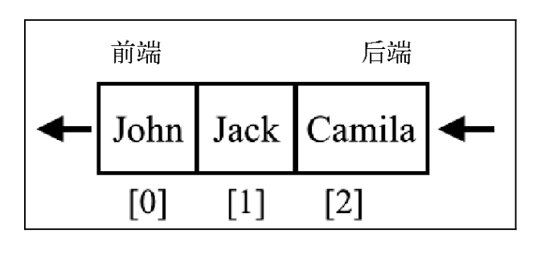
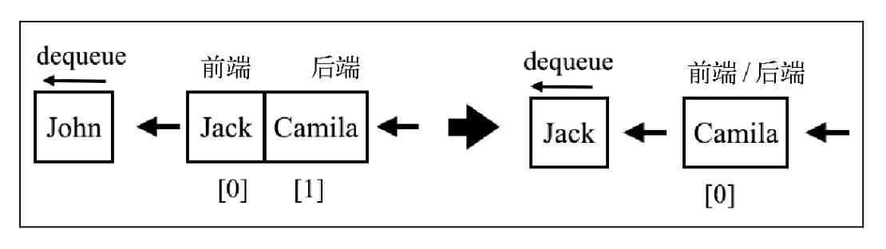
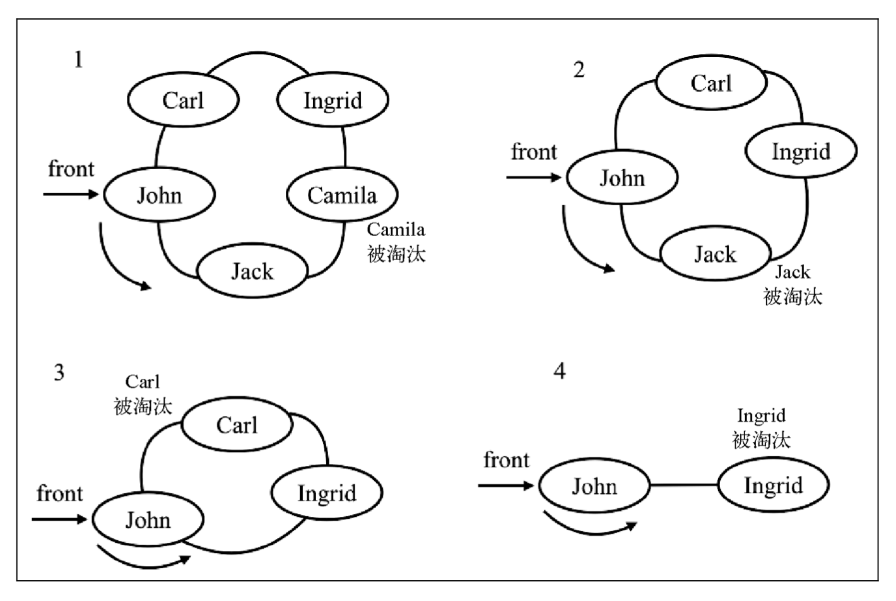

# 队列和双端队列

## 定义

队列是遵循`先进先出`(FIFO，也称为先来先服务)原则的一组有序的项。队列在尾部添加新元素，并从顶部移除元素。最新添加的元素必须排在队列的末尾。

## 方法

方法 | 说明 | 是否有返回
---|---|---
enqueue(element(s)) | 向队列尾部添加一个(或多个)新的项 | false
clear | 清空队列 | false
dequeue() | 移除队列的第一项(即排在队列最前面的项)并返回被移除的元素 | true
peek() | 返回队列中第一个元素——最先被添加，队列不做任何变动 | true
isEmpty() | 如果队列中不包含任何元素，返回 true，否则返回 false | true
size() | 返回队列包含的元素个数，与数组的 length 属性类似 | true

## 使用对象实现

可以使用数组，但是，为了写出一个在获取元素时更高效的数据结构，使用一个对象来存储元素

```js
class Queue {
  constructor() {
    this.count = 0 // 记录队列的大小
    this.lowestCount = 0 // 记录队列的前端
    this.items = {}
  }
  // 从`队列末尾`添加元素
  enqueue(element) {
    this.items[this.count] = element
    this.count++
  }
  // 从`队列头部`移除元素
  dequeue() {
    if (this.isEmpty()) {
      return undefined
    }
    // 删除队列前端
    const result = this.items[this.lowestCount]
    delete this.items[this.lowestCount]
    this.lowestCount++
    return result
  }
  peek() {
    if (this.isEmpty()) {
      return undefined
    }
    return this.items[this.lowestCount]
  }
  isEmpty() {
    return this.count - this.lowestCount === 0
  }
  size() {
    return this.count - this.lowestCount
  }
  clear() {
    this.items = {}
    this.count = 0
    this.lowestCount = 0
  }
  toString() {
    if (this.isEmpty()) {
      return ''
    }
    let objString = `${this.items[this.lowestCount]}`
    for (let i = this.lowestCount + 1; i < this.count; i++) {
      objString = `${objString},${this.items[i]}`
    }
    return objString
  }
}
```

测试：

```js
const queue = new Queue(); 
console.log(queue.isEmpty()); // 输出true
queue.enqueue('John');
queue.enqueue('Jack');
console.log(queue.toString()); // John,Jack
queue.enqueue('Camila');
```

下图描绘了对队列的操作和当前的状态：



```js
queue.dequeue(); // 移除John
queue.dequeue(); // 移除Jack
```

下图描绘了对队列的操作和当前的状态：



## 双端队列数据结构

**双端队列**(deque，或称 double-ended queue)是一种允许我们同时从前端和后端添加和移除元素的特殊队列。

由于双端队列同时遵守了**先进先出**和**后进先出**原则，可以说它是把`队列`和`栈`相结合的一种数据结构。

### 方法

- 与队列相同的方法：isEmpty、clear、size 和 toString
- addFront(element):该方法在双端队列前端添加新的元素
- addBack(element):该方法在双端队列后端添加新的元素(实现方法和 Queue 类中的 enqueue 方法相同)
- removeFront():该方法会从双端队列前端移除第一个元素(实现方法和 Queue 类中的 dequeue 方法相同)
- removeBack():该方法会从双端队列后端移除第一个元素(实现方法和 Stack 类中的 pop 方法一样)
- peekFront():该方法返回双端队列前端的第一个元素(实现方法和 Queue 类中的 peek 方法一样)
- peekBack():该方法返回双端队列后端的第一个元素(实现方法和 Stack 类中的 peek 方法一样)

### 实现

```js
class Deque {
  constructor() {
    this.count = 0
    this.lowestCount = 0
    this.items = {}
  }
  // 向双端队列的前端添加元素
  addFront(element) {
    if (this.isEmpty()) {
      // 场景一：双端队列是空的
      this.addBack(element)
    } else if (this.lowestCount > 0) {
      // 场景二：一个元素已经被从双端队列的前端移除
      this.lowestCount--
      this.items[this.lowestCount] = element
    } else {
      // 场景三：lowestCount 为 0 的情况
      for (let i = this.count; i > 0; i--) {
        this.items[i] = this.items[i - 1]
      }
      this.count++
      this.lowestCount = 0
      this.items[0] = element
    }
  }

  // 以下方法都是Stack和Queue中已实现的
  // 双端队列后端添加新的元素
  addBack(element) {
    this.items[this.count] = element
    this.count++
  }

  // 双端队列前端移除第一个元素
  removeFront() {
    if (this.isEmpty()) {
      return undefined
    }
    const result = this.items[this.lowestCount]
    delete this.items[this.lowestCount]
    this.lowestCount++
    return result
  }
  // 双端队列后端移除第一个元素
  removeBack() {
    if (this.isEmpty()) {
      return undefined
    }
    this.count--
    const result = this.items[this.count]
    delete this.items[this.count]
    return result
  }
  // 双端队列前端的第一个元素
  peekFront() {
    if (this.isEmpty()) {
      return undefined
    }
    return this.items[this.lowestCount]
  }
  // 双端队列后端的第一个元素
  peekBack() {
    if (this.isEmpty()) {
      return undefined
    }
    return this.items[this.count - 1]
  }

  // 以下方法同普通队列相同
  isEmpty() {
    return this.count - this.lowestCount === 0
  }
  size() {
    return this.count - this.lowestCount
  }
  clear() {
    this.items = {}
    this.count = 0
    this.lowestCount = 0
  }
  toString() {
    if (this.isEmpty()) {
      return ''
    }
    let objString = `${this.items[this.lowestCount]}`
    for (let i = this.lowestCount + 1; i < this.count; i++) {
      objString = `${objString},${this.items[i]}`
    }
    return objString
  }
}
```

测试：

```js
const deque = new Deque();
console.log(deque.isEmpty());                   // 输出true
deque.addBack('John'); 0 deque.addBack('Jack');
console.log(deque.toString());                  // John, Jack
deque.addBack('Camila');
console.log(deque.toString());                  // John, Jack, Camila
console.log(deque.size());                      // 输出3
console.log(deque.isEmpty());                   // 输出false
deque.removeFront();                            // 移除John
console.log(deque.toString());                  // Jack, Camila
deque.removeBack();                             // Camila 决定离开
console.log(deque.toString());                  // Jack
deque.addFront('John');                         // John 回来询问一些信息
console.log(deque.toString());                  // John, Jack
```

## 应用

### 击鼓传花游戏

击鼓传花游戏(hot potato)。在这个游戏中，孩子们围成一个圆圈，把花尽快地传递给旁边的人。某一时刻传花停止， 这个时候花在谁手里，谁就退出圆圈、结束游戏。重复这个过程，直到只剩一个孩子(胜者)。击鼓传花游戏是一个循环队列

模拟击鼓传花游戏：

```js
function hotPotato(elementsList, num) {
  const queue = new Queue()
  const elimitatedList = []
  // 遍历人数，将人添加到队列中
  for (let i = 0; i < elementsList.length; i++) {
    queue.enqueue(elementsList[i])
  }
  // 迭代队列，从队列开头移除一项，再将其添加到队列末尾
  while (queue.size() > 1) {
    for (let i = 0; i < num; i++) {
      queue.enqueue(queue.dequeue())
    }
    // 一旦达到给定的传递次数，拿着花的那个人就被淘汰了(从队列中 移除)
    elimitatedList.push(queue.dequeue())
  }
  return {
    eliminated: elimitatedList,
    winner: queue.dequeue(), // 最后只剩下一个人的时候，这个人就是胜者
  }
}
```

使用下面的代码来尝试 hotPotato 算法：

```js
const names = ['John', 'Jack', 'Camila', 'Ingrid', 'Carl'];
const result = hotPotato(names, 7);
result.eliminated.forEach(name => {
  console.log(`${name}在击鼓传花游戏中被击败`)
});
console.log(`胜利者: ${result.winner}`);

// 结果如下
// Camila在击鼓传花游戏中被击败
// Jack在击鼓传花游戏中被击败
// Carl在击鼓传花游戏中被击败
// Ingrid在击鼓传花游戏中被击败
// 胜利者: John
```

过程图解：



### 回文检查器

回文是正反都能读通的单词、词组、数或一系列字符的序列，例如 madam 或 racecar

- 有不同的算法可以检查一个词组或字符串是否为回文。
- 最简单的方式是`将字符串反向排列`并`检查它和原字符串是否相同`。如果两者相同，那么它就是一个回文。
- 也可以用栈来完成，但是利用数据结构来解决这个问题的最简单方法是使用双端队列

```js
function palindromeChecker(aString) {
  // 检查传入的字符串参数是否合法
  if (aString === undefined || aString === null || (aString !== null && aString.length === 0)) {
    return false
  }
  const deque = new Deque()
  const lowerString = aString
    .toLocaleLowerCase()  // 所有字母转化为小写
    .split(' ')           // 移除所有的空格
    .join('')
  let isEqual = true
  let firstChar, lastChar
  // 遍历字符串，将所有的字符串添加到队列中
  for (let i = 0; i < lowerString.length; i++) {
    // charAt(i)：获取一个字符串中下标为i的子字符串
    deque.addBack(lowerString.charAt(i))
  }

  while (deque.size() > 1 && isEqual) {
    // 如果所有元素都在双端 队列中(如果只有一个字符的话，那它肯定是回文)并且首尾字符相同的话
    // 从前端移除一个元素
    firstChar = deque.removeFront()
    // 再从后端移除一个元素
    lastChar = deque.removeBack()
    // 要使字符串为回文，移除的 两个字符必须相同。如果字符不同的话，这个字符串就不是一个回文
    if (firstChar !== lastChar) {
      isEqual = false
    }
  }
  return isEqual
}
```

测试：

```js
// 都是 true
console.log('a', palindromeChecker('a'));
console.log('aa', palindromeChecker('aa'));
console.log('kayak', palindromeChecker('kayak'));
console.log('level', palindromeChecker('level'));
console.log('Was it a car or a cat I saw', palindromeChecker('Was it a car or a cat I saw'));
console.log('Step on no pets', palindromeChecker('Step on no pets'));
```

### JavaScript 任务队列

当我们在浏览器中打开新标签时，就会创建一个任务队列。这是因为每个标签都是单线程处 理所有的任务，称为事件循环。浏览器要负责多个任务，如渲染 HTML、执行 JavaScript 代码、 处理用户交互(用户输入、鼠标点击等)、执行和处理异步请求

[事件循环](https://jakearchibald.com/2015/tasks-microtasks-queues-and-schedules/)