# 排序和搜索算法

## 排序算法

[动画演示](https://visualgo.net/zh/sorting)

- 冒泡排序
- 选择排序
- 插入排序
- 希尔排序
- 归并排序
- 快速排序
- 计数排序
- 桶排序
- 基数排序

从最慢的一个开始，接着是一些性能较好的算法

### 冒泡排序

- 比较所有相邻的两个项，如果第一个比第二个大，则交换它们
- 时间复杂度是 O(n²)

```js
const Compare = {
  LESS_THAN: -1,
  BIGGER_THAN: 1,
}
function defaultCompare(a, b) {
  if (a === b) {
    return 0
  }
  return a < b ? Compare.LESS_THAN : Compare.BIGGER_THAN
}
// 交换函数
function swap(array, a, b) {
  const temp = array[a]
  array[a] = array[b]
  array[b] = temp
}
function bubbleSort(array, compareFn = defaultCompare) {
  const { length } = array
  // 外循环
  for (let i = 0; i < length; i++) {
    // 内循环
    for (let j = 0; j < length - 1; j++) {
      if (compareFn(array[j], array[j + 1]) === Compare.BIGGER_THAN) {
        swap(array, j, j + 1)
      }
    }
  }
  return array
}

const arr = [5, 4, 3, 2, 1]
console.log(bubbleSort(arr))

// [1, 2, 3, 4, 5]
```

说明：

- 外循环：会从数组的第一位迭代至最后一位，它控制了在数组中经过多少轮排序（应该是数组中每项都经过一轮，轮数和数组长度一致）。
- 内循环：将从第一位迭代至倒数第二位，内循环实际上进行当前项和下一项的比较
- 当前项比下一项大，则交换它们

过程图解：

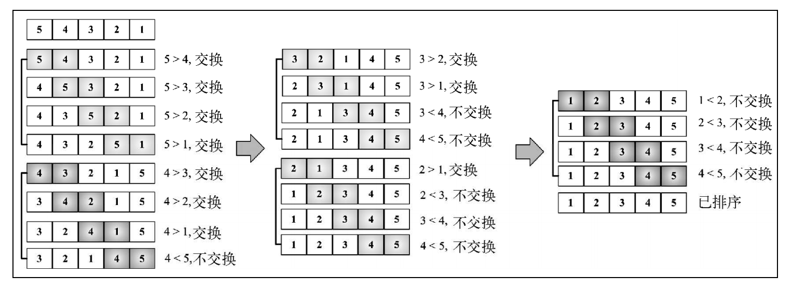

问题：

注意当算法执行外循环的第二轮的时候，数字 4 和 5 已经是正确排序的了。尽管如此，在后续比较中，它们还在一直进行着比较，即使这是不必要的

### 改进后的冒泡排序

```js
const Compare = {
  LESS_THAN: -1,
  BIGGER_THAN: 1,
}
function defaultCompare(a, b) {
  if (a === b) {
    return 0
  }
  return a < b ? Compare.LESS_THAN : Compare.BIGGER_THAN
}
// 交换函数
function swap(array, a, b) {
  const temp = array[a]
  array[a] = array[b]
  array[b] = temp
}
function modifiedBubbleSort(array, compareFn = defaultCompare) {
  const { length } = array
  for (let i = 0; i < length; i++) {
    for (let j = 0; j < length - 1 - i; j++) {
      if (compareFn(array[j], array[j + 1]) === Compare.BIGGER_THAN) {
        swap(array, j, j + 1)
      }
    }
  }
  return array
}
```

过程图解：

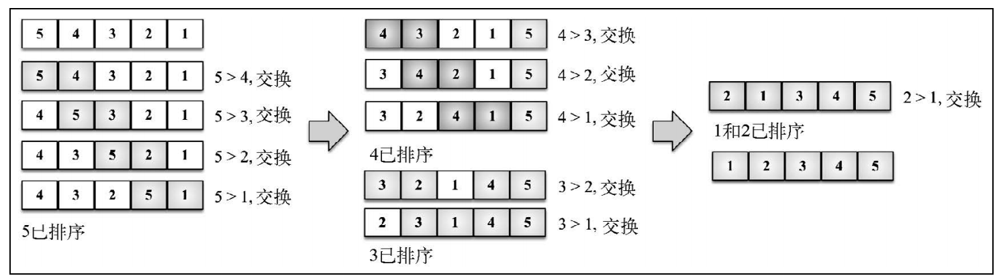

### 选择排序

- 大致的思路是找到数据结构中的最小值并将其放置在第一位，接着找到第二小的值并将其放在第二位，以此类推
- 时间复杂度是 O(n²)

```js
const Compare = {
  LESS_THAN: -1,
  BIGGER_THAN: 1,
}
function defaultCompare(a, b) {
  if (a === b) {
    return 0
  }
  return a < b ? Compare.LESS_THAN : Compare.BIGGER_THAN
}
// 交换函数
function swap(array, a, b) {
  const temp = array[a]
  array[a] = array[b]
  array[b] = temp
}

function selectionSort(array, compareFn = defaultCompare) {
  const { length } = array
  let indexMin
  for (let i = 0; i < length - 1; i++) {
    indexMin = i
    for (let j = i; j < length; j++) {
      if (compareFn(array[indexMin], array[j]) === Compare.BIGGER_THAN) {
        indexMin = j
      }
    }
    if (i !== indexMin) {
      swap(array, i, indexMin)
    }
  }
  return array
}

const arr = [5, 4, 3, 2, 1]
console.log(selectionSort(arr))
```

过程图解：

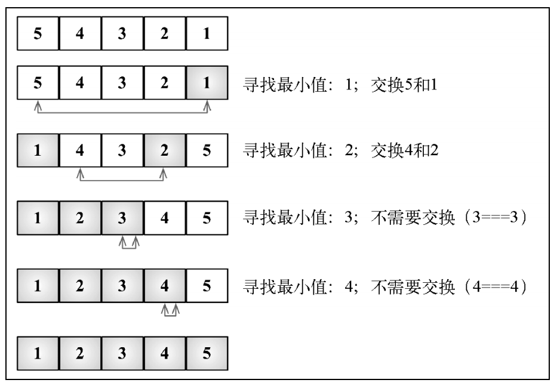

### 插入排序

- 每次排一个数组项，以此方式构建最后的排序数组。
- 假定第一项已经排序了。接着，它和第二项进行比较——第二项是应该待在原位还是插到第一项之前呢？这样，头两项就已正确排序，接着和第三项比较（它是该插入到第一、第二还是第三的位置呢），以此类推
- 排序小型数组时，此算法比选择排序和冒泡排序性能要好
- 时间复杂度是 O(n²)

```js
const Compare = {
  LESS_THAN: -1,
  BIGGER_THAN: 1,
}
function defaultCompare(a, b) {
  if (a === b) {
    return 0
  }
  return a < b ? Compare.LESS_THAN : Compare.BIGGER_THAN
}

function insertionSort(array, compareFn = defaultCompare) {
  const { length } = array
  let temp
  for (let i = 1; i < length; i++) {
    let j = i
    temp = array[i]
    while (j > 0 && compareFn(array[j - 1], temp) === Compare.BIGGER_THAN) {
      array[j] = array[j - 1]
      j--
    }
    array[j] = temp
  }
  return array
}

const arr = [5, 4, 3, 2, 1]
console.log(insertionSort(arr))
```

过程图解：

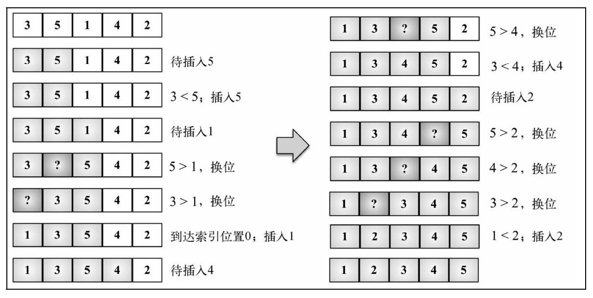

### 归并排序

归并排序是一种分而治之算法。其思想是将原始数组切分成较小的数组，直到每个小数组只有一个位置，接着将小数组归并成较大的数组，直到最后只有一个排序完毕的大数组

- 是第一个可以实际使用的排序算法。前面三个排序算法性能不好，但归并排序性能不错
- 复杂度为 O(nlog(n))

```js
const Compare = {
  LESS_THAN: -1,
  BIGGER_THAN: 1,
}
function defaultCompare(a, b) {
  if (a === b) {
    return 0
  }
  return a < b ? Compare.LESS_THAN : Compare.BIGGER_THAN
}
function merge(left, right, compareFn) {
  let i = 0
  let j = 0
  const result = []
  while (i < left.length && j < right.length) {
    result.push(compareFn(left[i], right[j]) === Compare.LESS_THAN ? left[i++] : right[j++])
  }
  return result.concat(i < left.length ? left.slice(i) : right.slice(j))
}
function mergeSort(array, compareFn = defaultCompare) {
  if (array.length > 1) {
    const { length } = array
    const middle = Math.floor(length / 2)
    const left = mergeSort(array.slice(0, middle), compareFn)
    const right = mergeSort(array.slice(middle, length), compareFn)
    array = merge(left, right, compareFn)
  }
  return array
}

const arr = [5, 4, 3, 2, 1]
console.log(mergeSort(arr))
```

过程图解：

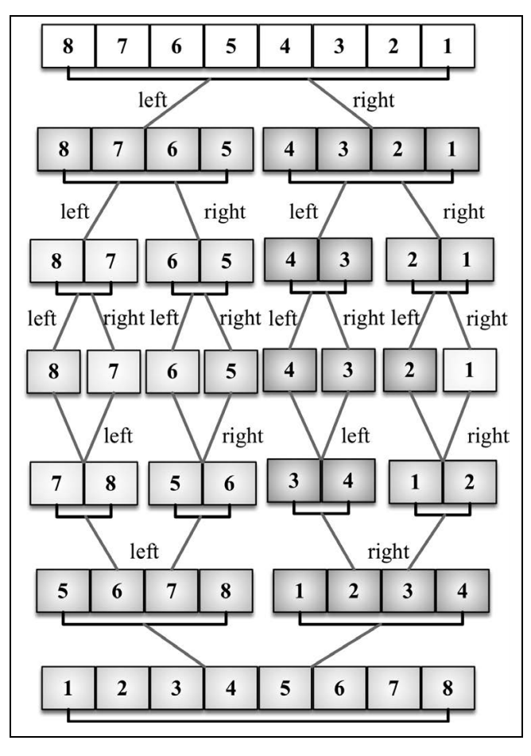

### 快速排序

快速排序也许是最常用的排序算法了

- 复杂度为 O(nlog(n))，且性能通常比其他复杂度为 O(nlog(n))的排序算法要好。
- 和归并排序一样，快速排序也使用分而治之的方法，将原始数组分为较小的数组

```js
const Compare = {
  LESS_THAN: -1,
  BIGGER_THAN: 1,
}
function defaultCompare(a, b) {
  if (a === b) {
    return 0
  }
  return a < b ? Compare.LESS_THAN : Compare.BIGGER_THAN
}
// 交换函数
function swap(array, a, b) {
  const temp = array[a]
  array[a] = array[b]
  array[b] = temp
}
function quickSort(array, compareFn = defaultCompare) {
  return quick(array, 0, array.length - 1, compareFn)
}
function quick(array, left, right, compareFn) {
  let index
  if (array.length > 1) {
    index = partition(array, left, right, compareFn)
    if (left < index - 1) {
      quick(array, left, index - 1, compareFn)
    }
    if (index < right) {
      quick(array, index, right, compareFn)
    }
  }
  return array
}
function partition(array, left, right, compareFn) {
  const pivot = array[Math.floor((right + left) / 2)]
  let i = left
  let j = right
  while (i <= j) {
    while (compareFn(array[i], pivot) === Compare.LESS_THAN) {
      i++
    }
    while (compareFn(array[j], pivot) === Compare.BIGGER_THAN) {
      j--
    }
    if (i <= j) {
      swap(array, i, j)
      i++
      j--
    }
  }
  return i
}
const arr = [3, 5, 1, 6, 4, 7, 2]
console.log(quickSort(arr))

```

过程图解：

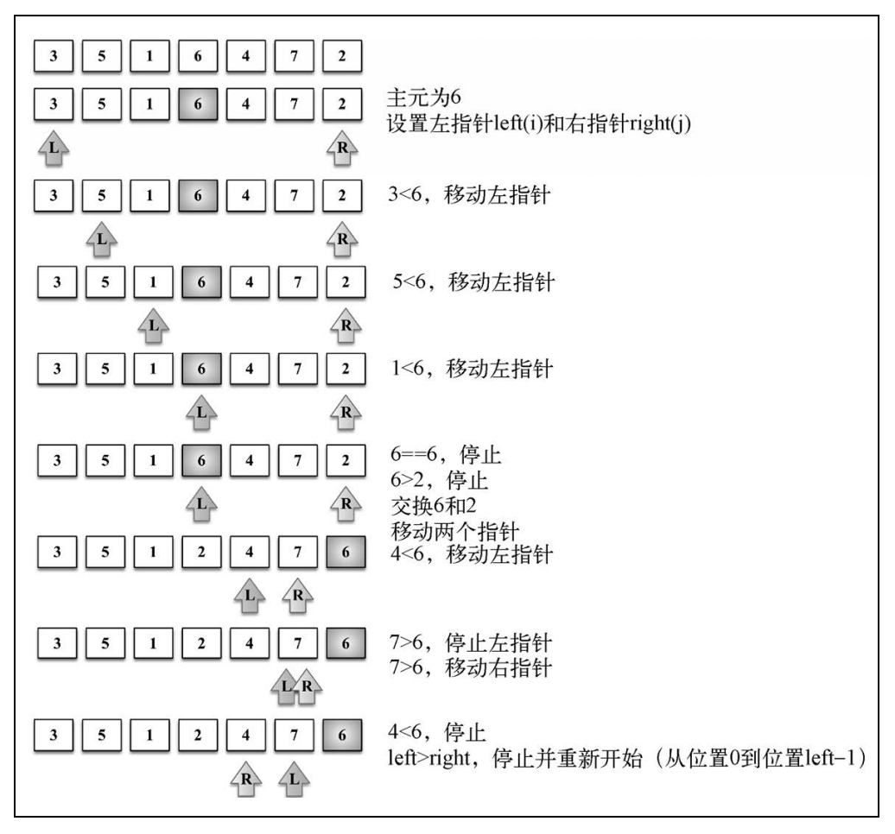

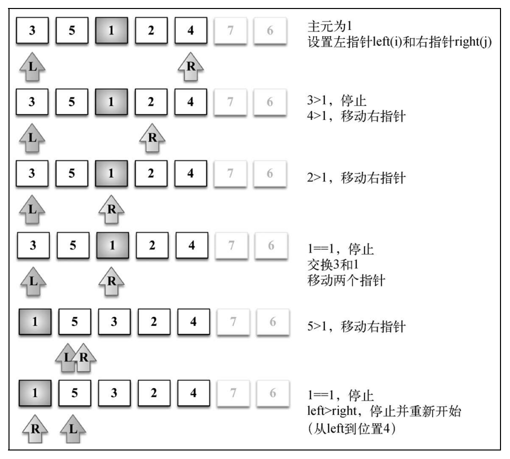

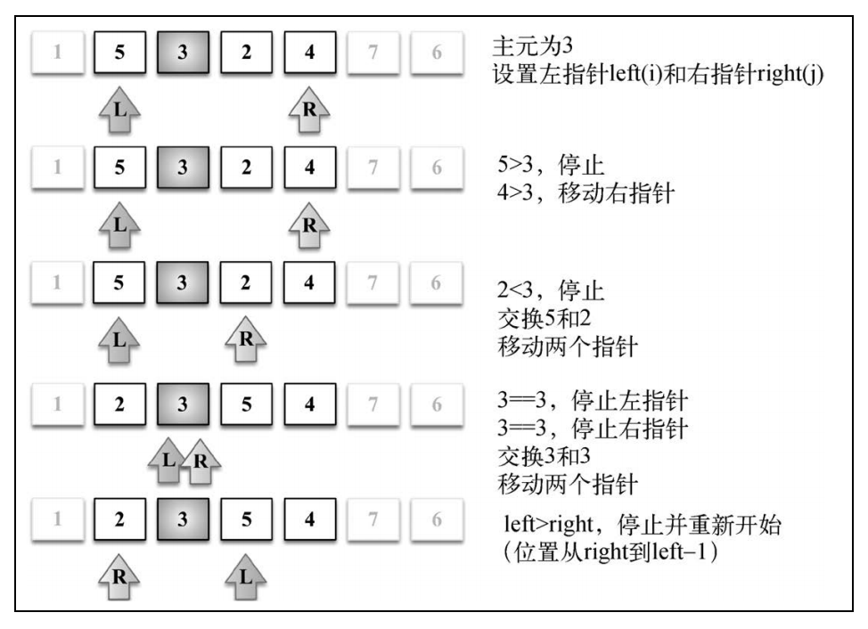

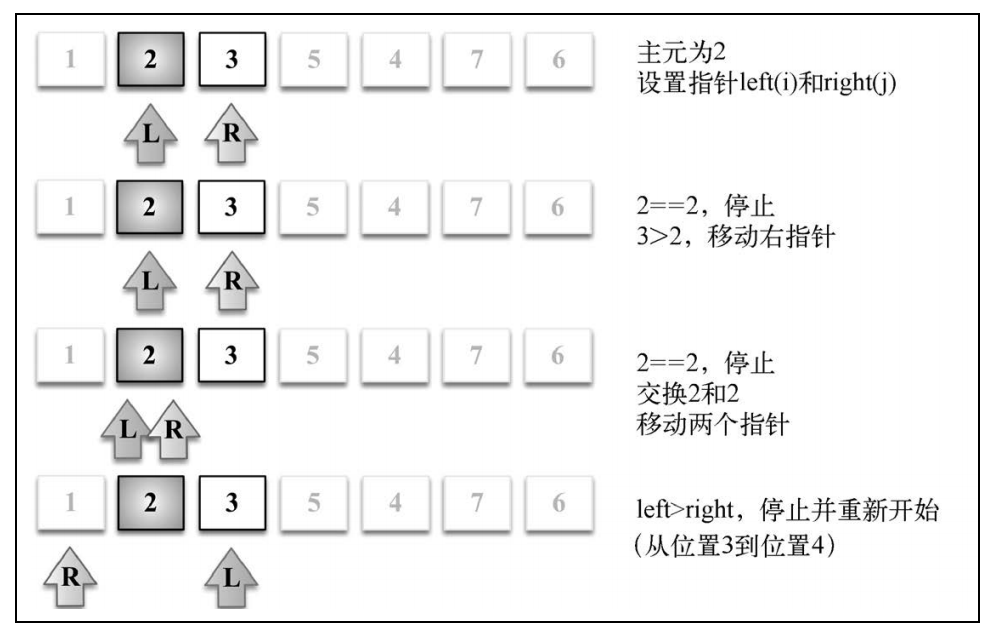

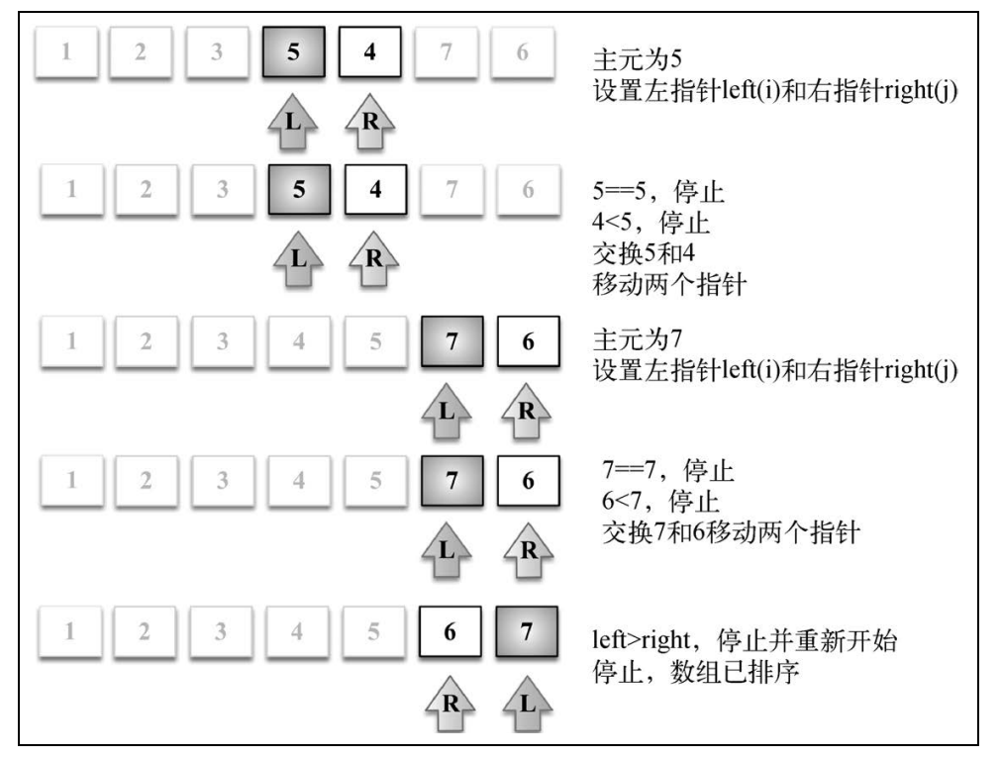

### 计数排序

- 是一个分布式排序
- 时间复杂度为 O(n+k)，其中 k 是临时计数数组的大小；
- 但是，它确实需要更多的内存来存放临时数组。

```js
function countingSort(array) {
  if (array.length < 2) {
    return array
  }
  const maxValue = findMaxValue(array)
  const counts = new Array(maxValue + 1)
  array.forEach(element => {
    if (!counts[element]) {
      counts[element] = 0
    }
    counts[element]++
  })
  let sortedIndex = 0
  counts.forEach((count, i) => {
    while (count > 0) {
      array[sortedIndex++] = i
      count--
    }
  })
  return array
}
function findMaxValue(array) {
  let max = array[0]
  for (let i = 1; i < array.length; i++) {
    if (array[i] > max) {
      max = array[i]
    }
  }
  return max
}
const arr = [3, 5, 1, 6, 4, 7, 2]
console.log(countingSort(arr))

```

过程图解：

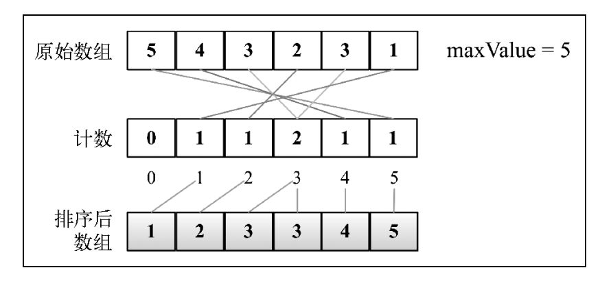

### 桶排序

桶排序（也被称为箱排序）也是分布式排序算法，它将元素分为不同的桶（较小的数组），
再使用一个简单的排序算法，例如插入排序（用来排序小数组的不错的算法），来对每个桶进行
排序。然后，它将所有的桶合并为结果数组。

### 基数排序

基数排序也是一个分布式排序算法，它根据数字的有效位或基数（这也是它为什么叫基数排
序）将整数分布到桶中。基数是基于数组中值的记数制的。

## 搜索算法

- 顺序搜索
- 内插搜索
- 二分搜索算法

### 顺序搜索

### 二分搜索

### 内插搜索

## 随机算法
