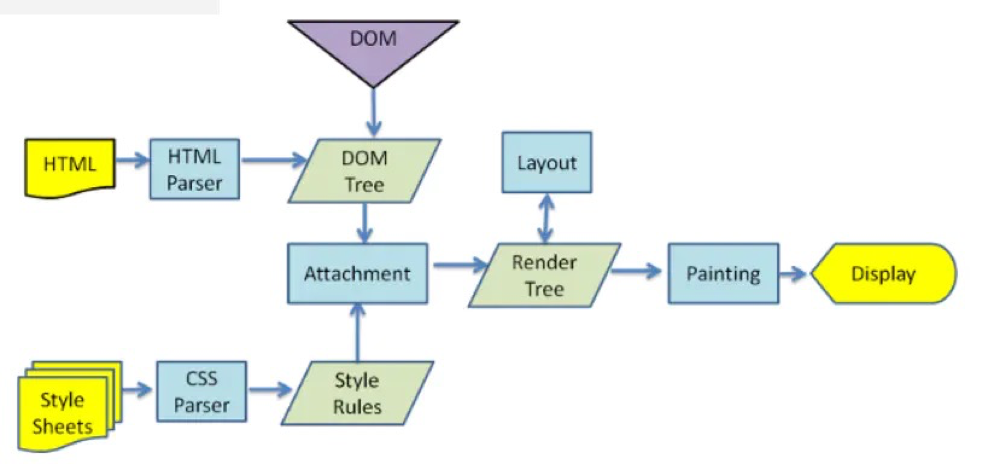

# 浏览器的渲染过程

以webkit渲染的为例:

## 1.解析HTML生成DOM树

当浏览器接收到服务器响应来的HTML文档后，会遍历文档节点，`HTML Parser`将HTML标记解析成DOM Tree

## 2.解析CSS生成CSSOM规则树

`CSS Parse`将每个CSS文件都被解析成一个StyleSheet对象，每个对象都包含Style Rules，Style Rules也叫CSSOM（CSS Object Model）

## 3. 将DOM树与CSSOM规则树合并在一起生成RenderTree渲染树

Render Tree的构建其实就是DOM Tree和CSSOM Attach的过程(每个 DOM 节点都有一个“attach”方法)

## 4.遍历渲染树开始布局，计算每个节点的位置、大小（Layout(回流）

创建渲染树后，下一步就是布局`Layout`,或者叫回流（reflow），这个过程就是通过渲染树中渲染对象的信息，计算出每一个渲染对象的位置和尺寸，将其安置在浏览器窗口的正确位置，而有些时候我们会在文档布局完成后对DOM进行修改，这时候可能需要重新进行布局，也可称其为回流，本质上还是一个布局的过程，每一个渲染对象都有一个布局或者回流方法，实现其布局或回流。

## 5.将渲染树每个节点绘制到屏幕

在绘制阶段，系统会遍历渲染树，并调用渲染器的`Painting`方法，将渲染器的内容显示在屏幕上

::: tip 说明

- 在构建DOM Tree的过程中可能会被CSS或者JS的加载而执行阻塞
- 解析DOM和解析CSS同时进行，但是与JS执行是互斥的

:::
