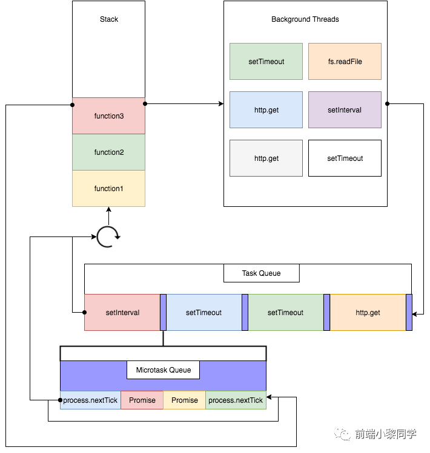

# 事件循环

因为js是单线程的，因此异步操作需要借助**事件循环**机制来实现，理解事件循环有助于我们深入理解异步事件

## 浏览器中的事件循环

因为浏览器的js是单线程的，也就是说同一时间只能做一件事（也就是执行一段js代码），可是浏览器又要执行DOM渲染、各种DOM操作事件、定时器、异步请求等操作，因此引入了事件循环机制。

看一张图：



- js的主线程有一个执行栈，所有的js代码都在执行栈中执行
- 在执行js代码的过程中，如果遇到异步任务，那么浏览器会将异步代码放到另一个线程中执行（幕后线程），这个线程的执行不阻塞主线程中代码的执行
- 当幕后线程中的代码执行完成之后，该线程会将异步代码的回调函数放到任务队列（又称作事件队列、消息队列）中等待执行
- 当主线程中的代码执行完成之后，它会去检查任务队列是否有任务要执行。如果有，则将该任务放到执行栈中执行，如果当前任务队列为空，它就会一直循环等待任务到来。因此，这叫做事件循环

### 任务队列

如果任务队列中有多个任务，那么先执行哪一个任务呢？由上图可见，实际上有两个任务队列，一个是**宏任务队列**（Macrotask Queue又叫Task Queue），一个是**微任务队列**（Microtask Queue）

宏任务：

- script的主代码块
- 定时器：setTimeout、setInterval、requestAnimationFrame
- 事件绑定
- ajax
- 回调函数
- 用户交互操作，UI渲染
- setImmediate （node）
- I/O（node）

微任务：

- Promise.then
- Promise.catch
- Promise.finally
- async/await
- process.nextTick(node)
- Object.observe
- MutationObserver

### 宏任务与微任务的执行

1. 执行栈中优先执行同步代码，同步代码执行完毕之后，进入下一步；
2. 检查`宏任务队列`是否为空，若不为空，则进行下一步，若为空，则跳到4；
3. 从`宏任务队列`中取队首(在队列时间最长)的任务进去执行栈中执行(仅仅一个)，执行完后进入下一步；
4. 检查`微任务队列`是否为空，若不为空，则进入下一步，否则，跳到2（开始新的事件循环）；
5. 从`微任务队列`中取队首(在队列时间最长)的任务进去事件队列执行，执行完后，跳到4；其中，在执行代码过程中新增的`microtask任务`会在当前事件循环周期内执行，而新增的`macrotask任务`只能等到下一次事件循环才能执行了。

::: tip

- 简单来说，一次事件循环只执行处于`宏任务队列`**队首**的任务，执行完成后，立即执行`微任务队列`中的**所有任务**。
- 执行栈全局任务属于宏任务
- 执行顺序为：执行栈全局任务(宏任务) --> 宏任务中的微任务 --> 下一个宏任务

:::

### 案例分析1

```js
console.log(1)
setTimeout(function() {
  //settimeout1
  console.log(2)
}, 0)
const intervalId = setInterval(function() {
  //setinterval1
  console.log(3)
}, 0)
setTimeout(function() {
  //settimeout2
  console.log(10)
  new Promise(function(resolve) {
    //promise1
    console.log(11)
    resolve()
  })
    .then(function() {
      console.log(12)
    })
    .then(function() {
      console.log(13)
      clearInterval(intervalId)
    })
}, 0)

//promise2
Promise.resolve()
  .then(function() {
    console.log(7)
  })
  .then(function() {
    console.log(8)
  })
console.log(9)
```

输出结果：1 9 7 8 2 3 10 11 12 13

分析：

执行栈全局任务（宏任务）：

- console.log(1)被执行，输出1
- settimeout1执行，加入macrotask队列
- setinterval1执行，加入macrotask队列
- settimeout2执行，加入macrotask队列
- promise2执行，它的两个then函数加入microtask队列
- console.log(9)执行，输出9
- 根据事件循环的定义，接下来会执行新增的microtask任务，按照进入队列的顺序，执行console.log(7)和console.log(8),输出7和8 microtask队列为空，回到第一步，进入下一个事件循环，此时macrotask队列为: settimeout1,setinterval1,settimeout2

第二次事件循环：

从macrotask队列里取位于队首的任务(settimeout1)并执行，输出2 microtask队列为空，回到第一步，进入下一个事件循环，此时macrotask队列为: setinterval1,settimeout2

第三次事件循环：

从macrotask队列里取位于队首的任务(setinterval1)并执行，输出3,然后又将新生成的setinterval1加入macrotask队列 
microtask队列为空，回到第一步，进入下一个事件循环，此时macrotask队列为: settimeout2,setinterval1

第四次事件循环：

从macrotask队列里取位于队首的任务(settimeout2)并执行,输出10，并且执行new Promise内的函数(new Promise内的函数是同步操作，并不是异步操作),输出11，并且将它的两个then函数加入microtask队列 从microtask队列中，取队首的任务执行，直到为空为止。因此，两个新增的microtask任务按顺序执行，输出12和13，并且将setinterval1清空。

此时，microtask队列和macrotask队列都为空，浏览器会一直检查队列是否为空，等待新的任务加入队列。在这里，大家可以会想，在第一次循环中，为什么不是macrotask先执行？因为按照流程的话，不应该是先检查macrotask队列是否为空，再检查microtask队列吗？

原因：因为一开始js主线程中跑的任务就是macrotask任务，而根据事件循环的流程，一次事件循环只会执行一个macrotask任务，因此，执行完主线程的代码后，它就去从microtask队列里取队首任务来执行。

注意：由于在执行microtask任务的时候，只有当microtask队列为空的时候，它才会进入下一个事件循环，因此，如果它源源不断地产生新的microtask任务，就会导致主线程一直在执行microtask任务，而没有办法执行macrotask任务，这样我们就无法进行UI渲染/IO操作/ajax请求了，因此，我们应该避免这种情况发生。在nodejs里的process.nexttick里，就可以设置最大的调用次数，以此来防止阻塞主线程。

### async/await

async/await其实是 Promise 和 Generator 的语法糖，所以我们把它们转成我们熟悉的 Promise

```js
async function async1() {
  console.log('async1 start');
  await async2();
  console.log('async1 end');
}

// 等价于
async function async1() {
  console.log('async1 start');
  Promise.resolve(async2()).then(()=>console.log('async1 end'))
}
```

### 案例分析2

```js
async function async1() {
  console.log('async1 start')
  await async2()
  console.log('async1 end')
}
async function async2() {
  console.log('async2')
}
async1()
new Promise(function(resolve) {
  console.log('promise1')
  resolve()
}).then(function() {
  console.log('promise2')
})
console.log('script end')
```

解析为：

```js
async function async1() {
  console.log('async1 start')
  Promise.resolve(async2()).then(()=>console.log('async1 end'))
}
async function async2() {
  console.log('async2')
}
async1()
new Promise(function(resolve) {
  console.log('promise1')
  resolve()
}).then(function() {
  console.log('promise2')
})
console.log('script end')
```

结果为：async1 start -> async2 -> promise1 -> script end -> async1 end -> promise2

Promise.resolve为同步任务

### 定时器的问题

setTimeout(task, 100)并不能保证任务会在100ms时去执行


### 案例分析3

```js
function func1() {
  console.log('func1 start')
  return new Promise(resolve => {
    resolve('OK')
  })
}
function func2() {
  console.log('func2 start')
  return new Promise(resolve => {
    setTimeout(() => {
      resolve('OK')
    }, 10)
  })
}
console.log(1)
setTimeout(async () => {
  console.log(2)
  await func1()
  console.log(3)
}, 20)
for (let i = 0; i < 90000000; i++) {} // 约 80 ms
console.log(4)
func1().then(() => {
  console.log(5)
})
func2().then(() => {
  console.log(6)
})
setTimeout(() => {
  console.log(7)
}, 0)
console.log(8)
```

结果： 1 -> 4 -> func1 start -> func2 start -> 8 -> 5 -> 2 -> func1 start -> 3 -> 7 -> 6

分析：

第一次循环打印结果：主线程执行完毕：1 -> 4 -> func1 start -> func2 start -> 8；

第二次循环打印结果：检查微任务队列是否有任务，执行任务func1().then()；func2().then()返回一个宏任务，执行栈中代码执行完毕：5；

第三次循环打印结果：2 -> func1 start -> 3；检测宏任务队列列表中是否有任务，执行队首宏任务，执行完毕之后，检测微任务队列中是否有任务，执行微任务

第四次循环打印结果：7 -> 6；检测宏任务队列列表中是否有任务，执行队首任务，执行完毕之后，检测微任务队列中是否有任务，执行微任务

### 案例分析4

```js
console.log('start')
setTimeout(() => {
  console.log('children2')
  Promise.resolve().then(() => {
    console.log('children3')
  })
}, 0)

new Promise(function(resolve, reject) {
  console.log('children4')
  setTimeout(function() {
    console.log('children5')
    resolve('children6')
  }, 0)
}).then(res => {
  // flag
  console.log('children7')
  setTimeout(() => {
    console.log(res)
  }, 0)
})
```

结果：start children4 children2 children3 children5 children7 children6

分析：

第一次循环：执行栈中同步任务执行完毕：start、children

第二次循环：由于resolve('children6')没有立即执行，因此没有本轮循环没有微任务，检测宏任务队列，并执行微任务队列的回调：children2、children3

第三次循环：检测宏任务队列，检测微任务队列：children5、children7、children6

### 案例分析5

```js
async function async1() {
  console.log('async1 start')
  await async2()
  console.log('async1 end')
}
async function async2() {
  console.log('async2')
}
console.log('script start')
setTimeout(function () {
  console.log('setTimeout')
}, 0)
async1()
new Promise((resolve) => {
  console.log('promise1')
  resolve()
}).then(function () {
  console.log('promise2')
})
console.log('script end')
```

分析：

第一轮循环：执行栈中同步任务先执行：script start  ->  async1 start -> async2 -> promise1 -> script end；

第二轮循环：检测微任务列表是否为空，执行微任务：async1 end -> promise2；

第三轮循环：检测宏任务列表是否为空，执行宏任务：setTimeout


### 案例分析6

```js
async function async1() {
  console.log('async1 start');
  await async2();
  console.log('async1 end');
}
async function async2() {
  new Promise(function (resolve) {
      console.log('promise1');
      resolve();
  }).then(function () {
      console.log('promise2');
  });
}
console.log('script start');
setTimeout(function () {
  console.log('setTimeout');
}, 0)
async1();
new Promise(function (resolve) {
  console.log('promise3');
  resolve();
}).then(function () {
  console.log('promise4');
});
console.log('script end');
```

分析：

主线程中代码执行：script start -> async1 start -> promise1 -> promise3 -> script end

第一轮循环：检查微任务队列中是否有任务：promise2 -> async1 end -> promise4 -> setTimeout


### 案例分析7

```js
async function async1() {
  console.log('async1 start');
  await async2();
  setTimeout(function() {
      console.log('setTimeout1') 
  },0)
}
async function async2() {
  setTimeout(function() {
      console.log('setTimeout2')
  },0)
}
console.log('script start');
setTimeout(function() {
  console.log('setTimeout3');
}, 0)
async1();
new Promise(function(resolve) {
  console.log('promise1');
  resolve();
}).then(function() {
  console.log('promise2');
});
console.log('script end');
```

分析：

第一轮：script start -> async1 start -> promise1 -> script end

第二轮：检测微任务队列：promise2

第三轮：检测宏任务队列：setTimeout3 -> setTimeout2 -> setTimeout1

## nodejs中的事件循环