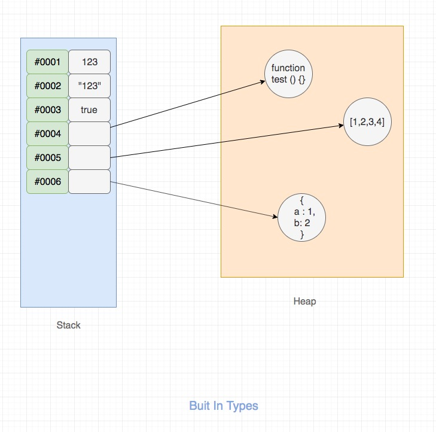

# 数据类型

JavaScript数据类型大体上有两种(细分有8种)

- 原始类型
- 引用类型

## 类型

类型 | 数据类型 | 存储
---|---|---
原始类型（又叫基本类型） | `string`、`number`、`boolean`、`null`、`undefined`、`bigint`、`symbol` (7种)| 栈(stack)
引用类型 | `object`，其中包含具体的引用类型`Array`、`Function`、`Date`、`RegExp`等 | 堆(heap)

## 存储



::: danger

- 可以看出，数据类型指的是**变量值**的类型，不是变量的类型
- 对于JS这种"弱类型"语言来说， 无法给变量限定类型，因为变量的类型是可变的

:::

## 检测

### 第一种：typeof运算符

`typeof`是通过检测**类型标签**来检测数据类型，返回数据类型

```js
typeof 'hello world'    // 'string'
typeof 10               // 'number'
typeof true             // 'boolean'
typeof undefined        // 'undefined'
typeof Symbol()         // 'symbol'
typeof 123n             // 'bigint'
typeof null             // 'object' 无法判定是否为 null

typeof {}               // 'object'
typeof []               // 'object'
typeof (()=>{})         // 'function'
typeof new Date         // 'object'
typeof /\d/             // 'object'
```

::: tip 总结

1. 可以看出，除了`null`以外，其他的原始数据类型都可以用`typeof`检测出来；

2. 为什么`typeof null === 'object'`？

因为 JavaScript 中的值是由一个**类型标签（type tag）和实际数据值**表示的，对象的类型标签是0，而`null`代表是空指针，它的类型标签也是0，而`typeof`是通过检测类型标签来返回类型的，因此返回`'object'`[参考](https://2ality.com/2013/10/typeof-null.html)

3. `typeof`无法检测引用类型,还可以使用`instanceof`来判断

:::

### 第二种：instanceof运算符

`instanceof`是比较一个对象是否为某一个构造函数的实例，返回`Boolean`值。注意：`instanceof`只能用于对象，不适用原始类型的值

```js
[] instanceof Array             // true
({}) instanceof Object          // true
(()=>{}) instanceof Function    // true
(new Date) instanceof Date      // true
/\d/ instanceof RegExp          // true

// 但是
[] instanceof Object            // true
(()=>{}) instanceof Object      // true
(new Date) instanceof Object    // true
/\d/ instanceof Object          // true
```

::: tip 总结

1. instanceof是通过原型链查找，可以参考另外一篇文章[原型和原型链](./prototype-chain.md)
2. 可以看出，`instanceof`无法精准的判断数据类型,可以使用`Object.prototype.toString.call()`来判断

:::

### 第三种：Object.prototype.toString

- JS所有的对象都是`Object`类型的实例，它们都会从`Object.prototype`继承属性和方法,其中就包括`toString()`方法；因此，每个对象都有`toString()`方法
- 返回一个表示该对象的字符串，默认格式是`"[object type]"`,其中`type`是对象的类型
- 但是，不同的类型可能对`toString()`进行了重写，如下案例
- 因此，只能通过`Object.prototype.toString()`来调用`Object`的`toString`方法
- 但是上述的方案，`this`始终都是指向`Object`,因此需要改变`this`指向
- 最终，`Object.prototype.toString.call()`或`Object.prototype.toString.apply()`

```js
Object.prototype.toString()             // "[object Object]"

// 重写了toString()方法
([1,2,3]).toString()                    // "1,2,3"
(10).toString()                         // "10"
(true).toString()                       // "true"
(Symbol()).toString()                   // "Symbol()"
(123n).toString()                       // "123"
```

测试`Object.prototype.toString.call()`：

```js
Object.prototype.toString.call("hello world") === "[object String]"
Object.prototype.toString.call(10) === "[object Number]"
Object.prototype.toString.call(true) === "[object Boolean]"
Object.prototype.toString.call(undefined) === "[object Undefined]"
Object.prototype.toString.call(null) === "[object Null]"
Object.prototype.toString.call(Symbol()) === "[object Symbol]"
Object.prototype.toString.call(123n) === "[object BigInt]"

Object.prototype.toString.call({}) === "[object Object]"
Object.prototype.toString.call([]) === "[object Array]"
Object.prototype.toString.call(()=>{})  === "[object Function]"

Object.prototype.toString.call(new Date) === "[object Date]"
Object.prototype.toString.call(/\d/) === "[object RegExp]"

// 构造函数
function Person(){}
Object.prototype.toString.call(new Person) === "[object Object]"
```

### 第四种：最终解决方案

```js
const dataType =  operand => {
    const type = typeof operand
    const toString = Object.prototype.toString
    const object = toString.call(operand).slice(8,-1).toLowerCase()
    return type !== 'object' ? type : object
}
```

测试：

```js
dataType("hello world")       // "string"
dataType(10)                  // "number"
dataType(true)                // "boolean"
dataType(undefined)           // "undefined"
dataType(null)                // "null"
dataType(123n)                // "bigint"
dataType({})                  // "object"
dataType([])                  // "array"
dataType(()=>{})              // "function"
dataType(new Date)            // "date"
dataType(/\d/)                // "regexp"
```
