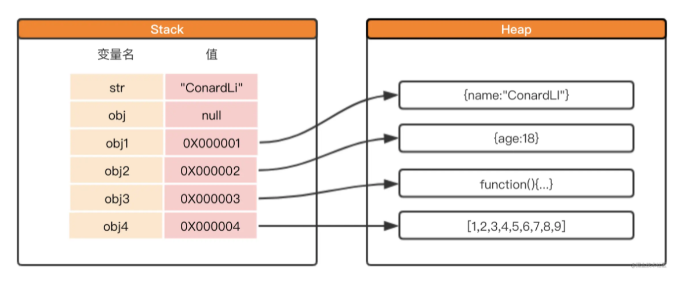

# 数据类型

## 分类

| 类型 | 数据类型 | 值存储 |
|---|---|---|
| 基本类型 | string、number、boolean、null、undefined、bigint、symbol (7种)| 栈(stack) |
| 引用类型 | object，其中包含具体的引用类型Array、Function、Date、RegExp等 | 堆(heap) |

## 值存储

JavaScript变量存储在内存的哪里？

- 基本类型保存在**栈内存**中，因为类型在内存中占有固定大小的空间，通过**按值来访问**
- 引用类型，因为这些值的大小不固定，但是内存地址是固定的，因此**将引用类型的访问地址保存在栈内存中，将值保存在堆内存中**。先从栈中读取内存地址，通过内存地址找到堆中的值。这叫做**按引用访问**



::: danger 提示

- 可以看出，数据类型指的是 **变量值** 的类型，不是变量的类型
- 对于JS这种"弱类型"语言来说， 无法给变量限定类型，因为变量的类型是可变的

:::

```js
let a1 = 1
let a2 = a1
a2++
console.log(a1, a2)       // 1 2

let obj1 = { name: 'john' }
let obj2 = obj1
obj2.name = 'marry'
console.log(obj1, obj2) // {name: 'marry'} {name: 'marry'}
```

## 数据类型的检测

### 第一种：typeof运算符

`typeof`是通过检测变量值的 **类型标签（type tag）** 来检测数据类型，**返回数据类型字符串**

```js
typeof 'hello world'    // 'string'
typeof 10               // 'number'
typeof true             // 'boolean'
typeof undefined        // 'undefined'
typeof Symbol()         // 'symbol'
typeof 123n             // 'bigint'

typeof null             // 'object' 无法判定是否为 null

typeof {}               // 'object'
typeof []               // 'object'
typeof (()=>{})         // 'function'
typeof new Date         // 'object'
typeof /\d/             // 'object'
```

::: tip 总结

1. 可以看出，除了`null`以外，其他的基本类型都可以用`typeof`检测出来；
2. 为什么`typeof null === 'object'`？

因为 JavaScript 中的值是由一个 **类型标签（type tag）** 和 **实际数据值** 表示的，对象的类型标签是0，而`null`代表是空指针，它的类型标签也是0，因此返回`'object'`

[参考文档](https://2ality.com/2013/10/typeof-null.html)

3. **typeof**检测不了**null**和**引用类型**

:::

### 第二种：instanceof运算符

`instanceof`检测构造函数的 `prototype` 属性是否出现在某个实例对象的原型链上，**返回Boolean值**。

注意：`instanceof`只能用于引用类型，不适用基本类型

```js
[] instanceof Array             // true
({}) instanceof Object          // true
(()=>{}) instanceof Function    // true
(new Date) instanceof Date      // true
/\d/ instanceof RegExp          // true

// 但是
[] instanceof Object            // true
(()=>{}) instanceof Object      // true
(new Date) instanceof Object    // true
/\d/ instanceof Object          // true
```

::: tip 总结

1. instanceof 是通过原型链查找，可以参考另外一篇文章[原型和原型链](./prototype-chain.md)
2. 可以看出，`instanceof`也无法精准的判断数据类型

:::

### 第三种：内部属性[[Class]]

内部属性`[[Class]]`无法直接访问，一般通过 `Object.prototype.toString()` 来查看

- JS所有的对象都是`Object`类型的实例，它们都会从`Object.prototype`上继承属性和方法，比如`toString()`方法；因此，每个对象都有`toString()`方法
- `Object.prototype.toString()`返回一个表示该对象的字符串，默认格式是`"[object type]"`,其中`type`是对象的类型
- 但是，不同的类型可能对`toString()`进行了重写，如`Array`、`Number`等

```js
Object.prototype.toString()             // "[object Object]"

// 重写了toString()方法
([1,2,3]).toString()                    // "1,2,3"
(10).toString()                         // "10"
(true).toString()                       // "true"
(Symbol()).toString()                   // "Symbol()"
(123n).toString()                       // "123"
```

- 因此，只能通过`Object.prototype.toString()`来调用`Object`的`toString`方法
- 但是上述的方案，`this`始终都是指向`Object`,因此需要改变`this`指向
- 改变`this`指向可以通过`call()`,`apply()`

测试`Object.prototype.toString.call()`：

```js
// 基本类型
Object.prototype.toString.call("hello world") === "[object String]"
Object.prototype.toString.call(10) === "[object Number]"
Object.prototype.toString.call(true) === "[object Boolean]"
Object.prototype.toString.call(undefined) === "[object Undefined]"
Object.prototype.toString.call(null) === "[object Null]"
Object.prototype.toString.call(Symbol()) === "[object Symbol]"
Object.prototype.toString.call(123n) === "[object BigInt]"

// 引用类型
Object.prototype.toString.call({}) === "[object Object]"
Object.prototype.toString.call([]) === "[object Array]"
Object.prototype.toString.call(()=>{})  === "[object Function]"
Object.prototype.toString.call(new Date) === "[object Date]"
Object.prototype.toString.call(/\d/) === "[object RegExp]"

// 构造函数
function Person(){}
Object.prototype.toString.call(new Person) === "[object Object]"
```

### 最终解决方案

- 首先，使用`typeof`检测数据类型；
- 如果`typeof`检测数据类型为`'object'`,则使用`Object.prototype.toString.call()`检测数据类型
- 同时，`Object.prototype.toString.call()`返回字符串格式统一为`[object **]`，即字符串前八位一致
- 最后，做字符串的截取和字母小写的转换

```js
// 接收参数 operand：操作数
const dataType = operand => {
    const type = typeof operand
    const toString = Object.prototype.toString
    const object = toString.call(operand).slice(8,-1).toLowerCase()
    return type !== 'object' ? type : object
}
```

测试：

```js
dataType("hello world")       // "string"
dataType(10)                  // "number"
dataType(true)                // "boolean"
dataType(undefined)           // "undefined"
dataType(null)                // "null"
dataType(123n)                // "bigint"
dataType({})                  // "object"
dataType([])                  // "array"
dataType(()=>{})              // "function"
dataType(new Date)            // "date"
dataType(/\d/)                // "regexp"
```
