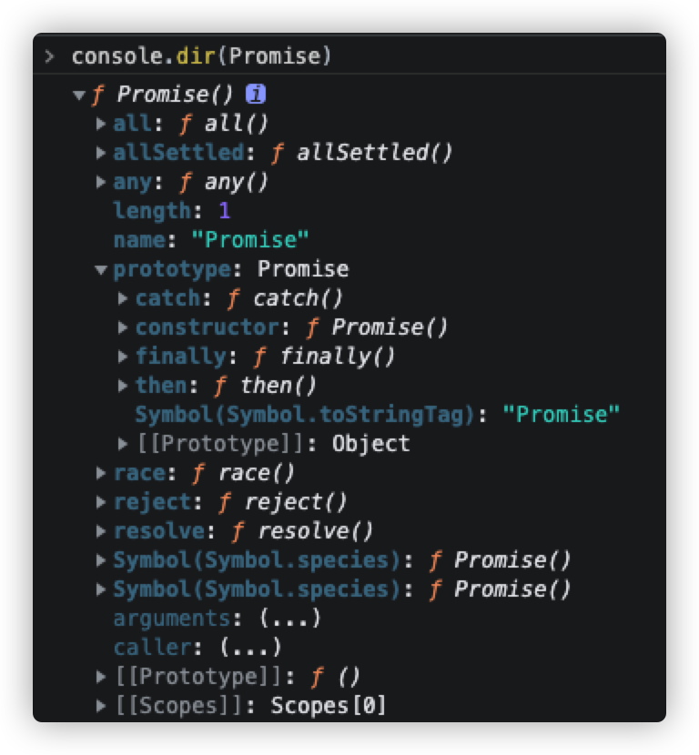

# es6

[w3c](https://www.w3cschool.cn/escript6/escript6-pm6z37es.html)

## le与const

`let`声明的变量只在它所在的`代码块`有效

```js
{
  let a = 10;
  var b = 1;
}
a // ReferenceError: a is not defined.
b // 1
```

## 解构赋值

## 字符串的扩展

## 字符串的新增方法

## 箭头函数与普通函数的区别

1. 箭头函数语法上更简洁
2. 箭头函数是匿名函数，不能作为构造函数，不能使用`new`操作符

```js
let arrowFn = () => {}
function commonFn() {}

let newFn = new arrowFn() // Uncaught TypeError: fn is not a constructor
let newCommonFn = new commonFn() // commonFn {}
```
3. 箭头函数没有原型对象`prototype`

```js
let arrowFn = () => {}
function commonFn() {}

console.log(arrowFn.prototype) // undefined
console.log(commonFn.prototype) // {constructor: ƒ}
```

4. 箭头函数没`this`，它里面的`this`**继承函数所处的上下文中的this**（通过查找作用域链来确定`this`的值），使用call/apply/bind 无法改变箭头函数的this指向

```js
let obj = {
    stuName: 'jack',
    printName: () => {
        // 指向window对象
        // 使用call无法改变this指向，仍然指向window对象
        console.log(this, 'printName') 
        console.log(this.stuName) // undefined
    },
    printName2: function() {
        // 指向当前对象obj
        // 使用call可以改变this指向对象 {stuName: 'luck'}
        console.log(this, 'printName2')
        console.log(this.stuName) // jack
    },
    printName3: function() {
        return () => {
            console.log(this, 'printName3') // 作用域链查找 指向当前对象obj
        }
    },
}

obj.printName()
obj.printName2()
obj.printName3()()
obj.printName2.call({stuName: 'luck'})
obj.printName.call({stuName: 'luck'})
```

5. 箭头函数中没有`arguments`（类数组），取而代之使用`rest`参数解决

```js
let arrowFn = (params) => { console.log(arguments) }
function commonFn(params) { console.log(arguments) }

arrowFn(1,2,3) // Uncaught ReferenceError: arguments is not defined
commonFn(1,2,3) // Arguments(3) [1, 2, 3, callee: ƒ, Symbol(Symbol.iterator): ƒ]

// 解决
let arrowFn = (...params) => { console.log(params) }
arrowFn(1,2,3) // [1, 2, 3]
```

## Symbol

1. 什么是Symbol

- ES6 引入的一种新的原始数据类型Symbol，表示独一无二的值
- 通过`Symbol()`函数生成实例，不能使用new创建

```js
let sym = Symbol() // 创建Symbol实例，不可以使用new来创建

let sym1 = Symbol('a')
let sym2 = Symbol('b')

typeof sym // symbol
sym1 === sym2 // false
```

2. 它的使用场景是什么

- 作为对象的属性名

```js
let symObj = {
    name: '小王'
}

const Age = Symbol()
const ClassName = Symbol()
symObj[Age] = 12
symObj[ClassName] = '一年级'

symObj[Age] // 12
symObj[ClassName] // "一年级"
```

::: tip
1. 使用`for...in`, `Object.keys()`枚举对象时，是获取不到Symbol类型的key的
2. 使用`JSON.stringify()`将对象转换成JSON字符串也是会忽略Symbol属性的
3. 获取以Symbol方式定义的对象属性：`Object.getOwnPropertySymbols(obj)`或者`Reflect.ownKeys(obj)`
:::


- 代替常量

```js
const COURSE_TYPE = Symbol()
const SKU_TYPE = Symbol()
const LIVE_TYPE = Symbol()
```

- 定义私有属性/方法

a.js
```js
const PASSWORD = Symbol()

class Login {
  constructor(username, password) {
    this.username = username
    this[PASSWORD] = password
  }

  checkPassword(pwd) {
      return this[PASSWORD] === pwd
  }
}

export default Login
```
b.js
```js
import Login from './a'

const login = new Login('admin', '123456')

login.checkPassword('123456')  // true

login.PASSWORD  // oh!no!
login[PASSWORD] // oh!no!
login["PASSWORD"] // oh!no
```

- 注册和获取全局Symbol
```js
let gs1 = Symbol.for('global_symbol_1')  //注册一个全局Symbol
let gs2 = Symbol.for('global_symbol_1')  //获取全局Symbol

gs1 === gs2  // true
```

## Map和Weakmap的区别

### 1. Map

字符串作为key， 和JS对象类似
```js
var map = new Map()
// set
map.set('name', 'John')
map.set('age', 29)
// get
map.get('name') // John
map.get('age')  // 29
```

key可以是任意类型
```js
// 对象作为key演示
var xy = {x: 10, y: 20}   // 坐标
var wh = {w: 100, h: 200} // 宽高
var map = new Map()
// set
map.set(xy, '坐标')
map.set(wh, '宽高')
// get
map.get(xy) // '坐标'
map.get(wh) // '宽高'
```

传数组方式

```js
var map = new Map([["name", "John"], ["age", "29"]])
 
// 遍历key
for (var key of map.keys()) {
    console.log(key) // name, age
}
```

迭代器 for...of

```js
var map = new Map()
// set
map.set('name', 'John')
map.set('age', 29)
// get
map.get('name') // 'John'
map.get('age')  // 29

// 遍历key
for (var key of map.keys()) {
    console.log(key)
}
 
// 遍历value
for (var val of map.values()) {
    console.log(val)
}
 
// 遍历实体
for (var arr of map.entries()) {
    console.log('key: ' + arr[0] + ', value: ' + arr[1])
}
 
// 遍历实体的简写
for (var [key, val] of map.entries()) {
    console.log('key: ' + key + ', value: ' + val)
}
```

方法和属性：
- clear
- delete
- entries
- forEach
- get
- set
- has
- keys
- size
- values

### 2. WeakMap

与Map的区别

- 不接受基本类型的值作为键名
- 没有keys、values、entries和size

属性和方法：

- clear
- delete
- get
- set
- has

## Set和Map的区别

Set 是一种叫做集合的数据结构，Map 是一种叫做字典的数据结构。

集合 与 字典 的区别：

- 共同点：集合、字典 可以储存不重复的值
- 不同点：集合 是以 [value, value]的形式储存元素，字典 是以 [key, value] 的形式储存

ES6 新增的一种新的数据结构，类似于数组，成员唯一（内部元素没有重复的值）。且使用键对数据排序即顺序存储（经评论区大佬提醒）。

Set 本身是一种构造函数，用来生成 Set 数据结构。

Set 对象允许你储存任何类型的唯一值，无论是原始值或者是对象引用。

操作方法：

- add(value)：新增，相当于 array里的push。
- delete(value)：存在即删除集合中value。
- has(value)：判断集合中是否存在 value。
- clear()：清空集合。

便利方法：遍历方法（遍历顺序为插入顺序）

- keys()：返回一个包含集合中所有键的迭代器。
- values()：返回一个包含集合中所有值得迭代器。
- entries()：返回一个包含Set对象中所有元素得键值对迭代器。
- forEach(callbackFn, thisArg)：用于对集合成员执行callbackFn操作，如果提供了 thisArg 参数，回调中的this会是这个参数，没有返回值。

## WeakSet与Set的区别

WeakSet 对象允许你将弱引用对象储存在一个集合中。

WeakSet 与 Set 的区别：

- WeakSet 只能储存对象引用，不能存放值，而 Set 对象都可以。
- WeakSet 对象中储存的对象值都是被弱引用的，即垃圾回收机制不考虑 WeakSet 对该对象的应用，如果没有其他的变量或属性引用这个对象值，则这个对象将会被垃圾回收掉（不考虑该对象还存在于 WeakSet 中），所以，WeakSet 对象里有多少个成员元素，取决于垃圾回收机制有没有运行，运行前后成员个数可能不一致，遍历结束之后，有的成员可能取不到了（被垃圾回收了），WeakSet 对象是无法被遍历的（ES6 规定 WeakSet 不可遍历），也没有办法拿到它包含的所有元素。

方法：

- add(value)：在WeakSet 对象中添加一个元素value。
- has(value)：判断 WeakSet 对象中是否包含value。
- delete(value)：删除元素 value

## Promise



1. `Promise`是一个构造函数

它的静态方法有：

- `all()`
- `allSettled()`
- `any()`
- `race()`
- `reject()`
- `resolve`

实例方法有：

- `catch()`
- `finally()`
- `then()`

2. `Promise`有三种状态，分别是：
   
- `pending`（初始化）
- `fulfilled`（完成）
- `rejected`（失败）；

状态只能由`pending -> fulfilled`， `pending -> rejected`，且**不可逆**。

3. 当实例化一个`Promise`时，需要传入一个执行函数`executor()`，`executor()`有两个函数参数`resolve()`,`reject()`，并且执行该函数执行函数

### 基础结构

```js
const PENDING = 'PENDING'
const FULFILLED = 'FULFILLED'
const REJECTED = 'REJECTED'

class MyPromise {
  constructor(executor) {
    this.status = PENDING
    let resolve = () => {}
    let reject = () => {}
    executor(resolve, reject)
  }

  // 实例方法
  then() {}
  catch() {}
  finally() {}

  // 静态方法
  static resolve() {}
  static reject() {}
  static all() {}
  static race() {}
  static allSettled() {}
  static any() {}
}
```

### 初始化并执行传入的函数

```js
const p = new Promise((resolve, reject) => {
  console.log('执行函数')
  throw new Error('this is a Error')
})
p.catch(err=> {
    // 检测到throw抛出的错误
    console.log(err)
})
```

- 初始化时，`Promise`状态`status`为`pending`，成功的值`value`和失败的原因`reason`为`undefined`
- 执行函数`executor()`的两个**参数函数**`resolve()`和`reject()`，用于改变`status`状态
- 执行函数`executor()`执行时，因为`Promise`可以捕获到`throw new Error()`抛出的错误，所以外面需要包一层`try...catch`

```js
const PENDING = 'PENDING'
const FULFILLED = 'FULFILLED'
const REJECTED = 'REJECTED'

class MyPromise {
  constructor(executor) {
    this.status = PENDING
    this.value = undefined
    this.reason = undefined
    let resolve = value => {
      if (this.status === PENDING) {
        this.value = value
        this.status = FULFILLED
      }
    }
    let reject = reason => {
      if (this.status === PENDING) {
        this.reason = reason
        this.status = REJECTED
      }
    }
    try {
      executor(resolve, reject)
    } catch (error) {
      reject(error)
    }
  }
}
```

### then

```js
const p = new Promise((resolve, reject) => {
  console.log('执行函数')
  // resolve(1) // 执行时进 onFulfilled
  reject(1) // 执行时进 onRejected，如果不写控制台会报未捕获的错误
})

p.then(
  value => {
    console.log(value, 'onFulfilled')
  },
  reason => {
    console.log(reason, 'onRejected')
  }
)

// 链式调用
const promise = new Promise((resolve, reject) => {
  reject('失败')
})
  .then()
  .then()
  .then(
    data => {
      console.log(data)
    },
    err => {
      console.log('err', err)
    }
  )
```

- 执行函数`executor()`的函数体中如果不执行`resolve()`或`reject()`的话，是不会执行`then()`的
- `then()`接收两个可选的函数参数`onFulfilled()`， `onRejected()`，作为成功和失败的回调函数
  - 当状态`status`从`pending`变为`fulfilled`的时，执行`onFulfilled()`；当`status`从`pending`变为`rejected`时，执行`onRejected()`
  - 如果`onFulfilled()`是函数，它有一个参数，接受最终的结果`value`；否则在内部会替换为`(x) => x`
  - 如果`onRejected()`是函数，它有一个参数，为失败的原因`reason`；否则在内部会替换为`err => throw new Error(err)`
- `then()`是异步的，将成功回调存储得到`onFulfilledCallbacks`数组中,将失败回调存储到`onRejectedCallbacks`数组中（发布订阅模式）
- `then()`返回一个`Promise`实例
- 链式调用

```js
const resolvePromise = (promise, x, resolve, reject) => {
  if (promise === x) {
    return reject(new TypeError('Chaining cycle detected for promise #<Promise>'))
  }
  if (typeof x === 'object' && x !== null && typeof x === 'function') {
    let called
    try {
      let then = x.then
      if (typeof then === 'function') {
        then.call(
          x,
          y => {
            if (called) {
              return
            }
            resolvePromise(promise, y, resolve, reject)
          },
          r => {
            if (called) {
              return
            }
            called = true
            reject(r)
          }
        )
      } else {
        resolve(x)
      }
    } catch (error) {
      if (called) {
        return
      }
      called = true
      reject(error)
    }
  } else {
    resolve(x)
  }
}

then(onFulfilled, onRejected) {
    onFulfilled = typeof onFulfilled === 'function' ? onFulfilled : val => val
    onRejected =
      typeof onRejected === 'function'
        ? onRejected
        : err => {
            throw new Error(err)
          }

    let promise = new Promise((resolve, reject) => {
      if (this.status === FULFILLED) {
        setTimeout(() => {
          try {
            let x = onFulfilled(this.value)
            resolvePromise(promise, x, resolve, reject)
          } catch (error) {
            reject(error)
          }
        }, 0)
      }
      if (this.status === REJECTED) {
        setTimeout(() => {
          try {
            let x = onRejected(this.reason)
            resolvePromise(promise, x, resolve, reject)
          } catch (error) {
            reject(error)
          }
        }, 0)
      }
      if (this.status === PENDING) {
        this.onFulfilledCallbacks.push(() => {
          setTimeout(() => {
            try {
              let x = onFulfilled(this.value)
              resolvePromise(promise, x, resolve, reject)
            } catch (error) {
              reject(error)
            }
          }, 0)
        })
        this.onRejectedCallbacks.push(() => {
          setTimeout(() => {
            try {
              let x = onRejected(this.reason)
              resolvePromise(promise, x, resolve, reject)
            } catch (error) {
              reject(error)
            }
          }, 0)
        })
      }
    })
    return promise
}
```

### resolve

```js
static resolve(value) {
    if (value instanceof Promise) return value
    return new Promise((resolve, reject) => resolve(value))
}
```

### reject

```js
static reject(reason) {
    if (value instanceof Promise) return value
    return new Promise((resolve, reject) => reject(reason))
}
```

### all

- 接收一个Promise的iterable类型（Array,Map,Set），每个元素都是promise对象
- 只有所有的promise 都 fulfilled，才会执行then，并且结果顺序和iterable类型数据一致；如果有一个发生reject，则返回这个值
- 返回一个**Promise实例**

```js
static all(values) {
    if (!Array.isArray(values)) {
      const type = typeof values
      return new TypeError(`TypeError: ${type} ${values} is not iterable`)
    }
    return new Promise((resolve, reject) => {
      let arr = []
      let count = 0
      const processResultByKey = (val, index) => {
        arr[index] = val
        if (++count === values.length) {
          resolve(arr)
        }
      }
      for (let i = 0; i < values.length; i++) {
        let value = values[i]
        if (value && typeof value.then === 'function') {
          value.then(val => {
            processResultByKey(val, i)
          }, reject)
        } else {
          processResultByKey(value, i)
        }
      }
    })
}
```

### race

- 谁先完成用谁

```js
static race(values) {
    return new Promise((resolve, reject) => {
      for (let i = 0; i < values.length; i++) {
        let val = values[i]
        if (val && typeof val.then === 'function') {
          val.then(resolve, reject)
        } else {
          resolve(val)
        }
      }
    })
}
```

### catch

```js
catch(errCallback) {
    return this.then(null, errCallback)
}
```

### finally

```js
finally(cb) {
    return this.then(
      value => {
        return Promise.resolve(cb()).then(() => value)
      },
      reason => {
        return Promise.resolve(cb()).then(() => {
          throw reason
        })
      }
    )
}
```

### allSettled

### any

[参考](https://zhuanlan.zhihu.com/p/183801144)

## Proxy

## Relect

## Iterator 与 for...of 循环

## Generator函数的语法

## async 函数

## Class

## Module