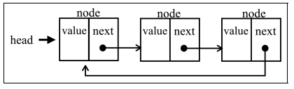
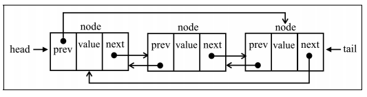

# 循环链表

## 定义

**循环链表**可以像链表一样只有单向引用，也可以像双向链表一样有双向引用。循环链表和链表之间唯一的区别在于，最后一个元素指向下一个元素的指针（ tail.next）不是引用undefined，而是指向第一个元素（`head`）



**双向循环链表**有指向 head 元素的 tail.next 和指向 tail 元素的 head.prev。



## 实现

```js
class CircularLinkedList extends LinkedList {
  constructor(equalsFn = defaultEquals) {
    super(equalsFn)
  }
}
```

### 在任意位置插入新元素

```js
insert(element, index) {
  if (index >= 0 && index <= this.count) {
    const node = new Node(element)
    let current = this.head
    if (index === 0) {
      if (this.head == null) {
        this.head = node
        node.next = this.head
      } else {
        node.next = current
        current = this.getElementAt(this.size())
        this.head = node
        current.next = this.head
      }
    } else {
      const previous = this.getElementAt(index - 1)
      node.next = previous.next
      previous.next = node
    }
    this.count++
    return true
  }
  return false
}
```

### 从任意位置移除元素

```js
removeAt(index) {
  if (index >= 0 && index < this.count) {
    let current = this.head
    if (index === 0) {
      if (this.size() === 1) {
        this.head = undefined
      } else {
        const removed = this.head
        current = this.getElementAt(this.size())
        this.head = this.head.next
        current.next = this.head
        current = removed
      }
    } else {
      const previous = this.getElementAt(index - 1)
      current = previous.next
      previous.next = current.next
    }
    this.count--
    return current.element
  }
  return undefined
}
```

## 最终实现

```js
function defaultEquals(a, b) {
  return a === b
}
// 链表元素
class Node {
  constructor(element) {
    this.element = element
    this.next = undefined
  }
}
// 链表类
class LinkedList {
  constructor(equalsFn = defaultEquals) {
    this.count = 0
    this.head = undefined
    this.equalsFn = equalsFn
  }
  push(element) {
    const node = new Node(element)

    if (this.head == null) {
      this.head = node
    } else {
      let current = this.head
      while (current.next != null) {
        current = current.next
      }
      current.next = node
    }
    this.count++
  }
  removeAt(index) {
    if (index >= 0 && index < this.count) {
      let current = this.head
      if (index === 0) {
        this.head = current.next
      } else {
        const previous = this.getElementAt(index - 1)
        current = previous.next
        previous.next = current.next
      }
      this.count--
      return current.element
    }
    return undefined
  }
  getElementAt(index) {
    if (index >= 0 && index <= this.count) {
      let node = this.head
      for (let i = 0; i < index && node != null; i++) {
        node = node.next
      }
      return node
    }
    return undefined
  }
  insert(element, index) {
    if (index >= 0 && index <= this.count) {
      const node = new Node(element)
      if (index === 0) {
        const current = this.head
        node.next = current
        this.head = node
      } else {
        const previous = this.getElementAt(index - 1)
        const current = previous.next
        node.next = current
        previous.next = node
      }
      this.count++
      return true
    }
    return false
  }
  indexOf(element) {
    let current = this.head
    for (let i = 0; i < this.count && current != null; i++) {
      if (this.equalsFn(element, current.element)) {
        return i
      }
      current = current.next
    }
    return -1
  }

  remove(element) {
    const index = this.indexOf(element)
    return this.removeAt(index)
  }

  size() {
    return this.count
  }
  isEmpty() {
    return this.size() === 0
  }
  getHead() {
    return this.head
  }
  toString() {
    if (this.head == null) {
      return ''
    }
    let objString = `${this.head.element}`
    let current = this.head.next
    for (let i = 1; i < this.size() && current != null; i++) {
      objString = `${objString},${current.element}`
      current = current.next
    }
    return objString
  }
}

class CircularLinkedList extends LinkedList {
  constructor(equalsFn = defaultEquals) {
    super(equalsFn)
  }
  insert(element, index) {
    if (index >= 0 && index <= this.count) {
      const node = new Node(element)
      let current = this.head
      if (index === 0) {
        if (this.head == null) {
          this.head = node
          node.next = this.head
        } else {
          node.next = current
          current = this.getElementAt(this.size())
          this.head = node
          current.next = this.head
        }
      } else {
        const previous = this.getElementAt(index - 1)
        node.next = previous.next
        previous.next = node
      }
      this.count++
      return true
    }
    return false
  }
  removeAt(index) {
    if (index >= 0 && index < this.count) {
      let current = this.head
      if (index === 0) {
        if (this.size() === 1) {
          this.head = undefined
        } else {
          const removed = this.head
          current = this.getElementAt(this.size())
          this.head = this.head.next
          current.next = this.head
          current = removed
        }
      } else {
        const previous = this.getElementAt(index - 1)
        current = previous.next
        previous.next = current.next
      }
      this.count--
      return current.element
    }
    return undefined
  }
}

```