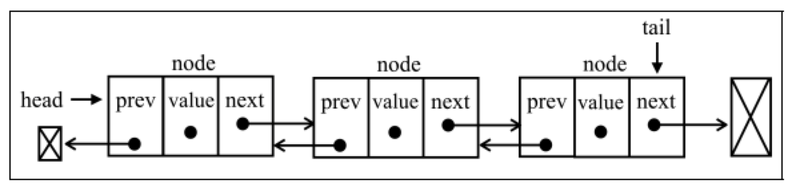
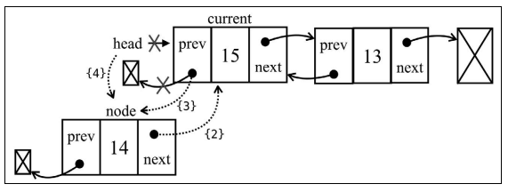
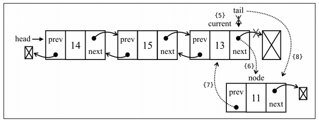
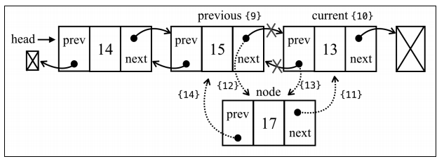
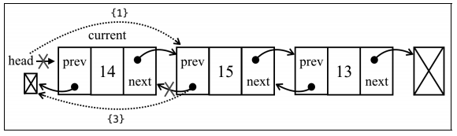
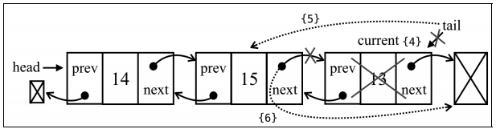
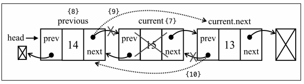

# 双向链表

## 定义

双向链表和普通链表的区别在于：

- 在链表中，一个节点只有链向下一个节点的链接；
- 而在双向链表中，链接是双向的：一个链向下一个元素，另一个链向前一个元素



## 实现

### 链表元素

```js
// 继承`Node`类的所有属性和方法，并扩展
class DoublyNode extends Node {
  constructor(element, next, prev) {
    // 调用构造函数`Node`,初始化`element`，`next`
    super(element, next)
    this.prev = prev
  }
}
```

### 链表类

```js
// 继承`LinkedList`类的所有属性和方法，并扩展
class DoublyLinkedList extends LinkedList {
  constructor(equalsFn = defaultEquals) {
    // 调用构造函数`LinkedList`，初始化 `equalsFn`、 `count` 和 `head` 属性
    super(equalsFn) 
    // 保存链表最后一个元素的指针
    this.tail = undefined
  }
}
```

在单向链表中，如果迭代时错过了要找的元素，就需要回到起点，重新开始迭代。这是双向链表的一个优势

### 插入元素

两个场景：

- 链表为空，添加的是第一个元素
- 链表不为空，向其追加元素
- 链表不为空，向任意位置插入元素

链表为空，添加的是第一个元素



链表不为空，向其追加元素



链表不为空，向任意位置插入元素



```js
insert(element, index) {
  if (index >= 0 && index <= this.count) {
    const node = new DoublyNode(element)
    let current = this.head
    if (index === 0) {
      if (this.head == null) {
        this.head = node
        this.tail = node
      } else {
        node.next = this.head
        current.prev = node
        this.head = NodeFilter
      }
    } else if (index === this.count) {
      current = this.tail
      current.next = node
      node.prev = current
      this.tail = node
    } else {
      const previous = this.getElementAt(index - 1)
      current = previous.next
      node.next = current
      previous.next = node
      current.prev = node
      node.prev = previous
    }
    this.count++
    return true
  }
  return false
}
```

### 移除元素

双向链表中移除元素跟链表非常类似。唯一的区别就是，还需要设置前一个位置的指针

三个场景：从头部、从中间和从尾部移除一个元素





```js
removeAt(index) {
  if (index >= 0 && index < this.count) {
    let current = this.head
    if (index === 0) {
      this.head = current.next
      if (this.count === 1) {
        this.tail = undefined
      } else {
        this.head.prev = undefined
      }
    } else if (index === this.count - 1) {
      current = this.tail
      this.tail = current.prev
      this.tail.next = undefined
    } else {
      current = this.getElementAt(index)
      const previous = current.prev
      previous.next = current.next
      current.next.prev = previous
    }
    this.count--
    return current.element
  }
  return undefined
}
```

## 最终实现

```js
function defaultEquals(a, b) {
  return a === b
}
// 链表元素
class Node {
  constructor(element) {
    this.element = element
    this.next = undefined
  }
}
// 链表类
class LinkedList {
  constructor(equalsFn = defaultEquals) {
    this.count = 0
    this.head = undefined
    this.equalsFn = equalsFn
  }
  push(element) {
    const node = new Node(element)

    if (this.head == null) {
      this.head = node
    } else {
      let current = this.head
      while (current.next != null) {
        current = current.next
      }
      current.next = node
    }
    this.count++
  }
  removeAt(index) {
    if (index >= 0 && index < this.count) {
      let current = this.head
      if (index === 0) {
        this.head = current.next
      } else {
        const previous = this.getElementAt(index - 1)
        current = previous.next
        previous.next = current.next
      }
      this.count--
      return current.element
    }
    return undefined
  }
  getElementAt(index) {
    if (index >= 0 && index <= this.count) {
      let node = this.head
      for (let i = 0; i < index && node != null; i++) {
        node = node.next
      }
      return node
    }
    return undefined
  }
  insert(element, index) {
    if (index >= 0 && index <= this.count) {
      const node = new Node(element)
      if (index === 0) {
        const current = this.head
        node.next = current
        this.head = node
      } else {
        const previous = this.getElementAt(index - 1)
        const current = previous.next
        node.next = current
        previous.next = node
      }
      this.count++
      return true
    }
    return false
  }
  indexOf(element) {
    let current = this.head
    for (let i = 0; i < this.count && current != null; i++) {
      if (this.equalsFn(element, current.element)) {
        return i
      }
      current = current.next
    }
    return -1
  }

  remove(element) {
    const index = this.indexOf(element)
    return this.removeAt(index)
  }

  size() {
    return this.count
  }
  isEmpty() {
    return this.size() === 0
  }
  getHead() {
    return this.head
  }
  toString() {
    if (this.head == null) {
      return ''
    }
    let objString = `${this.head.element}`
    let current = this.head.next
    for (let i = 1; i < this.size() && current != null; i++) {
      objString = `${objString},${current.element}`
      current = current.next
    }
    return objString
  }
}
class DoublyNode extends Node {
  constructor(element, next, prev) {
    super(element, next)
    this.prev = prev
  }
}
class DoublyLinkedList extends LinkedList {
  constructor(equalsFn = defaultEquals) {
    super(equalsFn)
    this.tail = undefined
  }
  insert(element, index) {
    if (index >= 0 && index <= this.count) {
      const node = new DoublyNode(element)
      let current = this.head
      if (index === 0) {
        if (this.head == null) {
          this.head = node
          this.tail = node
        } else {
          node.next = this.head
          current.prev = node
          this.head = NodeFilter
        }
      } else if (index === this.count) {
        current = this.tail
        current.next = node
        node.prev = current
        this.tail = node
      } else {
        const previous = this.getElementAt(index - 1)
        current = previous.next
        node.next = current
        previous.next = node
        current.prev = node
        node.prev = previous
      }
      this.count++
      return true
    }
    return false
  }
  removeAt(index) {
    if (index >= 0 && index < this.count) {
      let current = this.head
      if (index === 0) {
        this.head = current.next
        if (this.count === 1) {
          this.tail = undefined
        } else {
          this.head.prev = undefined
        }
      } else if (index === this.count - 1) {
        current = this.tail
        this.tail = current.prev
        this.tail.next = undefined
      } else {
        current = this.getElementAt(index)
        const previous = current.prev
        previous.next = current.next
        current.next.prev = previous
      }
      this.count--
      return current.element
    }
    return undefined
  }
}
```

测试

```js
const doublyLinkedList = new DoublyLinkedList()
doublyLinkedList.insert(1, 0)
doublyLinkedList.insert(2, 1)
doublyLinkedList.insert(3, 2)
doublyLinkedList.insert(4, 3)
console.log(doublyLinkedList)
```
