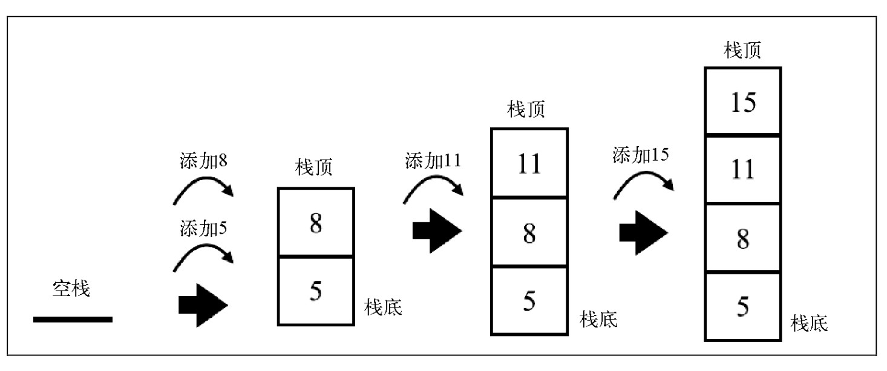

# 栈

## 定义

栈是一种遵从`后进先出(LIFO)`原则的有序集合。新添加或待删除的元素都保存在栈的同
一端，称作栈顶，另一端就叫栈底。在栈里，新元素都靠近栈顶，旧元素都接近栈底。

栈也被用在编程语言的编译器和内存中保存变量、方法调用等，也被用于浏览器历史记录 (浏览器的返回按钮)。

## 栈的方法

- push(element(s)):添加一个(或几个)新元素到栈顶
- pop():移除栈顶的元素，同时返回被移除的元素
- peek():返回栈顶的元素，不对栈做任何修改(该方法不会移除栈顶的元素，仅仅返回它)
- isEmpty():如果栈里没有任何元素就返回 true，否则返回 false
- clear():移除栈里的所有元素
- size():返回栈里的元素个数。该方法和数组的 length 属性很类似

## 实现方式一：数组

```js
class Stack {
  constructor() {
    this.items = []
  }
  // 向栈添加元素
  push(element) {
    this.items.push(element)
  }
  // 从栈移除元素
  pop() {
    return this.items.pop()
  }
  // 查看栈顶元素
  peek() {
    return this.items[this.items.length - 1]
  }
  // 检查栈是否为空
  isEmpty() {
    return this.items.length === 0
  }
  size() {
    return this.items.length
  }
  // 清空栈元素
  clear() {
    this.items = []
  }
}
```

使用Stack类：

```js
var stack = new Stack()
console.log(stack.isEmpty()); // 输出为true
stack.push(5);
stack.push(8);
console.log(stack.peek()); // 输出8
stack.push(11);
console.log(stack.size()); // 输出3
console.log(stack.isEmpty()); // 输出false
stack.push(15);
```

下图描绘了对栈的操作和当前的状态：



然后移除元素：

```js
stack.pop();
stack.pop(); console.log(stack.size()); // 输出2
```

下图描绘了对栈的操作和当前的状态：


## 实现方式二：对象

```js
class Stack {
  constructor() {
    // 记录栈的大小
    this.count = 0
    this.items = {}
  }
  // 向栈中插入元素
  push(element) {
    this.items[this.count] = element
    this.count++
  }
  // 验证一个栈是否为空和它的大小
  isEmpty() {
    return this.count === 0
  }
  size() {
    return this.count
  }
  // 从栈中弹出元素
  pop() {
    if (this.isEmpty()) {
      return undefined
    }
    this.count--
    const result = this.items[this.count]
    delete this.items[this.count]
    return result
  }
  // 查看栈顶的值并将栈清空
  peek() {
    if (this.isEmpty()) {
      return undefined
    }
    return this.items[this.count - 1]
  }
  clear() {
    this.count = 0
    this.items = {}
  }
  // 创建toString方法
  toString() {
    if (this.isEmpty()) {
      return ''
    }
    let objString = `${this.items[0]}`
    for (let i = 1; i < this.count; i++) {
      objString = `${objString},${this.items[i]}`
    }
    return objString
  }
}
```

### 问题

使用`class`定义类无法设置`私有属性`和`私有方法`，解决方案：

- 使用下划线命名约定
- Symbol
- WeakMap
- TypeScript 提供了一个给类属性和方法使用的 private 修饰符。然而，该修饰符只在编译时 有用(包括我们在前几章讨论的 TypeScript 类型和错误检测)。在代码被转移完成后，属性同样 是公开的。
- 在属性前添加井号(`#`)作为前缀来声明私有属性

## 用栈解决问题

### 十进制转化为二进制

转化的原理：

将该十进制数除以 2(二进制是满二进一)并对商取整， 直到结果是 0 为止


```js
function decimalToBinary(decNumber) {
  const remStack = new Stack()
  let number = decNumber
  // 余数
  let rem
  let binaryString = ''

  while (number > 0) {
    // 取余数
    rem = number % 2
    // 以十进制10为例，分布将`0,1,0,1`存入栈中
    remStack.push(rem)
    // 取商的整数（向下取整）
    number = Math.floor(number / 2)
  }

  while (!remStack.isEmpty()) {
    // 用 pop 方法把栈中的元素都移除，把出栈的元素连接成字符串
    binaryString += remStack.pop().toString()
  }
  return binaryString
}

// 测试
decimalToBinary(10)     // '1010'
decimalToBinary(233)    // '11101001'
```

### 十进制转化为其他进制

把十进制转换成基数为 2~36 的任意进制

```js
function baseConverter(decNumber, base) {
  const remStack = new Stack()
  const digits = '0123456789ABCDEFGHIJKLMNOPQRSTUVWXYZ'
  let number = decNumber
  let rem
  let baseString = ''

  if (!(base >= 2 && base <= 36)) {
    return ''
  }

  while (number > 0) {
    rem = number % base
    remStack.push(rem)
    number = Math.floor(number / base)
  }

  while (!remStack.isEmpty()) {
    // 十进制转成十六进制时，余数是 0~9 加上 A、B、C、D、E 和 F
    baseString += digits[remStack.pop()]
  }
  return baseString
}

// 测试
baseConverter(10,2)           // '1010'
baseConverter(100345, 2)      // '11000011111111001'
baseConverter(100345, 8)      // '303771'
baseConverter(100345, 16)     // '187F9'
baseConverter(100345, 35)     // '2BW0'
```
