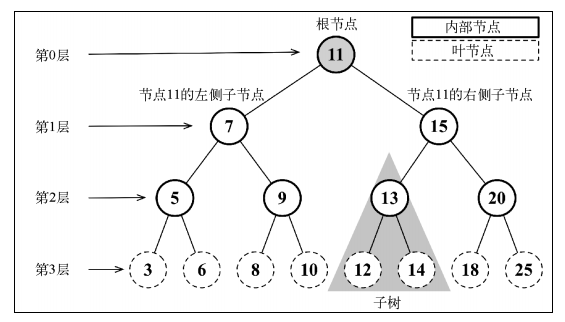

# 树

到目前为止，已经介绍了一些顺序数据结构，而第一个非顺序数据结构是散列表。学习另一种非顺序数据结构——树，它对于存储需要快速查找的数据非常有用



## 二叉树和二叉搜索树

**二叉树**中的节点最多只能有两个子节点：一个是左侧子节点，另一个是右侧子节点

**二叉搜索树**（ BST）是二叉树的一种，但是只允许你在左侧节点存储（比父节点）小的值，在右侧节点存储（比父节点）大的值。上图展示了一棵二叉搜索树

### 创建 BinarySearchTree 类

```js
const Compare = {
  LESS_THAN: -1,
  BIGGER_THAN: 1,
}
function defaultCompare(a, b) {
  if (a === b) {
    return 0
  }
  return a < b ? Compare.LESS_THAN : Compare.BIGGER_THAN
}
class Node {
  constructor(key) {
    this.key = key //  节点值
    this.left = null // 左侧子节点引用
    this.right = null // 右侧子节点引用
  }
}
class BinarySearchTree {
  constructor(compareFn = defaultCompare) {
    this.compareFn = compareFn  // 用来比较节点值
    this.root = null            // Node 类型的根节点
  }
}

```

方法：

- insert(key)：向树中插入一个新的键。
- search(key)：在树中查找一个键。如果节点存在，则返回 true；如果不存在，则返回false。
- inOrderTraverse()：通过中序遍历方式遍历所有节点。
- preOrderTraverse()：通过先序遍历方式遍历所有节点。
- postOrderTraverse()：通过后序遍历方式遍历所有节点。
- min()：返回树中最小的值/键。
- max()：返回树中最大的值/键。
- remove(key)：从树中移除某个键。

### 向二叉搜索树中插入一个键

