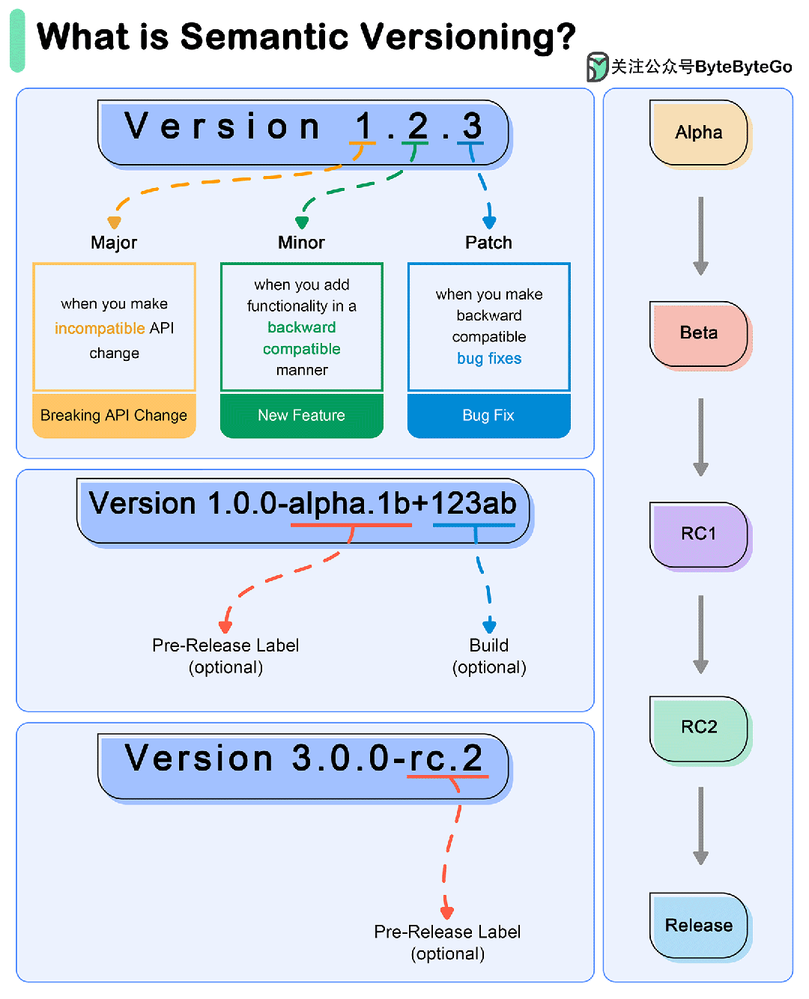

# 版本号管理规范

版本号管理，采用[语义化版本控制规范（SemVer）](https://semver.org/lang/zh-CN/)（`Semantic Versioning`）的方式进行版本管理。

## 摘要

版本格式：**主版本号.次版本号.修订号**（`major.minor.patch`），版本号递增规则如下：

1. 主版本号：当你做了不兼容的 API 修改，
2. 次版本号：当你做了向下兼容的功能性新增，
3. 修订号：当你做了向下兼容的问题修正。

先行版本号及版本编译信息可以加到 **主版本号.次版本号.修订号** 的后面，作为延伸。

- 先行版本格式：`major.minor.patch-alpha`、`major.minor.patch-beta`
- 版本编译版本格式：`major.minor.patch-alpha+01AB-`

## 规范

- 标准的版本号 **必须** 采用 `X.Y.Z` 的格式，其中 `X`、`Y` 和 `Z` 为非负的整数，且 **禁止** 在数字前方补零。`X` 是主版本号、`Y` 是次版本号、而 `Z` 为修订号。每个元素 **必须** 以数值来递增。例如：`1.9.1 -> 1.10.0 -> 1.11.0`。
  
- 标记版本号的软件发行后，**禁止** 改变该版本软件的内容。任何修改都 **必须** 以新版本发行
  
- **主版本号为零**（`0.y.z`）的软件处于开发初始阶段，一切都可能随时被改变。这样的公共 API 不应该被视为稳定版。
  
- `1.0.0` 的版本号用于界定公共 API 的形成。这一版本之后所有的版本号更新都基于公共 API 及其修改内容
  
- 修订号（`Patch`） `Z`（`x.y.Z | x > 0`）**必须** 在只做了向下兼容的修正时才递增。这里的修正指的是针对不正确结果而进行的内部修改。
  
- 次版本号（`Minor`） `Y`（`x.Y.z | x > 0`）**必须** 在有向下兼容的新功能出现时递增。在任何公共 API 的功能被标记为弃用时也 **必须** 递增。也 **可以** 在内部程序有大量新功能或改进被加入时递增，其中 **可以** 包括修订级别的改变。每当次版本号递增时，**修订号必须归零**。
  
- 主版本号（`Major`） `X`（`X.y.z | X > 0`）**必须** 在有任何不兼容的修改被加入公共 API 时递增。其中 **可以** 包括次版本号及修订级别的改变。每当主版本号递增时，**次版本号和修订号必须归零**
  
- 先行版本号（`pre-release`） **可以** 被标注在修订版之后，先加上一个连接号再加上一连串以句点分隔的标识符来修饰。标识符 **必须** 由 `ASCII` 字母数字和连接号 [`0-9A-Za-z-`] 组成，且 **禁止** 留白。数字型的标识符 **禁止** 在前方补零。先行版的优先级低于相关联的标准版本。被标上先行版本号则表示这个版本并非稳定而且可能无法满足预期的兼容性需求。范例：`1.0.0-alpha`、`1.0.0-alpha.1`、`1.0.0-0.3.7`、`1.0.0-x.7.z.92`，先行版本通常有`base、alpha、beta、RC、release`

- 版本编译信息 **可以** 被标注在修订版或先行版本号之后，先加上一个加号再加上一连串以句点分隔的标识符来修饰。标识符 **必须** 由 `ASCII` 字母数字和连接号 [`0-9A-Za-z-`] 组成，且 **禁止** 留白。当判断版本的优先层级时，版本编译信息可被忽略。因此当两个版本只有在版本编译信息有差别时，属于相同的优先层级。范例：`1.0.0-alpha+001`、`1.0.0+20130313144700`、`1.0.0-beta+exp.sha.5114f85`。

- 版本的优先层级指的是不同版本在排序时如何比较
  
  - 判断优先层级时，**必须** 把版本依序拆分为主版本号、次版本号、修订号及先行版本号后进行比较（版本编译信息不在这份比较的列表中）。
  
  - 由左到右依序比较每个标识符，第一个差异值用来决定优先层级：主版本号、次版本号及修订号以数值比较。例如：`1.0.0 < 2.0.0 < 2.1.0 < 2.1.1`。

  - 当主版本号、次版本号及修订号都相同时，该以优先层级比较低的先行版本号决定。例如：`1.0.0-alpha < 1.0.0`。
 
  -  有相同主版本号、次版本号及修订号的两个先行版本号，其优先层级 **必须** 透过由左到右的每个被句点分隔的标识符来比较，直到找到一个差异值后决定：
     -  只有数字的标识符以数值高低比较。

     -  有字母或连接号时则逐字以 ASCII 的排序来比较。

     -  数字的标识符比非数字的标识符优先层级低。

     -  若开头的标识符都相同时，栏位比较多的先行版本号优先层级比较高。

     - 例如：`1.0.0-alpha < 1.0.0-alpha.1 < 1.0.0-alpha.beta < 1.0.0-beta < 1.0.0-beta.2 < 1.0.0-beta.11 < 1.0.0-rc.1 < 1.0.0`。
  
## 案例

### 01 初始开发阶段

从版本 0.1.0 开始。

发布一些增量更改和错误修复：0.1.1, 0.2.0, 0.2.1, 0.3.0.

### 02 第一个稳定版本

发布稳定版本：1.0.0.

### 03 后续变更

- 补丁发布：
  - 需要对 `1.0.0` 进行错误修复，更新至 `1.0.1`。
  - 更多错误修复：`1.0.2`, `1.0.3`.
- 次要版本：
  - `1.0.3` 中添加了一个向后兼容的新功能，更新至 `1.1.0`。
  - 新增另一项功能：`1.2.0`。
  - 新小版本中的错误修复：`1.2.1`, `1.2.2`。
- 重大版本
  - `1.2.2` 中引入了不向后兼容的重大变更，更新至 `2.0.0`。

以后的小版本和补丁更新遵循相同模式。

### 04 特殊版本和预发布版本

- 预发布版本
  - 用连字符和一系列以点分隔的标识符表示。例如 `alpha` 版、`beta` 版和候选发布版：`1.0.0-alpha`、`1.0.0-beta`、`1.0.0-rc.1`。

- 构建元数据。
    - 用加号和一系列以点分隔的标识符表示。
    - 示例：`1.0.0+20130313144700`。

语义版本管理提供了一种清晰、结构化的软件版本管理方法，让开发人员更容易了解变更的影响并管理依赖关系。通过遵循 `SemVer` 规则，开发人员可以确保其软件以可预测的方式稳定发展。