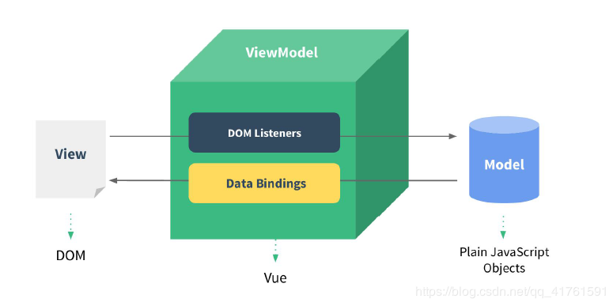
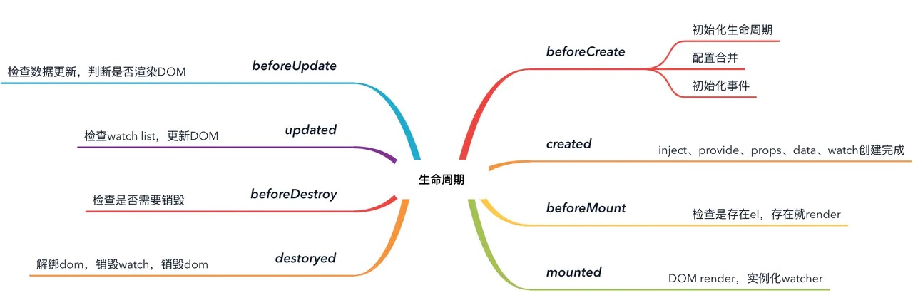
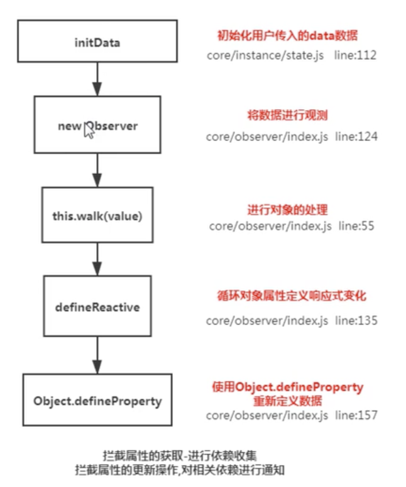

# 问题

## MVVM



### 什么是MVVM

MVVM是`Model-View-ViewModel`缩写，也就是把`MVC`中的`Controller`演变成`ViewModel`,即双向数据绑定

- Model【模型】层代表数据模型，即 纯js对象
- View【视图】代表UI组件，即 DOM
- ViewModel【视图模型】是View和Model层的桥梁,在vue中指 Vue,包括`DOM事件的监听`以及`数据的绑定`

### MVVM的特点

- 视图变化，更新数据（DOM事件的监听）
- 数据变化，更新视图（数据的绑定）

总结：在MVVM的框架下，`View`和`Model`是不能直接通信的。它们通过`ViewModel`来通信，`ViewModel`通常要实现一个`observer`观察者，当数据发生变化，`ViewModel`能够监听到数据的这种变化，然后通知到对应的视图做自动更新，而当用户操作视图，`ViewModel`也能监听到视图的变化，然后通知数据做改动，这实际上就实现了数据的双向绑定。

### 如何实现MVVM

### 阐述你所理解的MVVM响应式原理


vue采用数据劫持，配合发布-订阅者模式的方式，通过Object.defineProperty()来劫持各个属性的getter和setter，在数据变动时，发布消息给依赖收集器，去通知观察者，做出对应的回调函数，去更新试图。

MVVM作为绑定的入口，整合Observer，Compile和Watcher三者，通过Observer来监听model数据变化，通过Compile来解析模板指令，最终通过Watcher搭起了Observer和Compile之间的通信桥梁，达到数据变化 => 数据更新，视图交互变化 => 数据model变更的双向绑定效果

## 生命周期

生命周期图：


8个阶段：Vue 实例的创建到组件销毁的一个的过程

- 创建前/后：beforeCreate/created
- 挂载前/后：beforeMount/mounted
- 更新前/后：beforeUpdate/updated
- 销毁前/后：beforeDestory/destoryed

描述：



组件加载渲染过程：**beforeCreate-->created-->beforeMount-->mounted**

### 父子组件的渲染过程

父子组件加载渲染过程：（子组件先走mounted,父组件在mounted）:

**父级beforeCreate-->父级created-->父级beforeMount**-->子级beforeCreate->子级created-->子级beforeMount-->子级mounted-->**父级mounted**

### 父子组件的更新过程

父子组件更新过程：（子级先updated,父级再updated）:

**父级beforeUpdate**-->子级beforeUpdate-->子级updated-->**父级updated**

### 父子组件的销毁过程

销毁过程：（子级先destoryed,父级再destoryed）：

**父级beforeDestory**-->子级beforeDestory-->子级destoryed-->**父级destoryed**

### 何时使用beforeDestory

- 解绑自定事件 event.$off
- 清除定时器
- 解绑自定义的dom事件，比如 window scroll等

### 父组件监听到子组件的生命周期

使用on和emit：

```js
// Parent.vue
<Child @mounted="doSomething"/>
// Child.vue
mounted() {
  this.$emit("mounted");
}
```

使用hook钩子函数：

```js
//  Parent.vue
<Child @hook:mounted="doSomething" ></Child>
doSomething() {
   console.log('父组件监听到 mounted 钩子函数 ...');
},

//  Child.vue
mounted(){
   console.log('子组件触发 mounted 钩子函数 ...');
},
// 以上输出顺序为：
// 子组件触发 mounted 钩子函数 ...
// 父组件监听到 mounted 钩子函数 ...
```

## 组件通信

### 父子组件通信

方式 | api
---|---
父传子 | `props`
子传父 | `$on`、`$emit`
获取父子组件实例 | `$parent`、`$children`
获取实例的方式调用组件的属性或者方法 | `$ref`
官方不推荐使用，但是写组件库时很常用 | `provide`,`inject`

### 兄弟组件通信

方式 | api
---|---
Event Bus | 实现跨组件通信 `Vue.prototype.$bus = new Vue()`
vuex |

### 跨级组件通信

方式 | api
---|---
vuex |
$attrs、$listeners |
provide、inject |

### 将组件所有的props传递给子组件

- 通过$props

```js
<User v-bind="$props" />
```

### 在Vue中，如何能直接访问父组件、子组件和根实例

访问父组件`$parent`,访问子组件`$children`,访问根实例`$root`

## 指令

### 自定义Vue的指令

声明自定义指令的两种方式：

1. 全局

```js
let Opt = {
    bind:function(el,binding,vnode){ },
    inserted:function(el,binding,vnode){ },
    update:function(el,binding,vnode){ },
    componentUpdated:function(el,binding,vnode){ },
    unbind:function(el,binding,vnode){ },
}
Vue.directive('指令名称', Opt)
```

2. 局部：钩子函数directives中进行声明

```js
Directives: {
 Demo:  Opt
}
```

### v-model指令提供了哪些修饰符

- .lazy：懒加载修饰符
- .number：转为数字类型
- .trim：过滤首尾空格

### v-model的原理

- input元素的value = this.name
- 绑定input事件this.name = $event.target.value
- data更新触发re-render

v-model本质就是一个语法糖，可以看成是value + input方法的语法糖。 可以通过model属性的prop和event属性来进行自定义。原生的v-model，会根据标签的不同生成不同的事件和属性。

v-model会把它关联的响应式数据，动态地绑定到表单元素的value属性上，然后监听表单元素的input事件：当v-model绑定的响应数据发生变化时，表单元素的value值也会同步变化；当表单元素接受用户的输入时，input事件会触发，input的回调逻辑会把表单元素value最新值同步赋值给v-model绑定的响应式数据。

[参考](https://segmentfault.com/a/1190000021039085?utm_source=tag-newest#item-4-1)

### 实现一个v-model

```vue
<template>
  <input type="text" :value="text" @input="$emit('change', $event.target,value)"/>
  <!-- 
    1. :value而不是v-model
    2. change和model.event对应起来即可
   -->
</template>
<script>
export default {
  model: {
    prop: 'text', // 对应到 props text
    event: 'change'
  },
  props: {
    text: String
  }
}
</script>
```

### v-if和v-show的区别

- v-show通过CSS display来控制显示和隐藏
- v-if是组件真的渲染和销毁，而不是显示和隐藏
- 频繁切换显示状态用v-show

### 避免同时使用v-for和v-if两条指令

为什么要，v-for比v-if的优先级高，一般会采用computed计算属性

## 修饰符

### 请列举v-on指令的修饰符

- .stop：阻止事件冒泡
- .prevent：阻止默认事件
- .capture：把默认的冒泡变为捕获
- .self：只当事件是从侦听器绑定的元素本身触发时才触发回调（比如：冒泡时，如果不是点击该元素不会触发他的click事件）
- .{keyCode | keyAlias}：用特定按键触发事件
- .native：监听组件根元素的原生事件
- .once：只触发一次回调
- .left | .middle | .right：鼠标的左键 中键 右键触发的事件

```html
<div v-on:mousedown.left="myfn">AAA</div>
<div v-on:mousedown.middle="myfn">BBB</div>
<div v-on:mousedown.right="myfn">CCC</div>
```

- .passive

### .native修饰符有什么作用

作用就是把一个vue组件转化为一个普通的HTML标签，并且该修饰符对普通HTML标签是没有任何作用的。

### .sync修饰符有什么作用

对prop进行“双向绑定”，使得子组件可以修改父组件的数据

## 内置组件

### keep-alive组件

作用：

- keep-alive可以实现`组件缓存`，当组件切换时不会对当前组件进行卸载。
- 常用的两个属性`include`/`exclude`，允许组件有条件的进行缓存。
- 两个生命周期`activated`/`deactivated`，用来得知当前组件是否处于活跃状态。
- keep-alive的中还运用了LRU(Least Recently Used)算法。

生命周期钩子：

- activated：当组件激活时，钩子触发的顺序是`created->mounted->activated`
- deactivated: 组件停用时会触发deactivated，当再次前进或者后退的时候只触发activated

### slot组件

slot插槽，分为匿名插槽，具名插槽，作用域插槽：
slot | 说明
---|---
匿名插槽 | 无name属性，在组件中只可以使用一次，父组件提供样式和内容
具名插槽 | 有name属性，在组件中可以用多次，父组件可以通过html模板上slot关联具名插槽
作用域插槽 | 父组件提供样式，子组件提供提供内容，在slot上绑定数据，子组件的值可以传给父组件使用，父组件展示子组件有三种，flex显示，列表显示，直接显示，使用slot-scope必须使用template。scope返回值是slot标签上放回所有属性值，并且是一个对象形式保存起来的，slot有两个属性，一个row，一个index

页面第一次进入，钩子的触发顺序`created-> mounted-> activated`，退出时触发deactivated。当再次进入（前进或者后退）时，只触发`activated`

## computed与watch的区别

1. computed本质是一个`具备缓存的watcher`，依赖的属性发生变化就会更新视图，并且计算属性默认只有`getter`，不过在需要时你也可以提供一个 `setter`

适用于场景：

- 计算比较消耗性能的计算场景
- 当表达式过于复杂时，在模板中放入过多逻辑会让模板难以维护，可以将复杂的逻辑放入计算属性中处理。

2. watch没有缓存性，更多的是观察的作用，可以监听某些数据执行回调。当我们需要深度监听对象中的属性时，可以打开`deep：true`选项，这样便会对对象中的每一项进行监听。这样会带来性能问题，优化的话可以使用字符串形式监听，如果没有写到组件中，不要忘记使用unWatch手动注销

```js
watch: {
obj: {
  handler(val, oldValue) {
    // ...
  },
  deep: true, // 深度监听
  immediate: true // 立即调用
}
}
```

## mixins

- 多个组件有相同的逻辑，抽离出来
- mixins有一些问题，后面vue3.0提出`composition api`来解决这些问题

问题：

- 来源不明确，不利于代码的阅读，如果有个mixins和自动合并
- 多个mixins会造成命名冲突
- mixin和组件可能出现多对多的关系，复杂度较高

## 全局函数

### Vue.extend()

extend是vue提供的一个全局方法，使用基础 Vue 构造器，创建一个“子类”。参数是一个包含组件选项的对象。

### Vue.use()

### Vue.nextTick()

在`下次 DOM 更新循环结束之后`执行`延迟回调`（简单的理解是：当数据更新了，在DOM中渲染后，自动执行该函数）。nextTick主要使用了`宏任务`和`微任务`。根据执行环境分别尝试采用：

- Promise
- MutationObserver
- setImmediate
- 如果以上都不行则采用setTimeout

定义了一个异步方法，多次调用nextTick会将方法存入队列中，通过这个异步方法清空当前队列

使用场景：

1. 在`created钩子函数`中使用，因为此时DOM并未渲染
2. 更改数据后当你想`立即使用js操作新的视图`的时候需要使用它

原理：

Vue是异步执行DOM更新的，一旦观察到数据变化，Vue就会开启一个队列，然后把在同一个事件循环 (event loop) 当中观察到数据变化的 watcher 推送进这个队列。如果这个watcher被触发多次，只会被推送到队列一次。这种缓冲行为可以有效的去掉重复数据造成的不必要的计算和DOM操作。而在下一个事件循环时，Vue会清空队列，并进行必要的DOM更新

## class可接收哪几种类型的值

对象:

```html
<div class="static" :class="{ active: isActive, 'text-danger': hasError }"></div>
```

数组:

```html
<div :class="[isActive ? activeClass : '', errorClass]"></div>
<!-- 或者数组中写对象 -->
<div :class="[{ active: isActive }, errorClass]"></div>
```

## style可接收哪几种类型的值

对象：

```html
<div :style="styleObject"></div>
```

```js
data: {
  styleObject: {
    color: 'red',
    fontSize: '13px'
  }
}
```

数组:

```html
<div v-bind:style="[baseStyles, overridingStyles]"></div>
```

```js
data: {
  baseStyles: {
    color: 'red',
    fontSize: '13px'
  },
  overridingStyles: {
    color: 'red',
    fontSize: '13px'
  }
}
```

## 如何监测数组变化

Vue官方给出了解释是【Vue不能检测】，而很多文章写出的是【Object.defineProperty不能检测】。但实际上Object.defineProperty是可以检测到数组索引的变化的

Vue的解决方案，就是重写了数组的原型，更准确的表达是`拦截`了数组的原型

源码：

```js
function def (obj: Object, key: string, val: any, enumerable?: boolean) {
  Object.defineProperty(obj, key, {
    value: val,
    enumerable: !!enumerable,
    writable: true,
    configurable: true
  })
}
// 获得原型上的方法
const arrayProto = Array.prototype
// 创建一个新对象，使用现有的对象来提供新创建的对象的__proto__
const arrayMethods = Object.create(arrayProto)
// Vue拦截的方法
const methodsToPatch = [
  'push',
  'pop',
  'shift',
  'unshift',
  'splice',
  'sort',
  'reverse'
]
// 将上面的方法重写
methodsToPatch.forEach(function (method) {
  // 缓存原始方法
  const original = arrayProto[method]
  // 
  def(arrayMethods, method, function mutator (...args) {
    const result = original.apply(this, args)
    const ob = this.__ob__
    let inserted
    switch (method) {
      case 'push':
      case 'unshift':
        inserted = args
        break
      case 'splice':
        inserted = args.slice(2)
        break
    }
    if (inserted) ob.observeArray(inserted)
    // 派发更新
    ob.dep.notify()
    return result
  })
})
```

## 采用异步渲染

因为不采用异步渲染，那么每次更新数据都会对当前组件进行重新渲染，所以为了性能考虑，vue会在本轮数据更新后，再去更新试图

## 数据绑定与响应式数据原理



- 监听data变化
- 组件渲染和更新的流程

Vue在初始化数据时，会使用`Object.defineProperty`重新定义data中的所有属性，当页面使用对应属性时，首先会进行`依赖收集`(收集当前组件的watcher)，如果属性发生变化会通知相关依赖进行更新操作(`发布订阅`)

采用`数据劫持`结合`发布者-订阅者模式`的方式，通过`Object.defineProperty()`来劫持各个属性的`setter`，`getter`，在数据变动时发布消息给订阅者，触发相应的监听回调

具体步骤：

1. 需要observe的数据对象进行递归遍历，包括子属性对象的属性，都加上 setter和getter
这样的话，给这个对象的某个值赋值，就会触发setter，那么就能监听到了数据变化

2. compile解析模板指令，将模板中的变量替换成数据，然后初始化渲染页面视图，并将每个指令对应的节点绑定更新函数，添加监听数据的订阅者，一旦数据有变动，收到通知，更新视图

3. Watcher订阅者是Observer和Compile之间通信的桥梁，主要做的事情是:
1、在自身实例化时往属性订阅器(dep)里面添加自己
2、自身必须有一个update()方法
3、待属性变动dep.notice()通知时，能调用自身的update()方法，并触发Compile中绑定的回调，则功成身退。

4. MVVM作为数据绑定的入口，整合Observer、Compile和Watcher三者，通过Observer来监听自己的model数据变化，通过Compile来解析编译模板指令，最终利用Watcher搭起Observer和Compile之间的通信桥梁，达到数据变化 -> 视图更新；视图交互变化(input) -> 数据model变更的双向绑定效果。

## ref和$refs有什么作用

ref 被用来给元素或子组件注册引用信息。引用信息将会注册在父组件的 $refs 对象上。如果在普通的 DOM 元素上使用，引用指向的就是 DOM 元素

## Vue3.x响应式数据原理

Vue3.x改用`Proxy`替代`Object.defineProperty`。因为`Proxy`可以直接监听对象和数组的变化，并且有多达13种拦截方法。并且作为新标准将受到浏览器厂商重点持续的性能优化

### Object.defineProperty()

缺点：

- 无法检测到对象属性的新增或删除，解决方案：Vue.set(obj, propertName/index, value),Vue.delete()
- 可以检测到数组索引的变化的，但是性能影响太大，因此vue重写了数组操作的方法，比如push，pop，shift，unshift，splice，sort，reverse。[参考](https://segmentfault.com/a/1190000015783546)

Proxy是ES6提供的一个新的API，用于修改某些操作的默认行为

- Proxy直接代理整个对象而非对象属性
- Proxy也可以监听数组的变化

Proxy只会代理对象的第一层，那么Vue3又是怎样处理这个问题的：

判断当前`Reflect.get`的返回值是否为`Object`，如果是则再通过`reactive`方法做代理， 这样就实现了`深度观测`

## vue-loader

- 解析`.vue`文件的一个加载器，将template/js/style转换成js模块。
- 用途：js可以写es6、style样式可以scss或less、template可以加jade等

```vue
<template comments="true">
    <!--这里是注释-->
<template>
```

## Vue中元素的key有什么作用

- 必须使用key，且不能使用index和random
- diff算法中通过tag和key来判断，是否是相同的dom
- 好处是减少渲染次数，提升渲染性能
- diff算法，就地复用

1. key能够决定节点是否应该被`删除`、`添加`、`修改`，当节点被`删除`、`添加`时，会发生以下事件:
   - 完整地触发组件的生命周期钩子
   - 触发过渡
2. 对比两个子节点数组时，建立 key-index映射代替遍历查找 sameNode,提高性能

## 组件中的data为什么是一个函数

一个组件被复用多次的话，也就会创建多个实例。本质上，这些实例用的都是同一个构造函数。如果data是对象的话，对象属于引用类型，会影响到所有的实例。所以为了保证组件不同的实例之间data不冲突，data必须是一个函数

## Vue模版编译原理

简单说，Vue的编译过程就是将`template`转化为`render函数`的过程。会经历以下阶段：

- 生成AST树
- 优化
- codegen
首先解析模版，生成`AST语法树`(一种用JavaScript对象的形式来描述整个模板)。
使用大量的正则表达式对模板进行解析，遇到标签、文本的时候都会执行对应的钩子进行相关处理。

Vue的数据是响应式的，但其实模板中并不是所有的数据都是响应式的。有一些数据首次渲染后就不会再变化，对应的DOM也不会变化。那么优化过程就是深度遍历AST树，按照相关条件对树节点进行标记。这些被标记的节点(静态节点)我们就可以跳过对它们的比对，对运行时的模板起到很大的优化作用。

编译的最后一步是将优化后的AST树转换为可执行的代码

## SSR

SSR(Serve Side Render)也就是服务端渲染，也就是将Vue在客户端把标签渲染成HTML的工作放在服务端完成，然后再把html直接返回给客户端。

优点：

- SPA 框架 SEO 的解决方案（nuxt）
- 首屏加载速度更快等优点

缺点：

- 开发条件会受到限制，服务器端渲染只支持beforeCreate和created两个钩子
- 当我们需要一些外部扩展库时需要特殊处理
- 服务端渲染应用程序也需要处于Node.js的运行环境
- 服务器会有更大的负载需求

## Vue的性能优化

### 编码阶段

- 尽量减少data中的数据，data中的数据都会增加getter和setter，会收集对应的watcher
- v-if和v-for不能连用
- 如果需要使用v-for给每项元素绑定事件时使用事件代理
- 更多的情况下，使用`v-if`替代`v-show`
- `key`保证唯一
- 使用`路由懒加载`、异步组件
- 防抖、节流
- 第三方模块按需导入
- 长列表滚动到可视区域动态加载
- 图片懒加载
- 自定义事件，dom事件及时销毁，否则会造成内存泄露，页面越来越卡
- 合理使用`keep-alive`

### SEO优化

- 预渲染
- 服务端渲染SSR

### 打包优化

- 压缩代码
- Tree Shaking/Scope Hoisting
- 使用cdn加载第三方模块
- 多线程打包happypack
- splitChunks抽离公共文件
- sourceMap优化
  
### 用户体验

- 骨架屏
- PWA
- 还可以使用缓存(客户端缓存、服务端缓存)优化、服务端开启gzip压缩等

[参考](https://juejin.im/post/5e04411f6fb9a0166049a073#heading-7)

## 怎么给vue定义全局方法

### 将方法挂载到 Vue.prototype 上面

```js
// global.js
const checkMobile = m => /^[1][0-9]{10}$/.test(m);
export default {
  checkMobile,
  ...
}
```

```js
// main.js
import Vue from "vue";
import global from "@/global";
Object.keys(global).forEach((key) => {
  Vue.prototype["$g_" + key] = global[key];
});
```

```js
// 挂载之后，在需要引用全局变量的模块处(App.vue)，
// 不需再导入全局变量模块，而是直接用this就可以引用了，如下:
export default {
  mounted() {
    this.$g_checkMobile(13988776655);
  },
};
```

### 全局混入mixin

```js
// mixin.js
const mixin = {
  methods: {
    checkMobile(m) {
      return /^[1][0-9]{10}$/.test(m)
    }
  },
}
export default mixin
```

```js
// main.js
import Vue from 'vue'
import mixin from '@/mixin'
Vue.mixin(mixin)
```

```js
// 在项目中直接使用
export default {
 mounted() {
   this.checkMobile()
 }
}
```

### 使用Plugin方式

```js
// plugin.js
const checkMobile = m => /^[1][0-9]{10}$/.test(m);

const plugin = {
  install: function(Vue) {
    Vue.prototype.$plugins_checkMobile = checkMobile
    // ...
  }
}
```

```js
// main.js
import Vue from 'vue'
import plugin from '@/plugin'
Vue.use(plugin)
```

```js
// 使用
export default {
 mounted() {
   this.$plugins_checkMobile()
 }
}
```

### 任意vue文件中写全局函数

```js
// 创建全局方法
this.$root.$on("test", function () {
  console.log("test");
});
// 销毁全局方法
this.$root.$off("test");
// 调用全局方法
this.$root.$emit("test");
```
