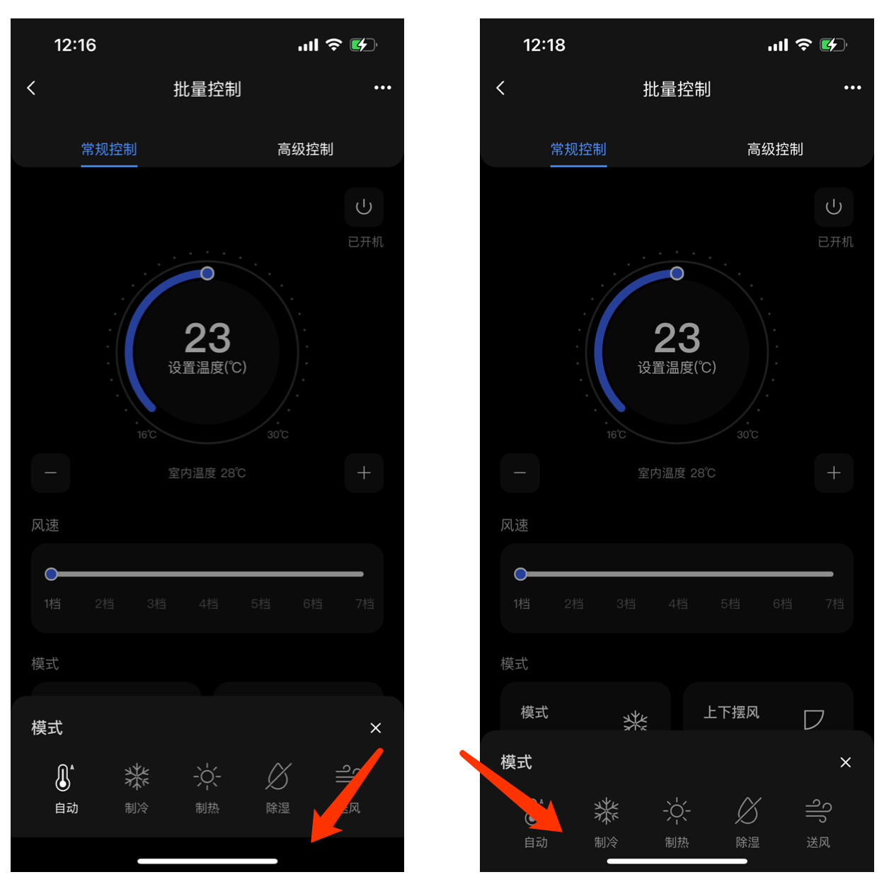
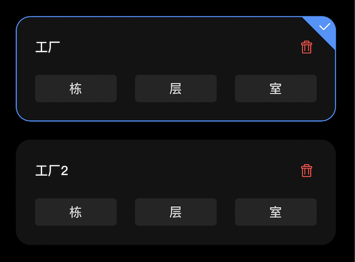

# Q&A

## 单位

- rpx 即响应式 px，一种根据屏幕宽度自适应的动态单位
- vh viewpoint height，视窗高度，1vh 等于视窗高度的 1%
- vw viewpoint width，视窗宽度，1vw 等于视窗宽度的 1%

## 开发调试

### 内置浏览器

不需要任何的跨域配置，但是会有一些意想不到的问题；比如，mac内置浏览器开发者控制台空白问题，[官方解决方案](https://hx.dcloud.net.cn/Tutorial/faq/devtools)：

```bash
lsof -i:9777 | awk '{print $2}' | tail -n +2 | xargs kill -9
```

### 其他浏览器调试

- 使用浏览器打开，需要配置跨域，配置`manifest.json`文件如下：

```json
"h5": {
    "devServer": {
        "proxy": {
            "/api": {
                "target": "https://xxx.com",
                "changeOrigin": true,
                "secure": true,
                "pathRewrite":{"^/api":"/"}
            }
        }
    }
}
```

### 真机调试

- 安卓手机连接mac电脑会时不时的断开连接，需要重新连接，苹果手机暂无该问题

## 状态栏遮挡

- 定义一个状态栏组件，参考官方文档[系统状态栏高度](https://uniapp.dcloud.io/tutorial/syntax-css.html#css-%E5%8F%98%E9%87%8F)

```scss
var(--status-bar-height)
```

## 页面被整体拖拽

### 禁止页面滚动

```json
"style": {
    "disableScroll": true
}
```

- 会导致页面无法滚动，设置`overflow: scroll`是无效的

### 禁止回弹属性

页面是可以滚动的

```json
"style": {
    "bounce":"none"
}
``

## 输入框的键盘会将页面上移

- 配置`page.json`

```json
{
    "path": "pages/login/index",
    "style": {
        "disableScroll": true,
        "app-plus": {
            "softinputMode": "adjustResize"
        }
    }
}
```

注意，如果底部有`position: absolute`或`position: fixed`定位的元素会被键盘顶起

### absolute和fixed定位上移

解决方案：

```js
// input 添加  @focus="hideFooter" @blur="showFooter"  
// 被顶起的内容添加v-if="show"
onLoad() {
uni.getSystemInfo({
    success: res => {
    this.windowHeight = res.windowHeight
    },
})
uni.onWindowResize(res => {
    if (res.size.windowHeight < this.windowHeight) {
        this.show = false
    } else {
        this.show = true
    }
})
},
hideFooter() {
    this.show = false
},
showFooter() {
    this.show = true
},
```

### 背景图也会被顶起

解决方案？？？

## 不能直接使用echart

- 使用「内置预览」模式可以正常显示，避免被坑
- 使用「运行到手机」时就会不显示图表

需要使用[renderjs](https://uniapp.dcloud.io/tutorial/renderjs.html#renderjs)，仅支持内联使用

```vue
<template>
  <view class="container">
    <view id="chart" :chartData="chartData" :change:chartData="render.updateChart" style="width: 340rpx; height: 180rpx"/>
  </view>
</template>

<script src="./index.js"></script>
<script module="render" lang="renderjs">
import echarts from '@/utils/echart'

let chart = null
export default {
  mounted() {
    chart = echarts.init(document.getElementById('chart'))
    const options = this.initChart(this.chartData)
    chart.setOption(options)
  },
  methods: {
    initChart(data) {
      const options = {
        title: {
          show: true,
          zlevel: 0,
          text: [`{c|${data?.total || 0}}`, '{b|设备总数}'].join('\n'),
          left: 40,
          top: 'center',
          textAlign: 'center',
          textStyle: {
            rich: {
              b: {
                fontSize: 12,
                fontWeight: 400,
                color: '#B4B4B4',
              },
              c: {
                fontSize: 24,
                color: '#fff',
                fontWeight: 500,
                padding: [0, 0, 5, 0],
              },
            },
          },
        },
        legend: {
          selectedMode: false,
          orient: 'vertical',
          right: 0,
          bottom: 0,
          itemWidth: 4,
          itemHeight: 4,
          icon: 'circle',
          textStyle: {
            color: '#B4B4B4',
          },
        },
        series: [
          {
            type: 'pie',
            center: [45, '50%'],
            radius: ['70%', '85%'],
            label: {
              show: false,
              position: 'center',
              backgroundColor: '#000',
              padding: [11, 18],
              borderRadius: 50,
              formatter: ['{c|{c}}', '{b|{b}}'].join('\n'),
              rich: {
                b: {
                  fontSize: 12,
                  fontWeight: 400,
                  color: '#B4B4B4',
                },
                c: {
                  fontSize: 24,
                  color: '#fff',
                  fontWeight: 500,
                  padding: [0, 0, 5, 0],
                },
              },
            },
            emphasis: {
              label: {
                show: true,
              },
              scaleSize: 5,
            },
            zlevel: 1,
            itemStyle: {
              color: function (params) {
                var colorList = [
                  { c1: '#4072FF', c2: '#6791FF' },
                  { c1: '#A5A5A5', c2: '#D2D2D2' },
                  { c1: '#FFC294', c2: '#FF8C71' },
                  { c1: '#E0F18D', c2: '#F2D574' },
                ]
                return new echarts.graphic.LinearGradient(1, 0, 0, 0, [
                  { offset: 0, color: colorList[params.dataIndex].c1 },
                  { offset: 1, color: colorList[params.dataIndex].c2 },
                ])
              },
            },
            data: data?.deviceStatus,
          },
        ],
      }
      return options
    },
    updateChart(newValue, oldValue) {
      const options = this.initChart(newValue)
      chart.setOption(options)
    },
  },
}
</script>

<style lang="scss" scoped src="./index.scss"></style>
```


## 云打包

使用云打包的方式,「一个账号一天大概只能打7-8次」，如需继续打包，使用付费服务（2元一次）

### android

- 公共证书
### ios

- 需要付费开通开发者账户
- [官方流程](https://ask.dcloud.net.cn/article/152)

### 问题

- android打包时，某一时段使用云打包的开发者太多，到时排队时间长
- 生成下载的链接，只可以下载5次，解决方案，将包下载下来，上传到`fir.im`平台（开通付费），[链接](https://www.betaqr.com/)

## process.env.NODE_ENV引发的问题

由于在项目中年没有配置`process.env.NODE_ENV`,直接使用作为判断，开发环境下没有问题（内置浏览器或运行到手机），但是打包之后，接口不会请求，排查问题浪费太多的时间

## uni.showModal在iOS和Android表现不一致

- ~~使用H5自定义开发modal，会遮盖不住tabbar~~
- 还有很多付费的插件

## uni.showToast在安卓机型上表现的问题

在安卓上如果一直点击按钮，会一直显示，加节流函数：

```js
export const throttle = (callback, delay = 800) => {
  let flag = true;
  return (...args) => {
    if (!flag) return;
    flag = false;
    setTimeout(() => {
      callback.apply(this, args);
      flag = true;
    }, delay);
  };
};
```

```vue
<template>
  <view class="logout-content">
        <view class="logout-btn" @click="handleClick">点击</view>
      </view>
</template>
<script>
import { throttle, notOnline } from '@/utils/index'
  export default {
    data() {
      return {}
    },
    methods: {
      handleClick: throttle(notOnline)
    }
  }
</script>
```

## checkbox没有绑定数据

添加checked字段，操作选择取消的时候，组件自身并不会改变数据的checked字段需要手动去改变

## 字体图标相对路径引入的问题

使用绝对路径的方式引用，否则Hbuilder会报`文件查找失败`的错误

```css
@font-face {
  font-family: "iconfont"; /* Project id 3354199 */
  src: url('@/static/iconfont.woff2') format('woff2'),
       url('@/static/iconfont.woff') format('woff'),
       url('@/static/iconfont.ttf') format('truetype'),
       url('@/static/iconfont.svg') format('svg');
}
```

使用:

在项目根目录的 `App.vue` 中，引入上述的 `iconfont.css`，注意自己存放的路径，且通过 `@import` 引入的外部样式，需要写在 `style` 标签有效内容中的最前面

```vue
 <uni-icons custom-prefix="iconfont" type="icon-yaobaiguan" size="30"></uni-icons>
```

## 基于slider封装更好看的slider

```vue
<template>
	<view class="m-slider-container">
		<slider ref="slider" class="m-slider" v-bind="$attrs" v-on="$listeners" />
		<view class="range-text" v-if="showStartEnd">
			<text>{{ $attrs.min }}{{ unit }}</text>
			<text>{{ $attrs.max }}{{ unit }}</text>
		</view>
		<view class="step-text" v-if="showTick">
			<text v-for="(item, index) in stepList" :key="item" class="text" :class="{ active: curValue === item }"
				:style="{ left: left(index) }">{{ item }}{{ unit }}</text>
		</view>
	</view>
</template>
<script>
	export default {
		props: {
			unit: {
				type: String,
				default: '',
			},
			showStartEnd: {
				type: Boolean,
				default: false,
			},
			showTick: {
				type: Boolean,
				default: false,
			},
		},
		data() {
			return {
				curValue: 1,
			}
		},
		computed: {
			stepList() {
				const {
					min,
					max
				} = this.$attrs
				let arr = []
				for (let i = min; i <= max; i++) {
					arr.push(i)
				}
				return arr
			},
		},
		mounted() {
			console.log(this.$listeners)
		},
		methods: {
			change(e) {
				console.log(e.detail.value)
				this.curValue = e.detail.value
				this.$emit('change', this.curValue)
			},
			left(index) {
				return index * (100 / (this.stepList.length - 1)) + '%'
			},
		},
	}
</script>
<style lang="scss" scoped>
	.m-slider-container {
		.m-slider {
			margin: 0;

			/deep/ {
				// 高度
				.uni-slider-handle-wrapper {
					height: 10rpx;
				}
				// 滑块
				.uni-slider-thumb {
					// background: -webkit-radial-gradient(circle closest-side, #4072ff 5px, #fff 2px);
				}
				// 滑动轨迹 track
				.uni-slider-track {
					background-image: linear-gradient(270deg, #4072ff 0%, #6791ff 99%);
					border-radius: 5px;
				}
			}
		}

		// 最大最小值
		.range-text {
			display: flex;
			align-items: center;
			justify-content: space-between;
			font-size: 24rpx;
		}

		// 步长
		.step-text {
			margin-top: 20rpx;
			height: 36rpx;
			position: relative;

			.text {
				position: absolute;
				top: 0;
				margin-left: -13px;
				text-align: center;
				width: 56rpx;
				font-size: 24rpx;
				&.active {
					color: #999999;
				}
			}
		}
	}
</style>
```

## 自定义仪表盘

### 绘制圆形

```js
ctx.arc(x, y, radius, startAngle, endAngle, anticlockwise);
```

- x,y为坐标中心
- radius为半径
- startAngle，endAngle为角度
- anticlockwise为false时，顺时针旋转从startAngle->endAngle;否则逆时针从endAngle->startAngle

[角度以及方向](https://blog.csdn.net/Abudula__/article/details/84951776)

### 绘制文本

```js
fillText(text, x, y [, maxWidth])
```

- text 文本内容
- x,y 文本位置

### 旋转

```js
ctx.rotate(angle);
```

- 旋转中心点一直是 canvas 的起始点。 如果想改变中心点，我们可以通过 [`translate()`](https://developer.mozilla.org/zh-CN/docs/Web/API/CanvasRenderingContext2D/translate) 方法移动 canvas 
- angle顺时针旋转的弧度(不是角度)。如果你想通过角度值计算，可以使用公式： `degree*Math.PI / 180` 

## 防抖节流

不能使用箭头函数，会导致`this`指向丢失（指向`undefined`）

```js
// export const throttle = (callback, delay = 800) => {
//   let flag = true
//   return (...args) => {
//     if (!flag) return
//     flag = false
//     setTimeout(() => {
//       callback.apply(this, args)
//       flag = true
//     }, delay)
//   }
// }

export function throttle(fn, wait = 300, isImmediate = false) {
  let flag = true
  if (isImmediate) {
    return function () {
      if (flag) {
        fn.apply(this, arguments)
        flag = false
        setTimeout(() => {
          flag = true
        }, wait)
      }
    }
  }
  return function () {
    if (flag == true) {
      flag = false
      setTimeout(() => {
        fn.apply(this, arguments)
        flag = true
      }, wait)
    }
  }
}
```

使用（可传参）：

```js
export default {
  data() {},
  methods: {
    touchmove: throttle(function (e) {
        this.gauge.touchmove(e.changedTouches[0])
    })
  }
}
```

## uni-popup在ios中被底部安全区遮盖



```vue
<uni-popup type="bottom" :safe-area="false">底部弹出 Popup</uni-popup>
```

## radio-group中使用stop修饰符

使用`radio-group`时，`change`事件与子元素`click`事件冲突；需要给子元素的`click`事件添加修饰符`.stop`来阻止事件冒泡，但是在`click`时控制台会报错...
  


解决方案：`@click.native.stop`

```vue
<radio-group @change="handleChecked">
  <label class="template-item" v-for="item in list" :key="item.id" :class="{ actived: item.id == checked }">
    <radio style="display: none" :value="item.id + ''" :checked="item.id == checked" />
    <view class="template-title">
      <text>{{ item.title }}</text>
      <uni-icons custom-prefix="iconfont" type="icon-delete" size="22" color="#FF4848" @click.native.stop="handleRemove($event)"></uni-icons>
    </view>
  </label>
</radio-group>
```