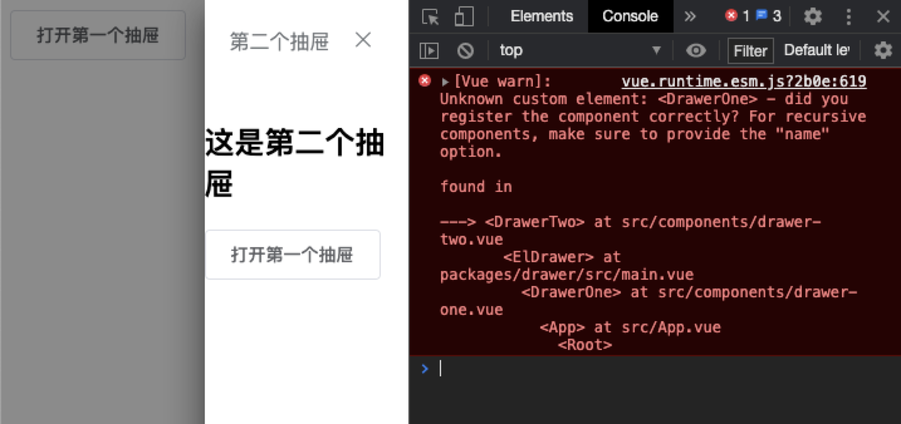

# 循环组件引用

## 业务场景

由于目前我们处理详情页面是使用`抽屉`的方式，当`A详情页`注册`B详情页`，`B详情页`又注册`A详情页`时，出现了组件循环引用的场景

## 问题分析

app.vue

```vue
<template>
  <div id="app">
    <DrawerOne ref="drawerOne" />
    <el-button @click="handleClick">打开第一个抽屉</el-button>
  </div>
</template>

<script>
import DrawerOne from './components/drawer-one'
export default {
  components: {
    DrawerOne,
  },
  data() {
    return {}
  },
  mounted() {},
  methods: {
    handleClick() {
      this.$refs.drawerOne.handleVisible()
    },
  },
}
</script>
```

drawer-one.vue

```vue
<template>
  <el-drawer title="第一个抽屉" :visible.sync="visible" :before-close="handleClose" size="50%" append-to-body>
    <h1>这是第一个抽屉</h1>
    <el-button @click="handleClick">打开第二个抽屉</el-button>
    <DrawerTwo ref="drawerTwo" />
  </el-drawer>
</template>
<script>
import DrawerTwo from './drawer-two'

export default {
    components: { DrawerTwo },
  data() {
    return {
      visible: false,
      direction: 'rtl',
    }
  },
  methods: {
    handleVisible() {
      this.visible = true
    },
    handleClose() {
      this.visible = false
    },
    handleClick() {
      this.$refs.drawerTwo.handleVisible()
    },
  },
}
</script>

```

drawer-two.vue

```vue
<template>
  <el-drawer title="第二个抽屉" :visible.sync="visible" :direction="direction" :before-close="handleClose" append-to-body size="50%">
    <h1>这是第二个抽屉</h1>
    <el-button @click="handleClick">打开第一个抽屉</el-button>
    <DrawerOne ref="drawerOne" />
  </el-drawer>
</template>
<script>
import DrawerOne from './drawer-one'

export default {
  components: { DrawerOne },
  data() {
    return {
      visible: false,
      direction: 'rtl',
    }
  },
  methods: {
    handleVisible() {
      this.visible = true
    },
    handleClose() {
      this.visible = false
    },
    handleClick() {
      this.$refs.drawerOne.handleVisible()
    },
  },
}
</script>

```

::: warning

1. 当点击`打开第二个抽屉`的按钮时，`抽屉二`正常打开，但是控制台报 `DrawerOne`组件未注册
:::



## 解决方案

drawer-one.vue

```vue
<template>
  <el-drawer title="第一个抽屉" :visible.sync="visible" :before-close="handleClose" size="50%" append-to-body>
    <h1>这是第一个抽屉</h1>
    <el-button @click="handleClick">打开第二个抽屉</el-button>
    <DrawerTwo ref="drawerTwo" />
  </el-drawer>
</template>
<script>
// import DrawerTwo from './drawer-two'

export default {
  //   components: { DrawerTwo },
  data() {
    return {
      visible: false,
      direction: 'rtl',
    }
  },
  beforeCreate() {
    // 解决循环抽屉打开，显示组件未注册的问题
    this.$options.components.DrawerTwo = () => import('./drawer-two')
  },
  methods: {
    handleVisible() {
      this.visible = true
    },
    handleClose() {
      this.visible = false
    },
    handleClick() {
      this.$refs.drawerTwo.handleVisible()
    },
  },
}
</script>

```
