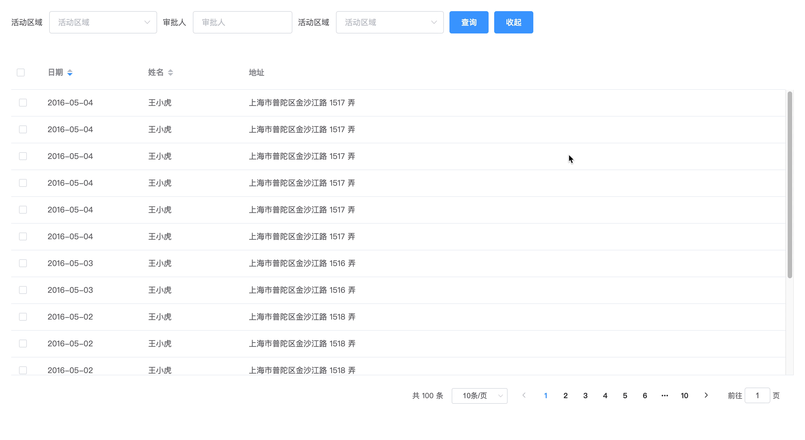

# ElementUI表格高度自适应

## 效果图



## 技术实现

adaptive.js

```js
// 自适应指令实现
import { addResizeListener, removeResizeListener } from 'element-ui/src/utils/resize-event'

const doResize = async (el, binding, vnode) => {
  const { componentInstance: $table } = await vnode
  const { value } = binding
  if (!$table.height) {
    throw new Error(`el-$table must set the height. Such as height='100px'`)
  }
  const bottomOffset = (value && value.bottomOffset) || 30
  if (!$table) return
  const height = window.innerHeight - el.getBoundingClientRect().top - bottomOffset
  $table.layout.setHeight(height)
  $table.doLayout()
}

export default {
  bind(el, binding, vnode) {
    el.resizeListener = async () => {
      await doResize(el, binding, vnode)
    }
    addResizeListener(el, el.resizeListener)
    addResizeListener(window.document.body, el.resizeListener)
  },
  async inserted(el, binding, vnode) {
    await doResize(el, binding, vnode)
  },
  unbind(el) {
    removeResizeListener(el, el.resizeListener)
  },
}

```

index.js

```js
// 指令注册文件
import adaptive from './adaptive'

const install = function(Vue) {
  Vue.directive('adaptive', adaptive)
}

if (window.Vue) {
  window['adaptive'] = adaptive
  // eslint-disable-next-line no-undef
  Vue.use(install)
}

adaptive.install = install
export default adaptive

```

全局引用：

main.js

```js
import adaptive from '@/directive/index'
Vue.use(adaptive)
```

单页面使用：

```js
import adaptive from '@/directive/index'
export default {
  directives: { adaptive },
  // 其他...
}
```
