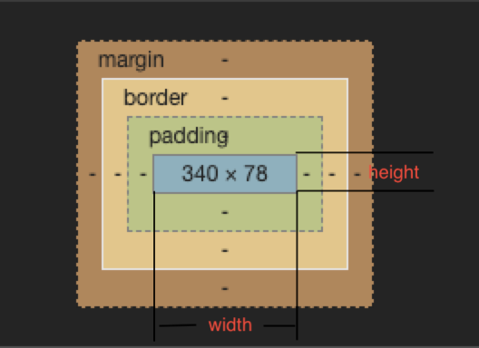
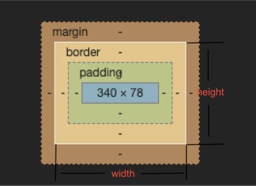

# 盒模型

## 概念

1. [概念](https://developer.mozilla.org/zh-CN/docs/Web/CSS/CSS_Box_Model/Introduction_to_the_CSS_box_model)


2. 说明：（四个部分）

- 内容边界 `content`：`[min、max]-width`、`[min、max]-height`
- 内边距边界 `padding`：`padding-[top、right、bottom、left]`
- 边框边界 `border`：`border-width`、`border`
- 外边框边界 `margin`：`margin-[top、right、bottom、left]`

## 标准盒模型 与 IE模盒型

| 概念 | 设置模型 | 说明 |
|---|---|---|
| <div style="width: 80px">标准盒模型</div> | <div style="width: 350px">`box-sizing: content-box;`（默认值）</div> <br> width和height是对**content**设置 |  |
| 怪异盒模型 | `box-sizing: border-box;` 怪异盒模型 <br> width和height是对**content+padding+border**设置 |  |

::: tip
1. 如果不想因为改变padding的时候盒子的大小也会跟着变化的话，可以使用怪异盒模型
2. 如果想让盒子的大小被padding撑开的话，可以使用标准盒模型
:::

## css的三种设置样式的方式


::: code-group
```html [内联样式]
<div style="width: 100px">text</div>
```

```html [内部样式]
<head>
    <style>
        .content {
            width: 100px;
        }
    </style>
</head>
```

```html [外部样式表]
<head>
    <link href="./css/index.css"/>
</head>
```
:::

## js如何获取盒模型对应的宽和高

### dom.style.width/height 

第一种：

```js
dom.style.width/height 
```

::: danger
只能获取**内联样式**的宽高，内部样式和外部css样式表中的高宽无法获取
:::

### dom.currentStyle.width/height 

第二种：

```js
dom.currentStyle.width/height 
```

::: danger
页面渲染完成后的结果，获取即时的计算的样式，但是**只有IE支持**
:::

### window.getComputedStyle(dom).width/height 

第三种：

```js
window.getComputedStyle(dom).width/height
```

::: danger
页面渲染完成后的结果，获取即时计算的样式，支持其他浏览器，兼容性更好
:::

### dom.getBoundingClientRect().width/height

第四种：

```js
dom.getBoundingClientRect().width/height
```

::: danger
获得运行后的属性，返回一个矩形对象，left,top,right,buttom
:::

### dom.offsetWidth/offsetHeight

第五种：

```js
dom.offsetWidth/offsetHeight
```

::: danger
返回元素实际大小，包含边框，内边距和滚动条,如果没有设置任何CSS宽度和高度，也会在计算后得到宽度和高度
:::