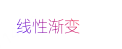
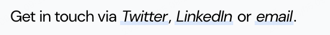

# 线性渐变linear-gradient

[linear-gradient()](https://developer.mozilla.org/zh-CN/docs/Web/CSS/gradient/linear-gradient) **函数** 用于创建一个表示两种或多种颜色 **线性渐变** 的图片。

## CSS语法

```css
background-image: linear-gradient(angle, color-stop1, color-stop2, ...);
```

- angle：用角度值指定渐变的方向（或角度）。如果不指定方向，**默认从上到下渐变**。
- color-stop1, color-stop2,...：用于指定渐变的起止颜色。

### angle

预定义方向有：to bottom、to top、to right、to left、to bottom right

角度是指水平线和渐变线之间的角度，逆时针方向计算。换句话说，0deg 将创建一个从下到上的渐变，90deg 将创建一个从左到右的渐变。


::: tip 案例

从上到下：

```css
background-image: linear-gradient(#e66465, #9198e5);

background-image: linear-gradient(180deg, #e66465, #9198e5);
```

从左到右：

```css
background-image: linear-gradient(to right, red , yellow);

background-image: linear-gradient(90deg, red , yellow);
```

从左上到右下：

```css
background-image: linear-gradient(to bottom right, red, yellow);

background-image: linear-gradient(135deg, red, yellow);
```

:::

### color

linear-gradient支持red、green、blue、yellow等，也支持透明度 `transparent`，可用于创建减弱变淡的效果

::: tip 案例

```css
background-image: linear-gradient(to right, rgba(255,0,0,0), rgba(255,0,0,1));
```

::: 

### 不均匀渐变百分比

百分比表示指定颜色的标准中心线位置，百分比之间是过渡色，如果百分比位置之间有重叠会失去渐变过渡色。

::: tip 案例

```css
background: linear-gradient(red 10%, green 85%, blue 90%);
```

::: 

- 10% 表示 red 的颜色中心线在线性渐变方向的 10% 的位置。
- 85% 表示 green 的颜色中心线在线性渐变方向的 85% 的位置。
- 90% 表示 blue 的颜色中心线在线性渐变方向的 90% 的位置。
- 10% 到 85% 是 red-green 的过渡色，85%-90% 是 green-blue 的过渡色。
- 如果百分比位置之间有重叠会失去渐变过渡色。
- 如果后边的百分比值小于前边的百分比值会失去渐变过渡色。

可参考文章[如何把css渐变背景玩出花样来](https://juejin.cn/post/6969128755067355143?searchId=202409051355181C239AFDD630970E12BB)


## 应用场景

### 文字渐变



```html
<a href="#">线性渐变</a>
```

```css
a {
    color: transparent;
    background-image: linear-gradient(45deg, blue, red);
    background-clip: text;
}
```

::: tip
`background-clip: text;` 将背景只应用到文本的形状上
:::

### 文字加特殊的下划线



```html
<a href="#">Twitter</a>
```

```css
a {
    display: inline-block;
    font-style: italic;
    padding: 0px 0.2vw;
    background-image: linear-gradient(to top, transparent, transparent 10%, rgba(0, 125, 255, 0.15) 10%, rgba(0, 125, 255, 0.15) 30%, transparent 30%);
    text-decoration: none;
    cursor: pointer;
}
```

## 在线调试工具

- [ColorSpace](https://mycolor.space/)
- [渐变神器Gradient](https://gradient.shapefactory.co/)
- [渐变在线工具](https://www.jyshare.com/more/gradients/#LemonLime)
- [设计师都爱用！51 个免费配色工具推荐：配色参考、技巧及灵感](https://cn.eagle.cool/blog/post/best-color-tools-for-designers)
- [炫酷网站背景pocoloco](https://pocoloco.io/)