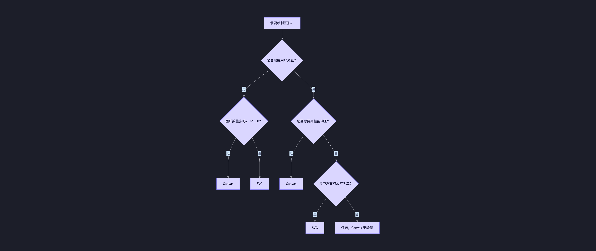
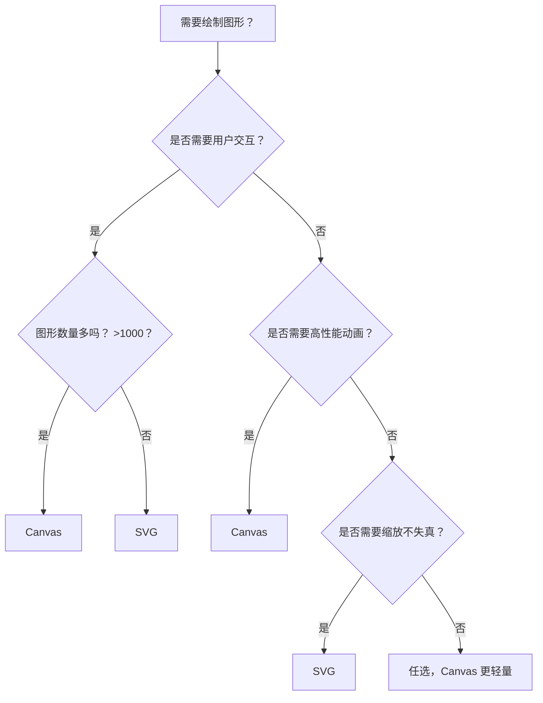

# Canvas vs SVG

> **一句话概括**：  
> **SVG 是“声明式矢量图”，适合交互性强、可缩放的场景；Canvas 是“命令式位图画布”，适合高性能、高频重绘的场景（如游戏、数据可视化）。**

## 一、核心定义

| 特性 | SVG | Canvas |
|------|-----|--------|
| **本质** | 基于 XML 的**矢量图形语言** | HTML5 提供的**位图画布 API** |
| **渲染方式** | 声明式（HTML 标签） | 命令式（JavaScript 绘图指令） |
| **图形类型** | 矢量图（无限缩放不失真） | 位图（依赖分辨率，放大模糊） |
| **DOM 结构** | 每个图形是独立 DOM 元素 | 整个画布是一个像素矩阵，无子元素 |

## 二、详细对比

### ✅ 1. 渲染机制

| | SVG | Canvas |
|---|-----|--------|
| **绘制方式** | `<circle cx="50" cy="50" r="40" />` | `ctx.arc(50, 50, 40, 0, Math.PI * 2)` |
| **更新方式** | 修改元素属性 → 浏览器自动重绘 | 需手动清除并重绘整个场景 |
| **内存模型** | 保留图形对象（Retained Mode） | 无状态（Immediate Mode） |

> 🔍 **关键区别**：  
> - SVG 中每个 `<circle>` 都是真实 DOM 节点，可被 JS/CSS 操作  
> - Canvas 只是一块“画布”，画完即忘，无法直接操作单个图形

### ✅ 2. 交互与事件

| | SVG | Canvas |
|---|-----|--------|
| **事件支持** | ✅ 原生支持 click、hover 等 | ❌ 不支持（需手动计算坐标） |
| **实现点击检测** | 直接绑定事件 | 需记录图形位置，通过 `isPointInPath()` 或数学判断 |

```js
// Canvas 手动实现点击检测（矩形）
canvas.addEventListener('click', (e) => {
  const rect = { x: 10, y: 10, width: 50, height: 50 };
  const { offsetX, offsetY } = e;
  if (
    offsetX >= rect.x &&
    offsetX <= rect.x + rect.width &&
    offsetY >= rect.y &&
    offsetY <= rect.y + rect.height
  ) {
    console.log('点击了矩形！');
  }
});
```

### ✅ 3. 性能与适用场景

| 场景 | 推荐方案 | 原因 |
|------|--------|------|
| **地图、图表、图标** | ✅ SVG | 矢量缩放清晰，支持 CSS/JS 交互 |
| **游戏、动画、粒子系统** | ✅ Canvas | 高频重绘性能优，无 DOM 开销 |
| **大量静态图形（>10k 元素）** | ⚠️ Canvas | SVG DOM 膨胀导致卡顿 |
| **需要导出图片** | ✅ Canvas | 原生支持 `toDataURL()` |
| **无障碍访问（a11y）** | ✅ SVG | 可添加 `<title>`、ARIA 属性 |

> 📊 **性能临界点**：  
> - 少量（<1000）交互图形 → **SVG**  
> - 大量（>1000）或高频更新图形 → **Canvas**

### ✅ 4. 开发体验

| 维度 | SVG | Canvas |
|------|-----|--------|
| **学习曲线** | 低（类似 HTML） | 中高（需理解坐标系、路径、状态栈） |
| **调试难度** | 低（DevTools 可 inspect 元素） | 高（只能看最终像素） |
| **CSS 支持** | ✅ 完全支持 | ❌ 仅能设置画布整体样式 |
| **动画实现** | SMIL / CSS / JS | 纯 JS（requestAnimationFrame） |

## 三、Canvas 核心 API 快速回顾

### 1. 基础设置
```html
<canvas id="myCanvas" width="400" height="300"></canvas>
```
> ⚠️ **注意**：必须用 **HTML 属性** 设置 `width/height`，CSS 会拉伸图像！

### 2. 获取上下文
```js
const canvas = document.getElementById('myCanvas');
const ctx = canvas.getContext('2d'); // 2D 渲染上下文
```

### 3. 常用绘图方法
| 类型 | 方法 | 说明 |
|------|------|------|
| **矩形** | `fillRect(x,y,w,h)` | 填充矩形 |
| | `strokeRect(x,y,w,h)` | 描边矩形 |
| | `clearRect(x,y,w,h)` | 清除区域 |
| **路径** | `beginPath()` | 开始新路径 |
| | `moveTo(x,y)` | 移动画笔 |
| | `lineTo(x,y)` | 画直线 |
| | `arc(x,y,r,sAngle,eAngle,anticlockwise)` | 画圆弧 |
| | `closePath()` | 闭合路径 |
| | `stroke()` / `fill()` | 描边 / 填充 |
| **样式** | `fillStyle = 'red'` | 填充色 |
| | `strokeStyle = '#000'` | 描边色 |
| | `lineWidth = 2` | 线宽 |

### 4. 导出图像
```js
const dataURL = canvas.toDataURL('image/png'); // 生成 base64 图片
```

## 四、如何选择？—— 决策树





## 五、现代演进与融合方案

### 1. **WebGL / Three.js**
- 当 Canvas 2D 性能不足时（3D、复杂特效），升级到 WebGL
- 适用于大型游戏、3D 可视化

### 2. **SVG + Canvas 混合使用**
- 用 SVG 做 UI 控件（按钮、标签）
- 用 Canvas 做动态背景或数据图表

### 3. **框架封装**
- **D3.js**：底层可切换 SVG/Canvas，智能选择渲染方式
- **ECharts**：大数据量自动降级为 Canvas

## 六、总结：核心差异表

| 维度 | SVG | Canvas |
|------|-----|--------|
| **图形类型** | 矢量图 | 位图 |
| **缩放** | 无损 | 失真 |
| **DOM** | 有（每个图形是元素） | 无（整块画布） |
| **事件** | 原生支持 | 需手动实现 |
| **性能** | 少量图形快 | 大量/高频重绘快 |
| **导出图片** | 需转为 Canvas | 原生支持 |
| **适用场景** | 图标、地图、图表 | 游戏、动画、图像处理 |

> 💡 **面试金句**：  
> “**SVG 是‘聪明的画’，Canvas 是‘勤奋的笔’。**  
> 前者记住每笔怎么画，后者只管当下落笔。”

## 附录：常见面试题

1. **Q：SVG 和 Canvas 哪个更适合做数据大屏？**  
   A：若数据量小、需交互 → SVG；若数据量大（如实时股票流）→ Canvas。

2. **Q：Canvas 如何实现撤销（undo）功能？**  
   A：保存历史状态（如 `toDataURL()` 快照）或记录操作命令（Command 模式）。

3. **Q：为什么 Canvas 不支持事件？**  
   A：因为 Canvas 是无状态的像素缓冲区，浏览器不知道“哪个图形在哪个位置”。