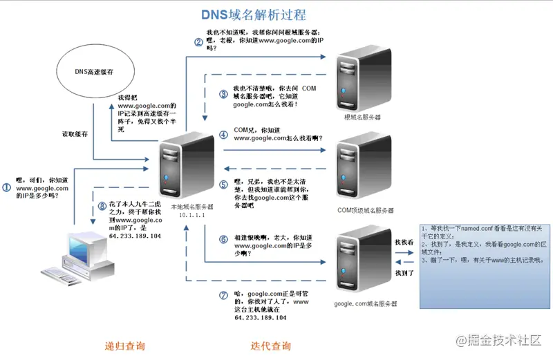

# html5相关

## 浏览器中输入url回车发生了什么

1. 对URL地址进行`DNS`域名解析找到对应的`IP`地址
2. 建立`TCP`连接（三次握手）
3. 浏览器发送`HTTP`请求报文
4. 服务器返回`HTTP`响应报文
5. 浏览器解析文档资源并渲染页面
6. 关闭`TCP`连接（四次挥手）

### DNS解析

DNS解析其实是一个递归的过程

- 输入www.google.com网址后，首先在**本地的域名服务器**中查找
- 没找到去**根域名服务器**查找
- 没有再去**com顶级域名服务器**查找，以此类推直到找到IP地址，然后把它记录在本地，供下次使用

### 发起TCP连接

### 发送HTTP请求

HTTP的端口为80/8080，而HTTPS的端口为443

发送HTTP请求的过程就是构建HTTP请求报文并通过TCP协议中发送到服务器指定端口；请求报文由请求行，请求头，请求正文组成。

请求行的格式为`Method Request-URL HTTP-Version CRLF eg: GET index.html HTTP/1.1 `常用的方法有: GET, POST, PUT, DELETE, OPTIONS, HEAD等。

[参考](https://juejin.cn/post/6844903832435032072)

## href和src的区别

|属性 | 解释 | 使用 | 说明 | 
|---|---|---|---|
| href | 标记超文本引用|用在`link`和`a`标签等元素上 | 用来建立当前元素和文档之间的链接，浏览器解析时会标记该文档为css文档，并行下载资源并且不会停止对该文档的处理（这是为什么建议使用link方式加载css，而不是使用@import）|
| src | 引用资源|用在`img`、`script`、`iframe`等上 | 当浏览器解析到src时，会暂停其他资源的下载和处理（图片不会暂停其他资源的下载和处理），直到将该资源加载、编译、执行完毕，图片和框架等也如此，类似于将所指向资源应用到当前内容。（这也是为什么建议把 js 脚本放在底部而不是头部的原因）|

## img标签中的alt和title属性的作用

| 属性 | 作用 |
|---|---|
| \ | 如果无法显示图像，浏览器将显示alt指定的内容
| \ | 在鼠标移到元素上时显示title的内容
