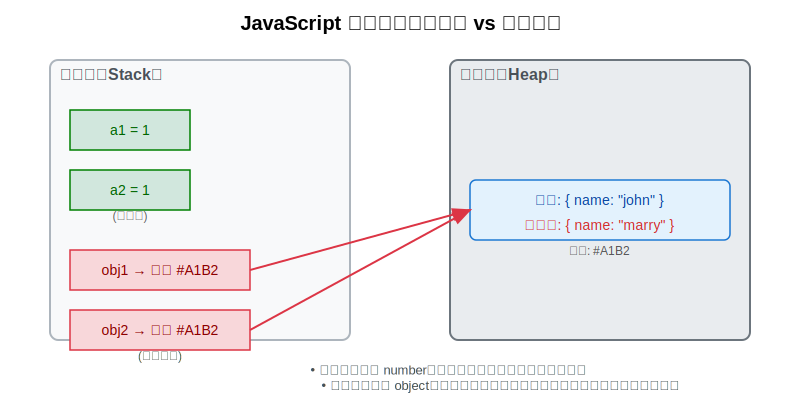

# JavaScript数据类型及检测

## 数据类型的分类

| 类型 | 数据类型 | 值存储 | 变量访问方式 |
|---|---|---|---|
| 基本类型 | string、number、boolean、null、undefined、<br>bigint（ES2020）、symbol（ES6）| 栈（Stack） | 按值来访问 |
| 引用类型 | Object、Array、Function、Date、RegExp等 | 堆（Heap），栈中存储引用地址 | 按引用访问 |

::: tip 注意：

- JavaScript 是弱类型语言，变量本身没有类型，类型指的是变量所保存的值的类型。
- 变量的类型可以在运行时改变（如 let x = 1; x = 'hello';）。

:::

## 值存储机制

- 基本类型：值直接存储在 **栈** 中，因为占用固定大小的内存空间，访问效率高。这叫做**按值来访问**
- 引用类型：对象本身存储在 **堆**（大小不固定），变量在栈中保存的是指向堆中对象的 **引用地址** 。访问时先从栈中取出地址，再通过地址定位到堆中的实际数据。这叫做**按引用访问**

```js
// 案例
let a1 = 1                      // 复制值
let a2 = a1
a2++                            // 修改 a2 不影响 a1
console.log(a1, a2)             // 1 2

let obj1 = { name: 'john' }
let obj2 = obj1                 // 复制引用地址            
obj2.name = 'marry'             // 修改堆中同一对象
console.log(obj1, obj2)         // {name: 'marry'} {name: 'marry'}
```



::: tip 关于“栈/堆”的说明

ECMAScript 规范并未规定具体的内存模型，“栈”和“堆”是 JavaScript 引擎（如 V8）常见的实现方式，用于帮助理解值的存储行为。实际开发中我们更关注“按值传递” vs “按引用传递”的语义差异。

:::

## 数据类型的检测方法

### 1. typeof运算符

`typeof` 是通过读取值的内部 **类型标签（type tag）** 返回类型字符串

```js
// 基本类型
typeof 'hello world'    // 'string'
typeof 10               // 'number'
typeof true             // 'boolean'
typeof undefined        // 'undefined'
typeof Symbol()         // 'symbol'
typeof 123n             // 'bigint'

// 特殊情况
typeof null             // "object" ❗（历史 bug）

// 引用类型
typeof {}               // 'object'
typeof []               // 'object'
typeof (()=>{})         // 'function'
typeof function(){}     // "function" ✅（唯一能识别的引用类型）
typeof new Date         // 'object'
typeof /\d/             // 'object'
```

✅ 优点：

- 简单快捷，适合判断基本类型（除 null）。
- 能准确识别 function。

❌ 缺点：

- `typeof null === 'object'` 是 JavaScript 的历史性错误。
- 无法区分 `Array、Date、RegExp` 等具体对象类型，全部返回 `"object"`。

::: tip 为什么 typeof null === 'object'？

在早期 JavaScript 实现中，值用 32 位单元表示，最低 3 位用于标识类型。对象的类型标签为 000，而 null 表示为空指针（全 0），因此也被误判为对象。详见[typeof null](https://2ality.com/2013/10/typeof-null.html)

:::

### 2. instanceof运算符

`instanceof` 检测构造函数的 `prototype` 属性是否出现在某个实例的原型链上，**返回Boolean值**。

注意：`instanceof` 只能用于引用类型，不适用基本类型

```js
[] instanceof Array             // true
({}) instanceof Object          // true
(()=>{}) instanceof Function    // true
(new Date) instanceof Date      // true
/\d/ instanceof RegExp          // true

// 但是
[] instanceof Object            // true
(()=>{}) instanceof Object      // true
(new Date) instanceof Object    // true
/\d/ instanceof Object          // true
```

✅ 优点：

- 可判断自定义类或内置构造函数的实例关系。

❌ 缺点：

- 仅适用于引用类型，对基本类型无效（如 123 instanceof Number → false）。
- 跨窗口/iframe 时失效：

```js
// 在 iframe 中创建数组
const iframe = document.createElement('iframe');
document.body.appendChild(iframe);
const arr = iframe.contentWindow.Array.of(1, 2, 3);

arr instanceof Array;    // false ❌（不同全局环境）
Array.isArray(arr);      // true ✅

// 因此，不要用 instanceof 判断数组！
```

::: tip 总结

1. instanceof 是通过原型链查找，可以参考另外一篇文章[原型和原型链](./prototype-chain.md)
2. 可以看出，`instanceof` 也无法精准的判断数据类型

:::

### 3. Object.prototype.toString.call()

对象的内部属性`[[Class]]`无法直接访问，一般通过 `Object.prototype.toString()` 来查看

- JS所有的对象都是`Object`类型的实例，它们都会从`Object.prototype`上继承属性和方法，比如`toString()`方法；因此，每个对象都有`toString()`方法
- `Object.prototype.toString()`返回一个表示该对象的字符串，默认格式是`"[object type]"`,其中`type`是对象的类型
- 但是，不同的类型可能对`toString()`进行了重写，如`Array`、`Number`等

```js
Object.prototype.toString()             // "[object Object]"

// 重写了toString()方法
([1,2,3]).toString()                    // "1,2,3"
(10).toString()                         // "10"
(true).toString()                       // "true"
(Symbol()).toString()                   // "Symbol()"
(123n).toString()                       // "123"
```

- 因此，只能通过`Object.prototype.toString()`来调用`Object`的`toString`方法
- 但是上述的方案，`this`始终都是指向`Object`，因此需要改变`this`指向
- 改变`this`指向可以通过`call()`，`apply()`

测试`Object.prototype.toString.call()`：

```js
// 基本类型
Object.prototype.toString.call("hello world") === "[object String]"
Object.prototype.toString.call(10) === "[object Number]"
Object.prototype.toString.call(true) === "[object Boolean]"
Object.prototype.toString.call(undefined) === "[object Undefined]"
Object.prototype.toString.call(null) === "[object Null]"
Object.prototype.toString.call(Symbol()) === "[object Symbol]"
Object.prototype.toString.call(123n) === "[object BigInt]"

// 引用类型
Object.prototype.toString.call({}) === "[object Object]"
Object.prototype.toString.call([]) === "[object Array]"
Object.prototype.toString.call(()=>{})  === "[object Function]"
Object.prototype.toString.call(new Date) === "[object Date]"
Object.prototype.toString.call(/\d/) === "[object RegExp]"

// 构造函数
function Person(){}
Object.prototype.toString.call(new Person) === "[object Object]"
```

✅ 优点：

- 覆盖所有内置类型，包括 `null` 和 `undefined。`
- 结果格式统一：`"[object Type]"`。
- 不受跨窗口影响。

❌ 注意：

- 必须使用 `call` 或 `apply` 调用，否则 `this` 指向 `Object.prototype`，结果恒为 `"[object Object]"`。
- 自定义类默认返回 `"[object Object]"`，除非重写 `Symbol.toStringTag`。

### 4. 通用类型判断函数

- 首先，使用`typeof`检测数据类型；
- 如果`typeof`检测数据类型为`'object'`,则使用`Object.prototype.toString.call()`检测数据类型
- 同时，`Object.prototype.toString.call()`返回字符串格式统一为`[object **]`，即字符串前八位一致
- 最后，做字符串的截取和字母小写的转换

```js
/**
 * 精确判断 JavaScript 数据类型
 * @param {*} value - 待检测的值
 * @returns {string} 小写类型名，如 'string', 'array', 'null' 等
 */
function dataType(value) {
  if (value === null) return 'null'; // 可选：提前处理 null
  const type = typeof value;
  if (type !== 'object') return type;

  // object 类型使用 toString 精确判断
  return Object.prototype.toString
    .call(value)
    .slice(8, -1) // 截取 "Object", "Array" 等部分
    .toLowerCase();
}
```

测试：

```js
dataType("hello world")       // "string"
dataType(10)                  // "number"
dataType(true)                // "boolean"
dataType(undefined)           // "undefined"
dataType(null)                // "null"
dataType(123n)                // "bigint"
dataType({})                  // "object"
dataType([])                  // "array"
dataType(()=>{})              // "function"
dataType(new Date)            // "date"
dataType(/\d/)                // "regexp"
```

## 面试

### 如何判断一个变量是否为数组？

```js
let arr = [1,2,3]

// ✅ 推荐：Array.isArray（ES5+）
Array.isArray(arr)    // true

// ⚠️ 次选：instanceof（不适用于跨窗口）
arr instanceof Array  // true

// ✅ 兼容性好：toString 方式
Object.prototype.toString.call(arr) === '[object Array]'    //true
```

### null和undefined区别

- null 和 undefined 都表示空值，但语义不同：
- undefined 是系统默认的“未赋值”状态，比如声明了变量但没初始化；而 null 是开发者主动设置的
“空值”，表示‘我知道这里该有东西，但现在是空的’。
- 从类型看，typeof undefined 是 'undefined'，但 typeof null 却是 'object'——这是 JS 的历史遗留问题。
- 在比较时，null == undefined 为 true，但 null === undefined 为 false。
- 工程上，建议用 `null` 显式表达空值，避免手动使用 `undefined`，这样代码意图更清晰，也兼容 JSON 序列化。
- 比如 API 返回用户数据时，用 { name: 'Alice', avatar: null } 比 avatar: undefined 更合理，因为字段存在只是值为空。”

### typeof null 的结果是什么，为什么？

- typeof null === 'object'

在 JavaScript 第一个版本中，所有值都存储在 32 位的单元中，每个单元包含一个小的 类型标签(1-3 bits) 以及当前要存储值的真实数据。类型标签存储在每个单元的低位中，共有五种数据类型：

````
000: object   - 当前存储的数据指向一个对象。
  1: int      - 当前存储的数据是一个 31 位的有符号整数。
010: double   - 当前存储的数据指向一个双精度的浮点数。
100: string   - 当前存储的数据指向一个字符串。
110: boolean  - 当前存储的数据是布尔值。
````

如果最低位是 1，则类型标签标志位的长度只有一位；如果最低位是 0，则类型标签标志位的长度占三位，为存储其他四种数据类型提供了额外两个 bit 的长度。

有两种特殊数据类型：

- undefined的值是 (-2)30(一个超出整数范围的数字)；
- null 的值是机器码 NULL 指针(null 指针的值全是 0)

那也就是说null的类型标签也是000，和Object的类型标签一样，所以会被判定为Object。

### instanceof 操作符的实现原理及实现

<<< ./code-snippet/instanceof.js

### 为什么0.1+0.2 ! == 0.3，如何让其相等

计算机是通过二进制的方式存储数据的，所以计算机计算0.1+0.2的时候，实际上是计算的两个数的二进制的和。一般我们认为数字包括整数和小数，但是在 JavaScript 中只有一种数字类型：Number，它的实现遵循IEEE 754标准，使用64位固定长度来表示，也就是标准的double双精度浮点数。在二进制科学表示法中，双精度浮点数的小数部分最多只能保留52位，再加上前面的1，其实就是保留53位有效数字，剩余的需要舍去，遵从“0舍1入”的原则。

根据这个原则，0.1和0.2的二进制数相加，再转化为十进制数就是：0.30000000000000004。

IEEE标准规定了一个偏移量，对于指数部分，每次都加这个偏移量进行保存，这样即使指数是负数，那么加上这个偏移量也就是正数了。由于JavaScript的数字是双精度数，这里就以双精度数为例，它的指数部分为11位，能表示的范围就是0~2047，IEEE固定双精度数的偏移量为1023。

### typeof NaN 的结果是什么

```js
typeof NaN; // "number"
```

`NaN !== NaN`，推荐使用 `Number.isNaN()`