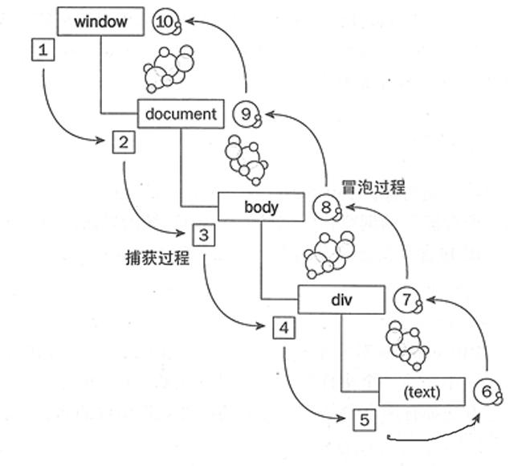

# DOM事件

## DOM事件

DOM事件的级别:

- **DOM0**: element.onclick=function(){}
- **DOM2**: element.addEventListener('click',function(){},false)，true表示在捕获阶段触发，false表示在冒泡阶段触发，默认是false
- **DOM3**: element.addEventListener('keyup',function(){},false)

## DOM事件模型

捕获（从上到下），冒泡（从下到上）

## DOM事件流

捕获以及冒泡事件流如下图：



- 三个阶段：**捕获（Capturing）->目标阶段（Target）->冒泡（Bubbling）**
- 比说点击鼠标左键的事情是如何传递到页面上的：点击事件通过捕获到达目标元素，再从目标元素上传到window对象
- 描述DOM事件捕获的具体流程
  - 捕获流程：**window -> document -> html标签 -> body -> 按照html结构传递... -> 目标元素**
  - 冒泡流程：与捕获阶段逆向


## 什么是事件代理（事件委托） 有什么好处

事件委托的原理：不给每个子节点单独设置事件监听器，而是设置在其父节点上，然后利用冒泡原理设置每个子节点。

优点：

- 减少内存消耗和 dom 操作，提高性能
在 JavaScript 中，添加到页面上的事件处理程序数量将直接关系到页面的整体运行性能，因为需要不断的操作 dom,那么引起浏览器重绘和回流的可能也就越多，页面交互的事件也就变的越长，这也就是为什么要减少 dom 操作的原因。每一个事件处理函数，都是一个对象，多一个事件处理函数，内存中就会被多占用一部分空间。如果要用事件委托，就会将所有的操作放到 js 程序里面，只对它的父级进行操作，与 dom 的操作就只需要交互一次，这样就能大大的减少与 dom 的交互次数，提高性能；

- 动态绑定事件因为事件绑定在父级元素 所以新增的元素也能触发同样的事件

## addEventListener 默认是捕获还是冒泡

默认是冒泡

addEventListener第三个参数默认为 false 代表执行事件冒泡行为。

当为 true 时执行事件捕获行为。

## Event对象的常见应用

```js
event.preventDefault()  // 阻止默认事件
event.stopPropagation() // 阻止冒泡
event.stopImmediatePropagation()
event.currentTarget
event.target
```

## 自定义事件,或者是模拟事件

1. Event对象

`new Event(typeArg[, eventInit])`

- typeArg：事件名称
- eventInit：参数如下：
  - "bubbles"，可选，Boolean类型，默认值为 false，表示该事件是否冒泡。
  - "cancelable"，可选，Boolean类型，默认值为 false， 表示该事件能否被取消。
  - "composed"，可选，Boolean类型，默认值为 false，指示事件是否会在影子DOM根节点之外触发侦听器

```js
// 缺点：Event只能指定事件名，不能添加数据
var eve = new Event('custome', {'bubbles': false})
ev.addEventListener('custome',funcion(){
    console.log('custome')
})
ev.dispatchEvent(eve)

```

1. CustomEvent：可以添加数据

`new CustomEvent(typeArg,customEventInit)`

- typeArg：事件名称
- customEventInit:
  - detail:可选的默认值是 null 的任意类型数据，是一个与 event 相关的值（向事件对象添加更多数据）
  - bubbles:一个布尔值，表示该事件能否冒泡。注意：测试chrome默认为不冒泡。
  - cancelable:一个布尔值，表示该事件是否可以取消

## 拓展

在juqery中`DOMContentLoaded`的表现：
``` javascript
$(function(){…})  <=> $(document).ready(function(){…})
```

在juqery中`onload`：
``` javascript
$(document).load(function(){…})
```

DOM中onload：
``` javascript
window.onload = function(){…}
```

总结：
DOMContentLoaded是DOM文件加载完成
load是页面加载完成
DOMContentLoaded比DOM要快

封装ready函数，考虑各种浏览器的兼容性：
``` javascript
function ready(fn){

    if(document.addEventListener) {
        document.addEventListener('DOMContentLoaded', function() {
            document.removeEventListener('DOMContentLoaded',arguments.callee, false);
            fn();
        }, false);
    } 

    // 如果IE
    else if(document.attachEvent) {
        // 确保当页面是在iframe中加载时，事件依旧会被安全触发
        document.attachEvent('onreadystatechange', function() {
            if(document.readyState == 'complete') {
                document.detachEvent('onreadystatechange', arguments.callee);
                fn();
            }
        });

        // 如果是IE且页面不在iframe中时，轮询调用doScroll 方法检测DOM是否加载完毕
        if(document.documentElement.doScroll && typeof window.frameElement === "undefined") {
            try{
                document.documentElement.doScroll('left');
            }
            catch(error){
                return setTimeout(arguments.callee, 20);
            };
            fn();
        }
    }
};
```