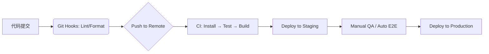

# 前端工程化

> **核心理念**：  
> **前端工程化不是工具的堆砌，而是通过系统性方法，将开发过程标准化、自动化、可协作化，最终提升交付效率与产品质量。**

## 一、什么是前端工程化？

前端工程化是指**围绕前端开发全生命周期**（编码 → 构建 → 测试 → 部署 → 监控），通过**模块化、组件化、规范化、自动化**四大支柱，构建一套高效、可靠、可维护的开发体系。

> 🎯 **目标**：  
> - **提效**：减少重复劳动，加速迭代  
> - **保质**：降低 Bug 率，保障线上稳定  
> - **促协作**：统一标准，降低沟通成本  

## 二、四大核心支柱

### 1. 模块化（Modularization）—— 代码组织的基石

#### ▶ 解决什么问题？
- 全局变量污染
- 依赖混乱（谁先加载？）
- 无法按需加载

#### ▶ 演进历程
| 规范 | 特点 | 适用场景 |
|------|------|--------|
| **CommonJS** | 同步加载，运行时输出值拷贝 | Node.js 后端 |
| **AMD** | 异步加载，依赖前置（RequireJS） | 早期浏览器 |
| **CMD** | 异步加载，依赖就近（SeaJS） | 已淘汰 |
| **ES Modules (ESM)** | 静态分析，编译时输出接口，支持 Live Binding | 现代浏览器 + Node.js |

#### ▶ 现代实践
- 所有资源皆模块：JS、CSS、图片、字体均可 `import`
- 动态导入实现懒加载：
  ```js
  const DetailPage = () => import('./DetailPage.vue');
  ```
- Tree Shaking 自动剔除未使用代码（依赖 ESM 静态结构）

> 💡 **关键区别**：  
> CommonJS 导出的是**值的快照**，ESM 导出的是**值的引用**（实时绑定）。

### 2. 组件化（Componentization）—— UI 复用的核心

#### ▶ 与模块化的区别
- **模块化**：关注逻辑/资源解耦（文件级）
- **组件化**：关注 UI/状态封装（功能级）

#### ▶ 组件设计原则
- **单一职责**：一个组件只做一件事
- **可组合**：通过 props/slots/children 构建复杂 UI
- **分层复用**：
  - **基础组件**：Button、Modal（跨项目）
  - **业务组件**：UserCard、OrderList（单业务线）
  - **页面组件**：HomePage（仅组装）

#### ▶ 现代方案
- React：Hooks + Context + Suspense
- Vue：SFC + `<script setup>` + Composition API
- Web Components：原生标准，框架无关

> 🌐 **延伸**：结合 **Design System** 建立统一设计语言，提升产品一致性。

### 3. 规范化（Standardization）—— 团队协作的保障

#### ▶ 为什么需要规范？
> “没有规范的团队，Code Review 就是互相伤害。”

#### ▶ 规范体系全景
```text
├── 目录结构规范（src/{pages, components, hooks, utils}）
├── 编码规范
│   ├── JS/TS: ESLint + Prettier（自动修复）
│   └── CSS: Stylelint + BEM / CSS Modules
├── 提交规范
│   └── Conventional Commits + Husky + lint-staged
├── 分支管理
│   └── Git Flow / GitHub Flow
└── Code Review
    └── PR 模板 + 自动化检查
```

#### ▶ 关键工具链
```json
// package.json 示例
{
  "scripts": {
    "lint": "eslint . --ext .js,.ts,.vue",
    "format": "prettier --write ."
  },
  "husky": {
    "hooks": {
      "pre-commit": "lint-staged"
    }
  },
  "lint-staged": {
    "*.{js,ts,vue}": ["eslint --fix", "prettier --write"]
  }
}
```

> ✅ **效果**：提交前自动格式化 + 修复，保证主干代码始终干净。

---

### 4. 自动化（Automation）—— 效能提升的引擎

#### ▶ 自动化流水线（CI/CD）


#### ▶ 主流工具对比
| 类型 | 工具 | 优势 |
|------|------|------|
| **构建工具** | Vite | 极速冷启动（ESBuild + Rollup） |
| | Webpack | 插件生态强大，适合复杂项目 |
| **CI/CD** | GitHub Actions | 云原生，免运维 |
| | Jenkins | 插件丰富，适合私有化部署 |

#### ▶ 典型自动化任务
- 单元测试（Jest）
- E2E 测试（Cypress / Playwright）
- 性能检测（Lighthouse CI）
- 自动生成 changelog
- 自动发布 NPM 包

> 🔧 **阿里实践参考**：结合 ARMS 监控 + 日志平台，实现“开发 → 上线 → 监控”闭环。

## 三、工程化演进趋势（加分认知）

| 趋势 | 说明 |
|------|------|
| **开箱即用框架** | 如 Modern.js、Bigfish，集成最佳实践 |
| **Monorepo 管理** | 使用 Turborepo / Nx 管理多包项目，共享代码 |
| **构建工具革新** | Rspack（Rust + Webpack 兼容）、Vite 生态成熟 |
| **低代码融合** | 工程化能力下沉到搭建平台（如阿里 Lowcode Engine） |

> 🚀 **未来方向**：  
> **“工程化即服务”** —— 开发者只需关注业务逻辑，环境、部署、监控由平台自动提供。

## 四、如何落地？—— 渐进式工程化策略

> ❗ 切忌“一步到位”，小团队过度工程化反而拖慢迭代。

| 团队规模 | 推荐策略 |
|--------|--------|
| **1~3 人** | Vite（零配置）+ ESLint + Git 提交规范 |
| **5~10 人** | + 组件库 + CI 自动测试 + TypeScript |
| **10+ 人** | + Monorepo + Design System + 完整 CI/CD + 监控告警 |

> ✅ **核心原则**：  
> **“当前最痛的点，就是工程化下一步要解决的问题。”**

## 五、总结

| 支柱 | 解决的问题 | 关键产出 |
|------|----------|--------|
| **模块化** | 代码组织混乱 | 可维护、可复用的代码结构 |
| **组件化** | UI 重复开发 | 高复用、高一致性的界面体系 |
| **规范化** | 协作成本高 | 统一标准，新人快速上手 |
| **自动化** | 人工操作易错 | 快速、可靠的交付流水线 |

> 🌟 **终极目标**：  
> **让前端工程师从“环境配置师”回归“产品创造者”。**

当然可以！以下是 **前端工程化方向的 5 个高频面试题**，涵盖你提到的核心考点（如“对前端工程化的理解”、“CommonJS 与 ES Module 区别”等）。每个问题都包含：

- ✅ **面试官考察点**  
- ✅ **高分回答结构**（简洁、有深度、带实践）  
- ✅ **常见错误/雷区提醒**

---

### 面试题 1：请谈谈你对前端工程化的理解？

#### 🔍 考察点
- 系统性思维
- 是否理解工程化本质（不只是工具）
- 是否有真实项目经验

#### ✅ 高分回答（1–2 分钟）

> “我认为前端工程化是**通过标准化、自动化手段，将前端开发从‘手工作坊’升级为‘工业化生产’的过程**，核心目标是提效、保质、促协作。  
> 我把它拆解为四大支柱：
>
> 1. **模块化**：用 ESM 组织代码，支持 Tree Shaking 和按需加载；
> 2. **组件化**：将 UI 拆分为可复用组件，建立设计系统；
> 3. **规范化**：通过 ESLint + Prettier + Git Hooks 统一代码风格，降低协作成本；
> 4. **自动化**：用 CI/CD 实现自动 lint、test、build、部署。
>
> 在上一家公司，我们通过引入 Vite + Husky + GitHub Actions，使构建速度提升 80%，线上 JS 错误率下降 70%。”

#### ⚠️ 雷区
- ❌ 只说“用了 Webpack、ESLint”
- ❌ 脱离业务，空谈概念

---

### 面试题 2：CommonJS 和 ES Module 有什么区别？

#### 🔍 考察点
- 对模块机制底层理解
- 是否了解运行时 vs 编译时
- 是否知道值拷贝 vs 引用

#### ✅ 高分回答

> 主要有三点核心区别：
>
> 1. **加载时机**  
>    - CommonJS 是**运行时加载**：执行到 `require()` 时才读取文件  
>    - ES Module 是**编译时加载**：在代码解析阶段就确定依赖关系
>
> 2. **输出机制**  
>    - CommonJS 输出的是**值的拷贝**（快照），后续修改不影响导入方  
>    - ES Module 输出的是**值的引用**（Live Binding），导入方始终看到最新值
>
> 3. **静态分析能力**  
>    - ESM 支持 Tree Shaking、静态优化  
>    - CommonJS 因动态特性无法被静态分析，打包体积更大
>
> 所以现代前端项目普遍采用 ESM，而 Node.js 也已原生支持 `.mjs` 或 `package.json` 中设 `"type": "module"`。

#### 💡 示例对比
```js
// a.js (ESM)
export let count = 0;
export const inc = () => count++;

// b.js
import { count, inc } from './a.js';
inc();
console.log(count); // 1（实时引用）

// CommonJS 版本则输出 0（拷贝）
```

#### ⚠️ 雷区
- ❌ 说“ES6 模块是异步的”（这是误解，ESM 本身是静态的，动态 import 才是异步）
- ❌ 忽略“值引用”这一关键差异

---

### 面试题 3：Webpack 和 Vite 的核心区别是什么？

#### 🔍 考察点
- 对构建工具原理的理解
- 是否关注开发体验与性能

#### ✅ 高分回答

> 核心区别在于**开发阶段的构建策略**：
>
> - **Webpack**：启动时**打包整个应用**（包括 node_modules），通过 HMR 更新模块。大型项目冷启动慢（几十秒）。
> - **Vite**：利用浏览器原生 ESM 支持，**不打包直接 serve 源码**，依赖预构建（ESBuild），冷启动极快（<1s）。
>
> 生产环境两者都用 Rollup（Vite）或 Webpack 打包，差异不大。  
> 所以 Vite 更适合**快速原型开发和中大型项目**，而 Webpack 在**高度定制化场景**（如复杂 loader/plugin）仍有优势。

#### ⚠️ 雷区
- ❌ 说“Vite 不能用于生产”（错误！Vite 生产构建很成熟）
- ❌ 只说“Vite 快”，不说**为什么快**

---

### 面试题 4：如何设计一个前端项目的目录结构？

#### 🔍 考察点
- 工程规范意识
- 架构设计能力

#### ✅ 高分回答（以 React/Vue 项目为例）

> 我们遵循 **“功能聚合 + 分层清晰”** 原则：
>
> ```
> src/
> ├── assets/          # 静态资源（图片、字体）
> ├── components/      # 通用组件（Button, Modal）
> ├── views/ 或 pages/ # 页面级组件
> ├── hooks/           # 自定义 Hooks（React）或 composables（Vue）
> ├── utils/           # 工具函数
> ├── services/        # API 请求封装
> ├── store/           # 状态管理（如 Redux/Pinia）
> ├── router/          # 路由配置
> └── styles/          # 全局样式 / 主题变量
> ```
>
> 关键原则：
> - **避免 deep nesting**（层级不超过 3 层）
> - **业务组件靠近使用处**（如 `views/UserProfile/components/`）
> - **共享代码抽离到 utils/hooks**

#### ⚠️ 雷区
- ❌ 目录随意命名（如 `js/`, `css/`, `img/`）
- ❌ 所有组件扔进一个 `components` 文件夹，无分类

---

### 面试题 5：你们项目中如何保证代码质量？

#### 🔍 考察点
- 质量保障意识
- 是否有完整 CI/CD 思维

#### ✅ 高分回答

> 我们从 **编码 → 提交 → 合并 → 部署** 全链路保障质量：
>
> 1. **编码阶段**：TypeScript + ESLint + Prettier，IDE 实时提示  
> 2. **提交阶段**：Husky + lint-staged，自动修复格式问题  
> 3. **PR 阶段**：CI 自动运行单元测试（Jest）+ E2E（Cypress）  
> 4. **上线后**：接入 Sentry 监控错误，Lighthouse 定期检测性能  
>
> 例如，我们要求所有 PR 必须通过测试覆盖率 > 80%，否则 CI 失败，无法合并。

#### ⚠️ 雷区
- ❌ 只说“我们写单元测试”
- ❌ 忽略“自动化拦截”机制（靠人自觉不可靠）

---

## 📌 附加建议：如何准备这类问题？

1. **结合 STAR 法则**：在回答中穿插 **S**ituation（背景）、**T**ask（任务）、**A**ction（行动）、**R**esult（结果）  
   > 例：“在用户增长项目中（S），首屏性能差（T），我引入 Vite + 动态 import（A），FCP 从 3s 降到 1.2s（R）”

2. **准备 1–2 个工程化案例**：比如搭建组件库、优化构建速度、推行 TypeScript

3. **了解大厂方案**（加分项）：
   - 阿里：Bigfish、Lowcode Engine
   - 字节：Modern.js
   - 腾讯：Ox