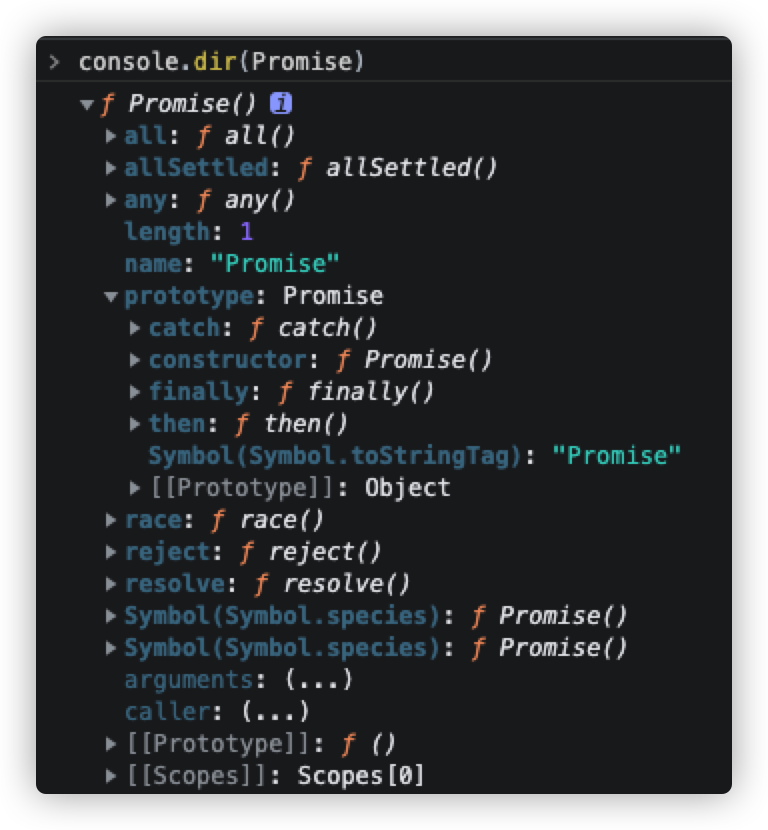

# Promise对象

`Promise`是异步操作的一种解决方案，支持链式调用可以解决**回调地狱**的问题

## 应用场景

- 定时器setTimeout/setInterval
- 文件读取
- ajax请求

```js
const fs = require('fs')

// fs.readFile('hello.txt', (err, data) => {
//     if (err) { throw err }
//     console.log(data.toString())
// })

let p = new Promise((resolve, reject) => {
    fs.readFile('hello.txt', (err, data) => {
        if (err) reject(err)
        resolve(data)
    })
})

p.then(value => {
    console.log(value.toString())
}, reason => {
    console.log(reason)
})

// 进一步封装一个文件读取的函数
function _readFile(path) {
    return new Promise((resolve, reject) => {
        fs.readFile(path, (err, data) => {
            if (err) reject(err)
            resolve(data)
        })
    })
}

_readFile('hello.txt').then(value => {
    console.log(value)
}, reason => {
    console.log(reason)
})

// nodejs中提供`promisify`
const util  = require('util')
let _readFile = util.promisify(fs.readFile)
_readFile('hello.txt').then(value => {
    console.log(value)
}, reason => {
    console.log(reason)
})
```

## 状态和结果

### pending

```js
let p = new Promise(function(resolve, reject) {})
console.log(p)
/*
  [[PromiseState]]: "pending"
  [[PromiseResult]]: undefined
*/
```

### fulfilled

```js
let p = new Promise(function(resolve, reject) {
  resolve('success')
})
console.log(p)
/*
  [[PromiseState]]: "fulfilled"
  [[PromiseResult]]: "success"
*/
```

### rejected

```js
let p = new Promise(function(resolve, reject) {
  reject('err')
})
console.log(p)
/*
  [[PromiseState]]: "rejected"
  [[PromiseResult]]: "err"
*/
```

状态只能由`pending -> fulfilled`， `pending -> rejected`，且**不可逆**。




```js
const PENDING = 'PENDING'
const FULFILLED = 'FULFILLED'
const REJECTED = 'REJECTED'

class MyPromise {
  constructor(executor) {
    this.status = PENDING
    let resolve = () => {}
    let reject = () => {}
    executor(resolve, reject)
  }

  // 实例方法
  then() {}
  catch() {}
  finally() {}

  // 静态方法
  static resolve() {}
  static reject() {}
  static all() {}
  static race() {}
  static allSettled() {}
  static any() {}
}
```

## 构造函数实现

### 初始结构

```js
function Promise(executor) {
    this.PromiseState = 'pending'
    this.PromiseResult = null
    const resolve = () => {}
    const reject = () => {}
    executor(resolve, reject)
}
Promise.prototype.then = function (onResolved, onRejected) {}
Promise.prototype.catch = function (onRejected) {}
Promise.resolve = function (value) {}
Promise.reject = function (reason) {}
Promise.all = function (promises) {}
Promise.race = function (promises) {}
```

### resolve与reject

resolve与reject函数的作用：

- 改变状态（resolve，reject，throw）
- 设置结果

#### 实现

```js
function Promise(executor) {
    this.PromiseState = 'pending'
    this.PromiseResult = null
    const resolve = (data) => {
        // 由于状态只能修改一次，所以需要判断状态
        if (this.PromiseState !== 'pending') return
        // 改变状态
        this.PromiseState = 'fulfilled'
        // 设置结果
        this.PromiseResult = data
    }
    const reject = (data) => {
        // 由于状态只能修改一次，所以需要判断状态
        if (this.PromiseState !== 'pending') return
        // 改变状态
        this.PromiseState = 'rejectd'
        // 设置结果
        this.PromiseResult = data
    }
    // 抛出异常改变状态
    try {
        executor(resolve, reject)
    } catch (error) {
        reject(error)
    }

}
```

#### 验证

```js
let p = new Promise((resolve, reject) => {
    resolve('OK');
    // reject('error')
});

console.log(p)
```

```js
let p = new Promise((resolve, reject) => {
    // resolve('OK');
    // reject('error')
    throw 'error'
});

console.log(p)
```

```js
let p = new Promise((resolve, reject) => {
    resolve('OK');
    reject('error')
    throw 'error'
});
console.log(p) // 期望：打印输出 OK
```

### then

#### 实现

```js
Promise.prototype.then = function (onResolved, onRejected) {
    if (typeof onResolved !== 'function') {
        onResolved = value => value
    }
    if (typeof onRejected !== 'function') {
        onRejected = reason => { throw reason }
    }
    return new Promise((resolve, reject) => {
        // 抽离公共函数
        const callback = type => {
            try {
                // 获取回调函数的执行结果
                let result = type(this.PromiseResult)
                if (result instanceof Promise) {
                    result.then(v => { resolve(v) }, r => { reject(r) })
                } else {
                    resolve(result)
                }
            } catch (error) {
                reject(error)
            }
        }
        if (this.PromiseState === 'fulfilled') {
            callback(onResolved)
        }
        if (this.PromiseState === 'rejected') {
            callback(onRejected)
        }
        if (this.PromiseState === 'pending') {
            this.callbacks.push({
                onResolved: () => {
                    callback(onResolved)
                },
                onRejected: () => {
                    callback(onRejected)
                }
            })

        }
    })
}
```

#### 验证

```js
let p = new Promise((resolve, reject) => {
    resolve('OK');
    // reject('error')
    // throw 'error'
});
p.then(value => {
    console.log(value);
}, reason => {
    console.warn(reason);
})

// 异步任务回调执行
let p = new Promise((resolve, reject) => {
    setTimeout(() => {
        resolve('OK')
    }, 1000)
});
p.then(value => {
    console.log(value);
}, reason => {
    console.warn(reason);
})
// 1s之后，打印输出 OK


// 多个异步任务回调执行
let p = new Promise((resolve, reject) => {
    setTimeout(() => {
        resolve('OK')
    }, 1000)
});
p.then(value => {
    console.log(value);
}, reason => {
    console.warn(reason);
})
p.then(value => {
    console.log(value);
}, reason => {
    console.warn(reason);
})
// 打印两次： ok ok


// 同步修改then方法结果返回
let p = new Promise((resolve, reject) => {
    resolve('OK')
});
const result = p.then(value => {
    // console.log(value);
    // return 'hello world';
    return new Promise((resolve, reject) => {
        // resolve('success')
        reject('error')
    })
    // throw 'error'
}, reason => {
    console.warn(reason);
})
console.log(result)


// 异步修改then方法返回
let p = new Promise((resolve, reject) => {
    setTimeout(() => {
        // resolve('OK')
        reject('Error')
    }, 1000)
});
const res = p.then(value => {
    // console.log(value);
    return 'error'
    // throw 'Error'
}, reason => {
    // console.warn(reason);
    throw 'Error'
})
console.log(res)
```

### catch

#### 简单实现

```js
Promise.prototype.catch = function (onRejected) {
    return this.then(undefined, onRejected)
}
```

验证

```js
let p = new Promise((resolve, reject) => {
    setTimeout(() => {
        reject('error');
    }, 1000)
});
const res = p.catch(reason => {
    console.log(reason)
})
console.log(res)
```

### resolve

```js
Promise.resolve = function (value) {
    // 返回promise对象
    return new Promise((resolve, reject) => {
        if (value instanceof Promise) {
            value.then(v => { resolve(v) }, r => { reject(r) })
        } else {
            resolve(value)
        }
    })
}
```

### reject

```js
Promise.reject = function (reason) {
    // 返回promise对象
    return new Promise((resolve, reject) => {
        reject(reason)
    })
}
```

### all

```js
Promise.all = function (promises) {
    return new Promise((resolve, reject) => {
        let result = []
        let count = 0
        for (let i = 0; i < promises.length; i++) {
            promises[i].then(v => {
                result[i] = v
                count++
                // 每个对象都成功
                if (count === promises.length) {
                    resolve(result)
                }
            }, r => {
                reject(r)
            })
        }
    })
}
```

### race

```js
Promise.race = function (promises) {
    return new Promise((resolve, reject) => {
        for (let i = 0; i < promises.length; i++) {
            promises[i].then(v => {
                resolve(v)
            }, r => {
                reject(r)
            })
        }
    })
}
```

## 最终实现

```js
function Promise(executor) {
    this.PromiseState = 'pending'
    this.PromiseResult = null

    this.callbacks = []

    const resolve = (data) => {
        // 判断状态
        if (this.PromiseState !== 'pending') return
        // 改变状态
        this.PromiseState = 'fulfilled'
        // 设置结果
        this.PromiseResult = data

        this.callbacks.forEach(item => {
            item.onResolved(data)
        })
    }
    const reject = (data) => {
        // 判断状态
        if (this.PromiseState !== 'pending') return
        // 改变状态
        this.PromiseState = 'rejected'
        // 设置结果
        this.PromiseResult = data

        this.callbacks.forEach(item => {
            item.onRejected(data)
        })
    }
    // 抛出异常改变状态
    try {
        executor(resolve, reject)
    } catch (error) {
        reject(error)
    }

}

Promise.prototype.then = function (onResolved, onRejected) {
    if (typeof onResolved !== 'function') {
        onResolved = value => value
    }
    if (typeof onRejected !== 'function') {
        onRejected = reason => { throw reason }
    }
    return new Promise((resolve, reject) => {
        // 抽离公共函数
        const callback = type => {
            try {
                // 获取回调函数的执行结果
                let result = type(this.PromiseResult)
                if (result instanceof Promise) {
                    result.then(v => { resolve(v) }, r => { reject(r) })
                } else {
                    resolve(result)
                }
            } catch (error) {
                reject(error)
            }
        }
        if (this.PromiseState === 'fulfilled') {
            callback(onResolved)
        }
        if (this.PromiseState === 'rejected') {
            callback(onRejected)
        }
        if (this.PromiseState === 'pending') {
            this.callbacks.push({
                onResolved: () => {
                    callback(onResolved)
                },
                onRejected: () => {
                    callback(onRejected)
                }
            })

        }
    })
}

Promise.prototype.catch = function (onRejected) {
    return this.then(undefined, onRejected)
}

Promise.resolve = function (value) {
    // 返回promise对象
    return new Promise((resolve, reject) => {
        if (value instanceof Promise) {
            value.then(v => { resolve(v) }, r => { reject(r) })
        } else {
            resolve(value)
        }
    })
}

Promise.reject = function (reason) {
    // 返回promise对象
    return new Promise((resolve, reject) => {
        reject(reason)
    })
}

Promise.all = function (promises) {
    return new Promise((resolve, reject) => {
        let result = []
        let count = 0
        for (let i = 0; i < promises.length; i++) {
            promises[i].then(v => {
                result[i] = v
                count++
                // 每个对象都成功
                if (count === promises.length) {
                    resolve(result)
                }
            }, r => {
                reject(r)
            })
        }
    })
}

Promise.race = function (promises) {
    return new Promise((resolve, reject) => {
        for (let i = 0; i < promises.length; i++) {
            promises[i].then(v => {
                resolve(v)
            }, r => {
                reject(r)
            })
        }
    })
}
```

## async和await