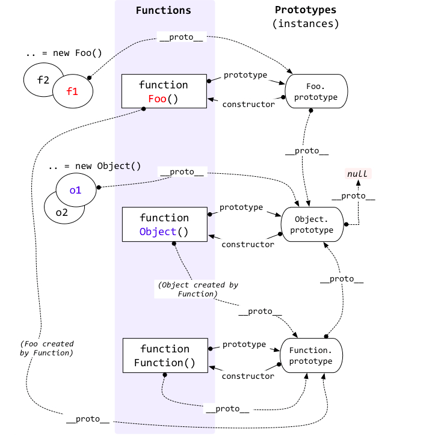

# 原型和原型链

JavaScript是面向对象编程（Object-oriented programming ，OOP）的语言，OOP的基本思想是在程序里，我们通过使用对象去构建现实世界的模型，把原本很难（或不可）能被使用的功能，简单化并提供出来，以供访问。

## 创建对象的几种方式

```js
/** 1. 字面量方法 */
var o = { name: 'o' }

/** 2. 构造函数 */
// 2.1 自定义构造函数
var M = function (name) { this.name = name }
var o = new M('o')
// 2.2 new Object()
var o = new Object({ name: 'o' })

/** 3. Object.create() */
// Object.create(),创建一个对象并继承原型对象
var p = { name: 'p' }
var o = Object.create(p)
// o.__proto__ === p
```

::: tip 提示

Object.create(null) 创建的对象是一个空对象，在该对象上没有继承原型链上的属性或者方法

:::

## 构造函数constructor

构造函数（constructor）也称之为构造器，功能类似对象模板，一个构造器可以生成任意多个实例，实例对象具有相同的属性和方法，但是不相等。在JavaScript中，构造器其实就是一个普通的函数。当使用**new操作符**来作用这个函数时，它就可以被称为构造函数

特点：

- 首字母大写
- 函数体内部使用`this`关键字,代表所要生成的对象实例
- 生成对象时，必须使用`new`操作符

## 原型

JavaScript中每个对象都拥有一个原型对象，对象以其原型为模板、从原型继承方法和属性。每个函数都有一个特殊的属性叫作原型（prototype）,案例如下：

```js
function doSomething(){}
console.log( doSomething.prototype );
```

可以看到`doSomething` 函数有一个默认的原型属性：

```js
{
    constructor: ƒ doSomething(),
    __proto__: {
        constructor: ƒ Object()
    }
}
```

现在，添加一些属性到 `doSomething` 的原型上面

```js
function doSomething(){}
doSomething.prototype.foo = "bar";
console.log( doSomething.prototype );
```

结果如下：

```js
{
    foo: "bar",
    constructor: ƒ doSomething(),
    __proto__: {
        constructor: ƒ Object()
    }
}
```

使用`new`关键字创建一个`doSomething`的实例：

```js
function doSomething(){}
doSomething.prototype.foo = "bar"; // add a property onto the prototype
var doSomeInstancing = new doSomething();
doSomeInstancing.prop = "some value"; // add a property onto the object
console.log( doSomeInstancing );
```

结果如下：

```js
{
    prop: "some value",
    __proto__: {
        foo: "bar",
        constructor: ƒ doSomething(),
        __proto__: {
            constructor: ƒ Object()
        }
    }
}
```

可以看到，`doSomeInstancing`实例的 `__proto__` 属性就是`doSomething`函数的`prototype`,即`doSomeInstancing.__proto__ === doSomething.prototype`。

- 当访问`doSomeInstancing`的一个属性的时候，浏览器首先查找`doSomeInstancing`是否有这个属性
- 如果没有，浏览器就会在`doSomeInstancing`的`__proto__`中查找这个属性，也就是到原型对象`doSomething.prototype`上查找
- 如果也没有找到，则继续在`doSomeInstancing`的`__proto__`的`__proto__`上查找，所有函数的原型属性的 `__proto__` 就是 `window.Object.prototype`
- 最后，原型链上的所有的`__proto__`都找完了也没找到该属性，这个属性返回`undefined`

原型对象 | 说明 | 值
---|---|---
显式原型对象`prototype` | 所有**函数**都有一个`prototype`属性 | 对象
隐式原型对象`__proto__` | 所有**实例**都有一个私有属性`__proto__` | 对象

::: tip 提示

- 所有**实例**的`__proto__`属性指向它**构造函数**的原型对象（`prototype`）
- 根据定义，`null` 没有原型，并作为这个原型链中的最后一个环节
- `__proto__`是一个内部属性，不建议对其进行直接操作
:::

## 原型对象

继承成员被定义的地方，被称作为原型对象`prototype`

比如，`Object`的`hasOwnProperty`、`toString`,`valueOf`都是可以继承的方法，但是`Object.create()`、`Object.keys()`、`Object.values()`,则不能被继承

```js
// 继承的属性和方法
console.log(Object.prototype)

{
    constructor: ƒ Object()
    hasOwnProperty: ƒ hasOwnProperty()
    isPrototypeOf: ƒ isPrototypeOf()
    propertyIsEnumerable: ƒ propertyIsEnumerable()
    toLocaleString: ƒ toLocaleString()
    toString: ƒ toString()
    valueOf: ƒ valueOf()
    __defineGetter__: ƒ __defineGetter__()
    __defineSetter__: ƒ __defineSetter__()
    __lookupGetter__: ƒ __lookupGetter__()
    __lookupSetter__: ƒ __lookupSetter__()
    get __proto__: ƒ __proto__()
    set __proto__: ƒ __proto__()
}
```

```js
// 不能被继承的属性和方法
console.dir(Object)

{
    arguments: (...)
    assign: ƒ assign()
    caller: (...)
    create: ƒ create()
    defineProperties: ƒ defineProperties()
    defineProperty: ƒ defineProperty()
    entries: ƒ entries()
    freeze: ƒ freeze()
    fromEntries: ƒ fromEntries()
    getOwnPropertyDescriptor: ƒ getOwnPropertyDescriptor()
    getOwnPropertyDescriptors: ƒ getOwnPropertyDescriptors()
    getOwnPropertyNames: ƒ getOwnPropertyNames()
    getOwnPropertySymbols: ƒ getOwnPropertySymbols()
    getPrototypeOf: ƒ getPrototypeOf()
    is: ƒ is()
    isExtensible: ƒ isExtensible()
    isFrozen: ƒ isFrozen()
    isSealed: ƒ isSealed()
    keys: ƒ keys()
    length: 1
    name: "Object"
    preventExtensions: ƒ preventExtensions()
    prototype: {constructor: ƒ, __defineGetter__: ƒ, __defineSetter__: ƒ, hasOwnProperty: ƒ, __lookupGetter__: ƒ, …}
    seal: ƒ seal()
    setPrototypeOf: ƒ setPrototypeOf()
    values: ƒ values()
    __proto__: ƒ ()
}
```

## 原型链

**在JavaScript中，每个对象都拥有一个原型对象，对象以其原型为模板、从原型继承方法和属性。原型对象也可能拥有原型，并从中继承方法和属性，一层一层、以此类推。这种关系常被称为原型链**。它解释了为何一个对象会拥有定义在其他对象中的属性和方法

### 原型链的查找过程

- 当访问一个对象的某个属性时，会先在这个对象本身属性上查找
- 如果没有找到，则会去该对象的`__proto__`上查找
- 如果还没有找到就会再在`__proto__`的`__proto__`中查找,最终会查到`Object.prototype`上
- 如果没有找到会返回`undefined`

### 图解



构造函数：
- function Foo()
- function Object()
- function Function()

总结：

1. 所有的实例化对象的`__proto__`指向 其构造函数的`prototype`
2. 所有普通的对象和构造函数的`prototype`的`__proto__`都指向`Object.prototype`
3. 所有函数（包括构造函数）都是`Function`的实例，所以`__proto__`都指向`Function.prototype`

过程：
- 定义一个构造函数Foo，并实例化为f1，从实例f1上查找某个属性或方法，会该实例本身上查找属性或方法，
- 如果没有找到，则从实例的__proto__上查找，也就是实例f1的构造函数Foo的原型对象上（即Foo.prototype）查找
- 如果没有找到，则继续从实例f1的__proto__的__proto__上查找，也就是实例f1的构造函数的原型的原型上查找，即Foo.prototype.__proro__上查找，
- 如果没有找到，则继续从实例f1的__proto__的__proto__的__proto__上查找，即实例f1的构造函数的原型的原型的原型上查找，即Foo.prototype.__proro__.__proro__上，最后找到Object.prototype上，
- 如果还是没有，则找到null
- 对象以此类推

## instanceof运算符

@[code](@code-snippet/instanceof.js)

## new运算符

创建一个对象的实例：`new [Constructor]`

1. 无 return

```js
function Foo(age) {
  this.age = age;
}

var o = new Foo(111);
console.log(o);         // { age: 111 }
```

2. return 对象类型数据

```js
function Foo(age) {
  this.age = age;

  return { type: "return 对象" };
}

var o = new Foo(222);
console.log(o);         // { type: "return 对象" }
```

3. return 基本类型数据

```js
function Foo(age) {
  this.age = age;

  return 1;
}

var o = new Foo(333);
console.log(o);         // { age: 333 }
```

总结：

- 如果构造函数显式返回对象类型，则直接返回这个对象
- 如果构造函数没有显式返回对象类型（返回基本数据类型或者直接不返回），则返回最开始创建的对象

::: tip 提示
如果构造函数是箭头函数，因为箭头函数中没有`[[Constructor]]`方法，所以不能使用`new`调用，会报错。
:::

### 原理

1. 创建一个空对象实例
2. 将实例的`__proto__`指向构造函数的原型`constructor.prototype`（继承构造函数的原型对象）
3. 执行构造函数，绑定`this`指向实例，实例作为`this`的上下文）
4. 如果构造函数的执行结果是一个对象，则返回这个对象，否则，返回实例对象

### 实现

@[code](@code-snippet/new.js)

## 继承

复制父类的方法和属性来重写子类的原型对象

### 1. 构造函数：子类构造函数中执行父类构造函数

子类构造函数中执行父类构造函数（` Parent.call(this) `）

```js
// 父类
function Parent() {
    this.name = 'Parent'
}
Parent.prototype.say = function() {}

// 子类
function Child() {
    // 调用父类，父类函数执行，绑定this
    Parent.call(this) // 或者使用apply，this 指向 Child
    this.type = 'Child'
}

var child = new Child()

// 测试
console.log(child)
```

结果：

```json
{
    name: "Parent"
    type: "Child"
    [[Prototype]]: {
        constructor: ƒ Child()
        [[Prototype]]: Object
    }
}
```

::: danger 缺点

1. 只能继承父类构造函数通过`this`声明的属性/方法。不能继承父类构造函数原型`prototype`上的属性/方法
2. 父类方法无法复用。每次实例化子类，都要执行父类函数。重新声明父类所定义的方法，无法复用

:::

### 2. 原型链：将父类构造函数的实例赋值给子类构造函数的原型

方法：将父类构造函数的实例赋值给子类构造函数的原型对象（`Child.prototype = new Parent()`）

原因：子类Child.prototype赋值父类的实例new Parent()，当子类实例化时，`子类实例的__proto__`就等于`子类构造函数的prototype`，`子类实例的__proto__`等于`父类的实例`，因此实现了继承

作用：弥补通过构造函数继承的缺点（继承不了父类构造函数原型对象`（Parent.prototype）`上的属性和方法）

```js
// 父类
function Parent() {
    this.name = 'Parent'
    this.play = [1,2,3]
}

// 子类
function Child() {
    this.type = 'Child'
}
// 子类函数原型指向构造函数的实例
Child.prototype = new Parent()

// 测试
console.log(new Child())
// 缺点：改变s1原型对象上的属性和方法会影响到s2对象，
// 原因是s1和s2的__proto__的指向相同（s1.__proto__ === s2.__proto__）
var s1 = new Child()
var s2 = new Child()
console.log(s1.play,s2.play)
s1.play.push(4)
console.log(s1.play,s2.play)
```

结果：

```json
Child
    type: "Child"
    [[Prototype]]: Parent
        name: "Parent"
        play: (3) [1, 2, 3]
        [[Prototype]]: Object
            constructor: ƒ Parent()
```

::: danger 缺点

1. 如果实例化两个子类构造函数，其中一个子类构造函数的原型上的方法和属性改变，另一个实例也会相应改变
2. 创建子类实例时，无法向父类构造函数传参

:::

### 3. 组合方式：构造函数+原型链

通过原型链继承来将this、prototype上的属性和方法继承到子类的原型对象上。借用构造函数来继承父类通过this声明的属性和方法在之子类的实例属性上

方法：

- 在子类构造函数中执行父类构造函数
- 然后将父类的构造函数的实例 赋值给 子类的原型对象

```js
// 父类
function Parent() {
    this.name = 'Parent'
    this.play = [1,2,3]
}
// 子类
function Child() {
    Parent.call(this)
    this.type = 'Child'
}

Child.prototype = new Parent()

// 测试
var s1 = new Child()
var s2 = new Child()
s1.play.push(4)
console.log(s1.play,s2.play)
```

::: danger 缺点

1. 父类构造函数执行了两次,造成一定的性能问题
2. 因调用两次父类，导致父类通过`this`声明的属性和方法被生成两份的问题
3. 原型链上下文丢失，子类和父类通过`prototype`声明的属性和方法都存在与子类`prototype`上

:::

### 4. 优化组合方式1: 将父类构造函数的原型赋值给子类构造函数的原型

方法：

- 子类构造函数中执行父类构造函数
- 然后将父类构造函数的原型对象赋值给子类构造函数的原型对象

```js
// 父类
function Parent() {
    this.name = 'Parent'
    this.play = [1,2,3]
}
// 子类
function Child() {
    Parent.call(this)
    this.type = 'Child'
}

Child.prototype = Parent.prototype

// 测试
var s1 = new Child()
var s2 = new Child()
console.log(s1, s2)
console.log(s1 instanceof Child) // true
console.log(s2 instanceof Parent) // true
console.log(s1.constructor) // 子类实例的构造函数是`Parent`，而不是`Child`
```

::: danger 缺点

区分不了一个对象是子类的实例化还是父类的实例化

:::

### 5. 优化组合方式2：通过Object.create()

方法：

- 在子类构造函数中执行父类构造函数
- 然后创建父类构造函数的实例继承赋值给子类构造函数的原型对象
- 最后将子类构造函数赋值给子类构造函数的原型对象的constructor

```js
// 父类
function Parent() {
    this.name = 'Parent'
    this.play = [1,2,3]
}
// 子类
function Child() {
    Parent.call(this)
    this.type = 'Child'
}
Child.prototype = Object.create(Parent.prototype)
Child.prototype.constructor = Child

// 测试
var s = new Child()
console.log(s instanceof Child, s instanceof Parent)
console.log(s.constructor) // 子类实例的构造函数是`Child`
```

### 6. 使用es6的extends

```js
// 父类
class Parent {
    constructor(value) {
        this.val = value
    }
    getValue() {
        console.log(this.val)
    }
}
// 子类
class Child extends Parent {
    constructor(value) {
        super(value) // Parent.call(this, value)
        this.val = value
    }
}

let child = new Child(1)
child.getValue() // 1
child instanceof Parent // true
```
