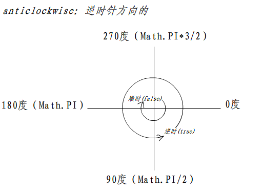

# canvas自定义仪表盘

## 功能

- [x] 刻度线及刻度值
- [x] 当前值显示
- [x] 任意起始终止角度
- [x] 拖拽
- [x] 当前值动画

## 前置知识

### canvas的基础使用

```html
<canvas id="canvas" width="400" height="400"></canvas>
```

```js
let canvas = document.getElementById('canvas')
let ctx = canvas.getContext('2d')
```

### 画布栅格以及坐标空间


### 圆弧绘制

画一个以（x,y）为圆心的以 radius 为半径的圆弧（圆），从 startAngle 开始到 endAngle 结束，按照 anticlockwise 给定的方向（默认为顺时针）来生成。

```js
arc(x, y, radius, startAngle, endAngle, anticlockwise)
```

坐标系及旋转：



### 角度和弧度转换

- 在CSS中，做旋转常用到的都是角度（deg）
- 在Canvas中绘制圆或圆弧时用到的是弧度（rad）

```js
// 角度 => 弧度
let rad = deg => (Math.PI * deg) / 180

// 弧度 => 角度
let deg = rad => (rad * 180) / Math.PI
```

- [参考大漠](https://www.open-open.com/lib/view/open1489798156717.html#articleHeader0)

### 圆上某个点的坐标

- 已知圆心(x0, y0)，半径radius，角度deg，求圆上某个点(x1, y1)的坐标

```js
let x1 = x0 + Math.cos(Math.PI/180*deg) * radius
let y1 = y0 + Math.sin(Math.PI/180*deg) * radius
```


- [正弦余弦](https://www.shuxuele.com/sine-cosine-tangent.html)

## 实现

### 绘制内层圆

### 绘制外层圆

### 绘制进度条

### 绘制刻度线

### 绘制文案

### 绘制当前值滑块圆点

### 滑动

### 动画

## 实现

```js
class Gauge {
	constructor(ctx, opt) {
		this.ctx = ctx
		this.width = opt.width
		this.min = opt.min
		this.max = opt.max
		this.curValue = opt.value
		this.unit = opt.unit

		this.tickLength = this.max - this.min
		this.x = this.width / 2
		this.y = this.width / 2
		this.radius = this.width / 2

		// 轨道
		this.trackLineWidth = 10
		this.trackRadius = this.radius - this.trackLineWidth / 2

		this.draw()

	}
	draw() {
		this.ctx.clearRect(0, 0, this.radius, this.radius)
		// 将坐标中心点移动到圆心位置
		this.ctx.translate(this.radius, this.radius)
		this.drawTrack()
		this.drawProgress()
		this.drawTick()
		this.drawTickLine()

		this.ctx.draw()
	}
	drawTrack() {
		this.ctx.lineWidth = this.trackLineWidth
		this.ctx.strokeStyle = '#ddd'
		this.ctx.arc(0, 0, this.trackRadius, this.degToRad(135), this.degToRad(45))

		// 中间文本
		this.ctx.fillStyle = '#FFAB91'
		this.ctx.textAlign = 'center'
		this.ctx.font = "34px serif"
		this.ctx.fillText(`${this.curValue}${this.unit}`, 0, 0)

		this.ctx.stroke()
	}
	drawProgress() {
		const curValueRad = this.getCurValueRad()
		this.ctx.beginPath()
		this.ctx.lineWidth = this.trackLineWidth
		this.ctx.strokeStyle = '#FD7347'
		// 终点角度是动态的
		this.ctx.arc(0, 0, this.trackRadius, this.degToRad(135), curValueRad)
		this.ctx.stroke()

	}
	drawTick() {
		// 不可是使用旋转，否则文字也会旋转
		let deg = this.degToRad(135)
		for (let i = this.min; i <= this.max; i++) {
			this.ctx.lineWidth = 1
			this.ctx.strokeStyle = '#999'
			this.ctx.beginPath()
			// 刻度起点
			let x0 = (this.radius - this.trackLineWidth - 2) * Math.cos(deg)
			let y0 = (this.radius - this.trackLineWidth - 2) * Math.sin(deg)
			// 刻度终点
			var x1 = (this.radius - this.trackLineWidth - 8) * Math.cos(deg)
			var y1 = (this.radius - this.trackLineWidth - 8) * Math.sin(deg)
			this.ctx.moveTo(x0, y0)
			this.ctx.lineTo(x1, y1)
			deg += this.tickRad
			this.ctx.stroke()
		}

	}
	drawTickLine() {
		let deg = this.degToRad(135)
		for (let i = this.min; i <= this.max; i++) {
			let x = (this.radius - this.trackLineWidth - 20) * Math.cos(deg)
			let y = (this.radius - this.trackLineWidth - 20) * Math.sin(deg)
			deg += this.tickRad
			this.ctx.font = '12px serif'
			this.ctx.fillStyle = '#999'
			// 不设置会与tick错位
			this.ctx.textBaseline = 'middle'
			this.ctx.fillText(i, x, y)
		}

	}
	// 角度转化为弧度
	degToRad(deg) {
		return deg * Math.PI / 180
	}
	// 当前值的弧度
	getCurValueRad() {
		// 每个刻度的弧度，圆弧开口角度： 360-90 = 270
		this.tickRad = this.degToRad(270) / this.tickLength
		// 超出
		if (this.curValue > this.max) {
			return (this.max - this.min) * this.tickRad + 3 / 4 * Math.PI
		}
		return (this.curValue - this.min) * this.tickRad + 3 / 4 * Math.PI
	}
}

export default Gauge

```