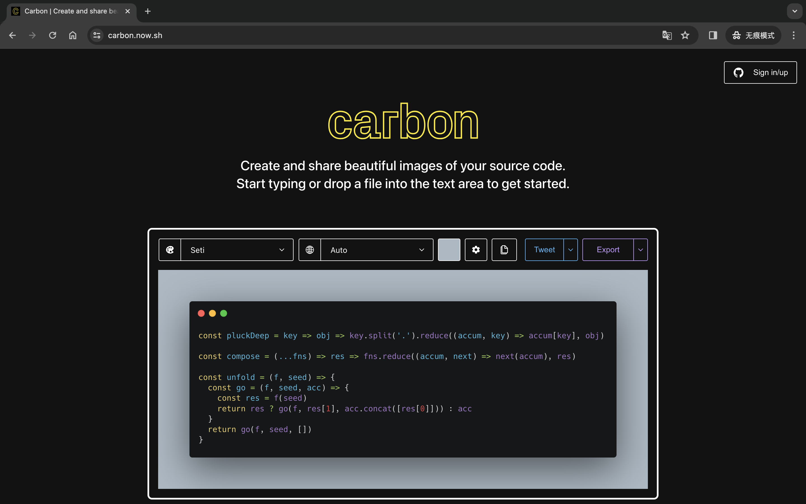
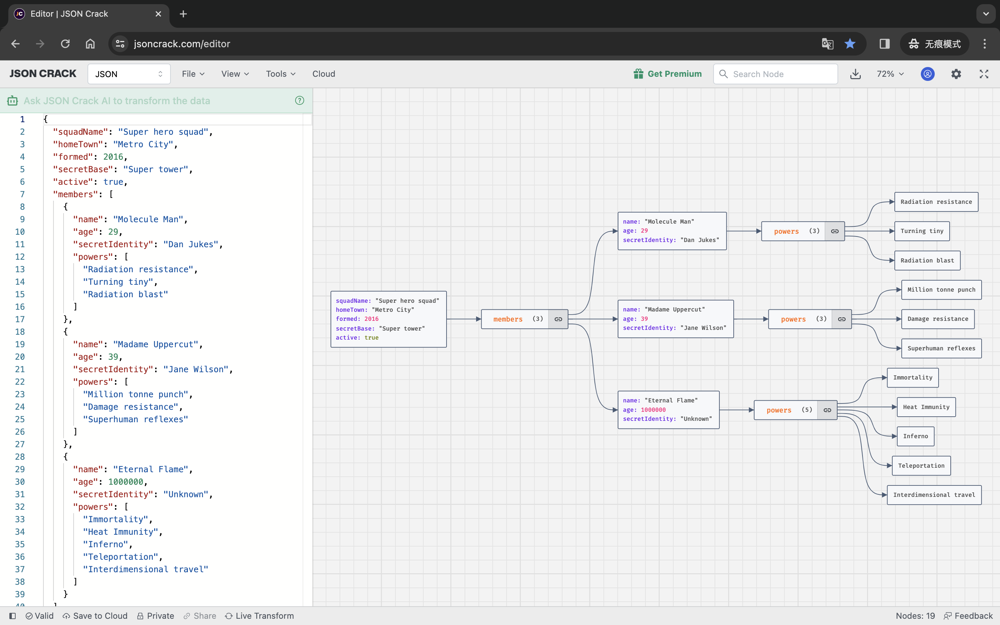

# VS Code

## 常用插件

- `Svg Preview` svg预览
- prettier 代码格式化
- GitLens — Git supercharged
- Chinese (Simplified) (简体中文) Language Pack for Visual Studio Code
- JS JSX Snippets
- React-Native/React/Redux snippets for es6/es7
- `vscode-pigments`：实时预览设置的颜色
- `Template String Converte`： 在字符串中输入$触发，将字符串转换为模板字符串
- `View In Browser`： 右键在浏览器中打开文件
- `Vetur`：开发vue必备
- `Vue 3 Snippets`
- `别名路径跳转`：别名路径跳转插件，支持任何项目，

### carbon-now-sh

用于生产代码片段

- [carbon-now-sh](https://marketplace.visualstudio.com/items?itemName=ericadamski.carbon-now-sh)
- [web版本](https://carbon.now.sh/)

### JSON Crack

- [官网](https://jsoncrack.com/)
- [vscode插件](https://marketplace.visualstudio.com/items?itemName=AykutSarac.jsoncrack-vscode)