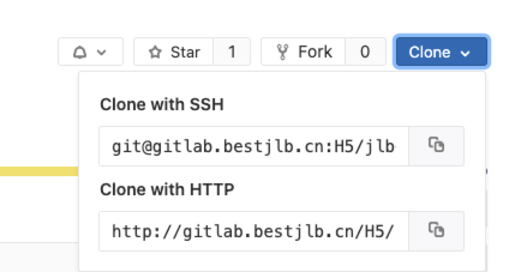

# 使用gitlab的上的url作为项目的依赖

[git-urls-as-dependencies](https://docs.npmjs.com/cli/v6/configuring-npm/package-json#git-urls-as-dependencies)

```bash
git+ssh://git@github.com:npm/cli.git#v1.0.27
git+ssh://git@github.com:npm/cli#semver:^5.0

git+https://isaacs@github.com/npm/cli.git
git://github.com/npm/cli.git#v1.0.27
```

## 克隆依赖的http或者ssh



## 引用依赖

在`package.json`中使用:

```bash
{
  "dependencies": {
    # 使用ssh
    "utils": "git+ssh://git@gitlab.bestjlb.cn:H5/utils.git",
    # 或者使用 http
    "utils": "http://gitlab.bestjlb.cn/H5/utils.git",
  }
}
```

::: tip 注意事项

依赖有更新时，需要及时更新依赖的`version`,否则更新的内容会拉取不下来

:::
