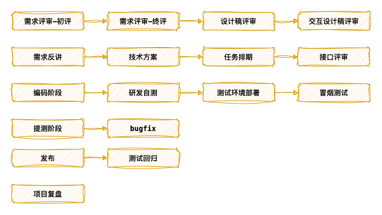

# 开发流程

## 需求评审-初评

主要对产品输出的prd进行评审，需要产品输出需求背景（用户故事）

## 需求评审-终评

针对UI设计师出图进行终评

## 交互设计稿

有条件的（有交互设计师的）需要输出相关的交互设计稿供前端参考

## 需求反讲

研发对需求进行梳理，提出疑问点，最好以xmind的形式输出

## 技术方案

研发针对产品输出可实现技术方案

## 任务排期

- 研发对需求进行需求合理的拆解，估时，并进行合理的任务排期
- 相关任务录入禅道并指派给相关的研发
- PM确定相关的时间节点（deadline）

## 接口评审

- 服务端定义接口文档，包括具体的接口返回数据
- 前端、测试、服务端同时参与

## 编码阶段

- 前端根据服务端定义的接口文档进行相关的mock
- 每日例会，同步开发进度，有风险需要提前暴露以免影响后面的时间节点

## 研发自测

- 在该任务节点的时候，前端服务端开发完成进行自测
- 前端需要将项目构建打包到测试环境

## 冒烟提测

- 研发根据测试部门输出到禅道的冒烟测试用例（主流程测试）进行自测
- 项目PM发起冒烟测试提测邮件，并抄送给相关的leader，以通知相关任务人员

## 提测阶段

- 在测试同学确认冒烟测试通过之后，项目全面提测，并发送提测邮件
- 快速响应测试提出的bug，当天bug当天清，以利于测试部门同学发送测试周报
- 测试完成之后，需要测试同学发起上线邮件并抄送相关leader审批

## 发布

项目发布

## 测试回归

在线上环境测试进行测试用例的回归

## 项目复盘

在项目上线之后，有重大问题的，进行项目的复盘会，总结问题，避免以后再出现类似问题